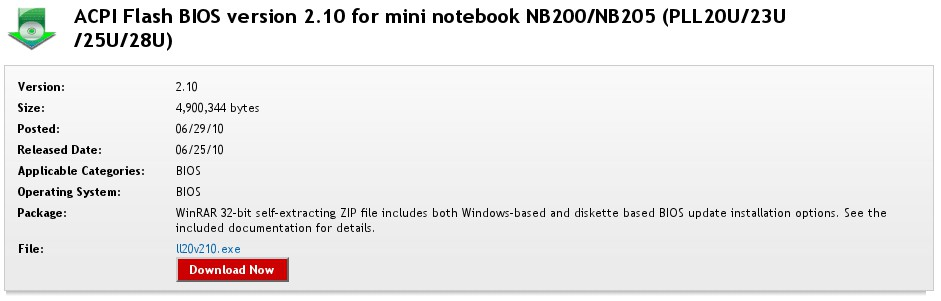
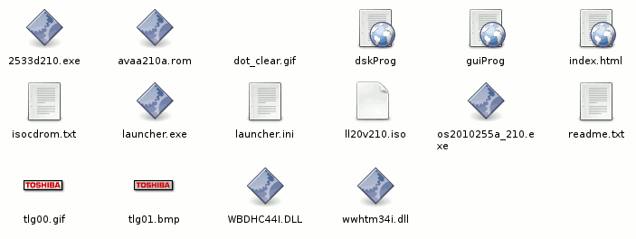
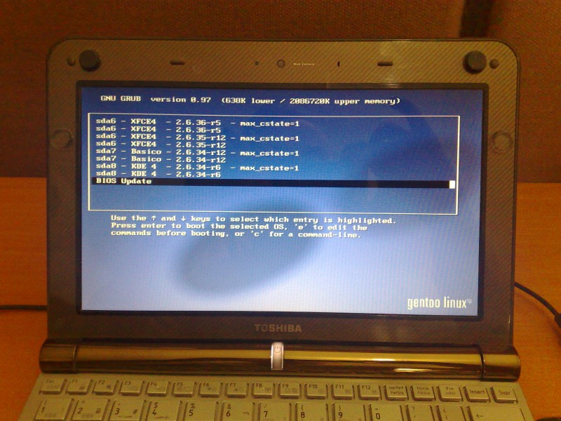
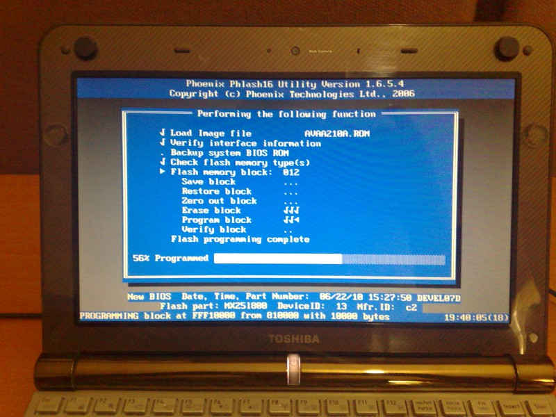

Title: Actualización del BIOS con GRUB
Slug: bios-update-with-grub
Summary: El BIOS es el software que se ejecuta al encender una computadora. Este apunte es para actualizar el BIOS por medio del gestor de arranque GRUB.
Tags: software libre
Date: 2010-12-28 14:00
Modified: 2010-12-28 14:00
Category: apuntes
Preview: preview.jpg

El [BIOS](http://es.wikipedia.org/wiki/BIOS) es el software que se ejecuta al encender una computadora. Es un software muy básico, que suele estar instalado en un _chip_ en la tarjeta madre.

El fabricante del equipo de cómputo suele ofrecer actualizaciones del BIOS en su sitio web. Como la gran mayoría de los equipos siguen vendiéndose con _Windows_, estas actualizaciones están disponibles sólo para este sistema operativo. Quienes usamos GNU/Linux tenemos que realizar una serie de _trucos_ técnicos para actualizar el BIOS con éxito.

El caso que documento es más complicado de resolver, ya que es para actualizar el BIOS de una _Netbook_; equipo donde *NO* disponemos de lector de _floppys_ o CD-ROM. Pareciera que nuestra única alternativa es hacer una memoria USB booteable con el software proporcionado por el fabricante o conteniendo el [FreeDOS](http://freedos.org/). Pero les muestro otra: **Actualizar el BIOS por medio del gestor de arranque GRUB.**

### ADVERTENCIA

La actualización del BIOS de una computadora es un proceso en el que se deben de tomar todas las precauciones posibles. Por ejemplo, debe tener completamente cargada la batería de su equipo portátil, así como mantenerlo conectado al cargador; de forma que se garantize que no se interrumpa el suministro eléctrico.

**Tenga en cuenta de que existe el riesgo de que falle la actualización del BIOS y que provoque que el equipo quede fuera de operación.**

Considere que este manual es meramente informativo y que debe de leer los pasos sugeridos por el fabricante. Si no tiene mucha experiencia en cuestiones computacionales, solicite la ayuda de un especialista en equipo de cómputo.

### Procedimiento

Busque en el sitio web del fabricante de su computadora el software para hacer la actualización del BIOS. En mi caso, tengo una Toshiba NB200, así que obtengo el software del [sitio web de soporte de Toshiba](http://www.csd.toshiba.com/).

¿Y qué cree?... Sí... El archivo de actualización **ll20v210.exe** es un programa para _Windows_.

Si en su GNU/Linux tiene [Wine](http://www.winehq.org/) instalado, pruebe ejecutar el archivo **EXE** en él y así desempacar su contenido.

Si **no tiene el Wine**, copie el archivo **EXE** a un dispositivo de almacenamiento (por ejemplo, una memoria USB) y vaya a otro equipo con _Windows_ para que lo desempaque. Copie lo desempacado en el mismo dispositivo de almacenamiento. De regreso en GNU/Linux, copie los archivos a su disco duro.

Uno de los archivos es un **readme.txt** que explica:

* Cómo crear un disco de arranque (floppy, memoria USB) con la actualización.
* Cómo actualizar el BIOS desde _Windows_.
* Cómo crear un CD-ROM _arrancable_ con la actualización.

Para hacer la actualización (por medio de GRUB) he fijado mi atención en el archivo **ll20v210.iso**, el cual es es la imagen de un CD-ROM _arrancable_. Suponemos que tiene dentro la actualización del BIOS.

Como **root** lo montamos en un directorio de nuestro GNU/Linux con el comando **mount**. Sustituya /home/USUARIO/ por la ruta correcta a ese archivo:

    # mkdir /mnt/iso
    # mount -o loop,ro /home/USUARIO/ll20v210.iso /mnt/iso
    # ls /mnt/iso

El parámetro **loop** en indispensable para **mount** al montar una imagen de disco. Por otro lado, hago que se monte como sólo lectura con el parámetro **ro** para evitar causarle algún cambio.

Busque en el contenido del **ISO** algún un archivo **IMG** o **IMA**. Éste puede ser un sistema operativo compacto que al arrancar ejecutará la actualización del BIOS.

Ahora es momento de configurar GRUB para que cargue el archivo **2533d210.ima**. Primero necesitamos de **memdisk** que viene incluido con **syslinux**. Instalamos **syslinux** en [Gentoo Linux](http://www.gentoo.org/) con...

    # emerge syslinux

La ubicación del archivo **memdisk** puede variar según su distribución. En Gentoo podemos averiguar los archivos que nos instala un paquete ejecutando...

    # equery files syslinux

Con el anterior comando obtengo que la ubicación es /usr/share/syslinux/memdisk

Si tiene /boot en su propia partición debemos montarla, puesto que ahí copiaremos el archivo IMG/IMA y memdisk...

    # mount /boot

Copie memdisk a su directorio /boot

    # cp /usr/share/syslinux/memdisk /boot/

Luego copie el archivo que suponemos es el actualizador del BIOS a /boot

    # cp 2533d210.ima /boot/

Edite el archivo de configuración de GRUB. Si usa una versión anterior a GRUB 2 (en mi caso es la 0.97) basta con editar el archivo...

    # nano -w /boot/grub/grub.conf

Y agregar al final es siguiente contenido. Sustituya 2533d210.ima por el nombre de su archivo IMA o IMG.

    title BIOS Update
    root (hd0,0)
    kernel /memdisk
    initrd /2533d210.ima

Si está usando GRUB 2 deberá agregar la opción con la nueva sintaxis. Según [Think Wiki - BIOS Update](http://www.thinkwiki.org/wiki/BIOS_Upgrade) debe agregar al archivo /boot/grub/grub.cfg lo siguiente:

    menuentry "BIOS Update" {
        set root=(hd0,0) #Revise que coincida con las otras opciones en grub.cfg
        linux16 /boot/memdisk
        initrd16 /boot/2533d210.ima
    }

Conecte el cargador de su _netboot_ o _laptop_ y reinicie su computadora. Cuando aparezca el menú del gestor de arranque GRUB elija la opción **BIOS update**.

### Más información en:

* [Wikipedia - BIOS](http://es.wikipedia.org/wiki/BIOS)
* [Think Wiki - BIOS Update](http://www.thinkwiki.org/wiki/BIOS_Upgrade)
