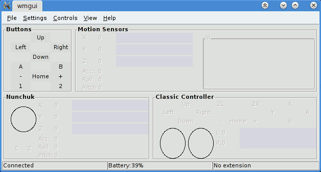
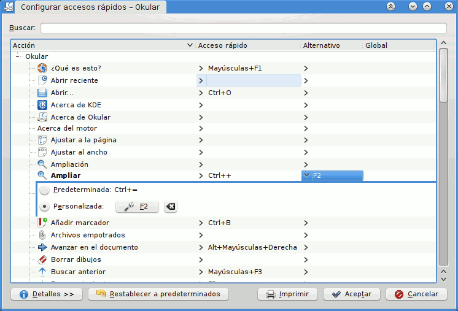
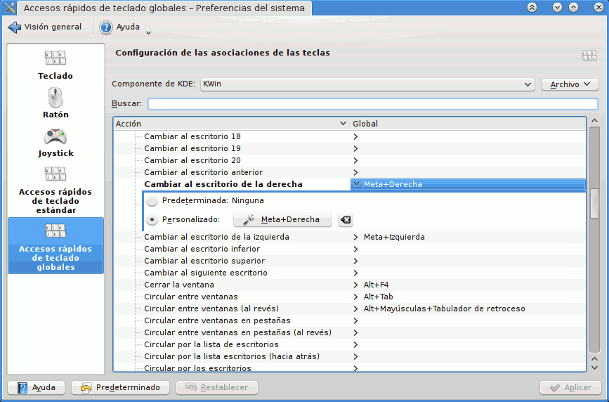
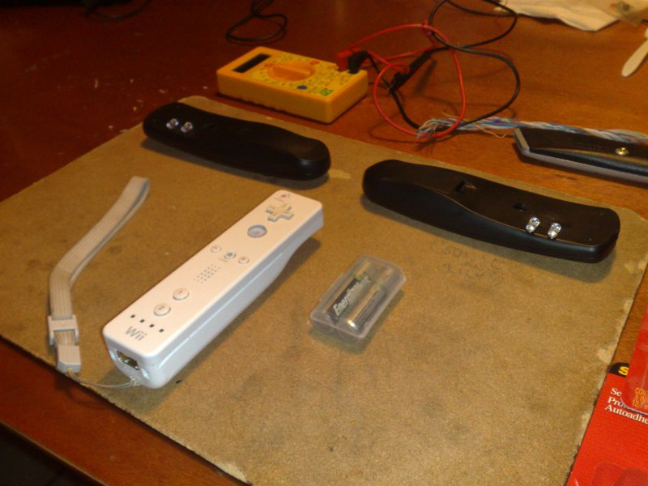
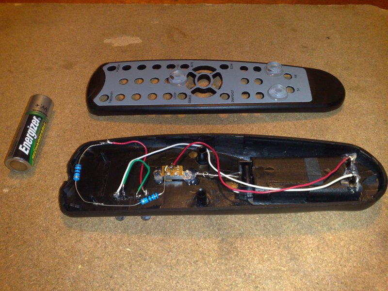

Title: Instalación de CWiid 0.6.00: Wiimote en GNU/Linux
Slug: cwiid-0.6.00
Summary: Pasos para instalar en Gentoo Linux el CWiid (versión 0.6.00) que es una colección de herramientas programadas en C para usar el wiimote.
Tags: gentoo linux
Date: 2010-10-26 20:00
Modified: 2010-10-26 20:00
Category: apuntes
Preview: preview.jpg

_Wii Remote_ (Control Remoto _Wii_ en Latinoamérica, Mando de _Wii_ en España o _Wiimote_ en el _mundo gamer_) es el control principal de la _Wii_ de Nintendo. Este dispositivo tiene estas cualidades:

* Botones A, B, +, home, -, 1 y 2.
* Sensores de aceleración y posición en el espacio 3D.
* Sensor que detecta a donde está apuntando, por medio de un visor infrarrojo y _leds_ sobre la pantalla.
* Leds que indican la carga de la batería y el número del control.
* Bocina integrada.
* Puede vibrar.
* Comunicación inalámbrica via _bluetooth_.

Aparte del magnífico papel que este dispositivo tiene con los video juegos, podemos darle un gran número de usos con GNU/Linux. Entre los cuales están:

* Controlar tus presentaciones de forma inalámbrica (en esta guía No. 10).
* Usarlo como sustituto del _mouse_ apuntando directamente a la proyección (No. 12).
* Jugar [SuperTux](http://supertux.lethargik.org/) usándolo como _joystick_ inalámbrico.
* Hacer de cualquier pantalla un [touchscreen](http://wiki.wiimoteproject.com/Wiimote_HOWTO)
* [Etcétera](http://abstrakraft.org/cwiid/wiki/ProgramsUsingCWiid)

A continuación describiré los pasos para instalar en [Gentoo Linux](http://www.gentoo.org/) el [CWiid](http://abstrakraft.org/cwiid/) (versión 0.6.00) que es una colección de herramientas programadas en C para usar el _wiimote_.

**Nota:** Los comandos que vea con **$** son ejecutados desde su cuenta de usuario. Mientras que los comandos que inicien con **#** deben ejecutarse como _root_ o con **sudo**.

### Video

<iframe width="420" height="315" src="//www.youtube.com/embed/gg8spZvyEE8" frameborder="0" allowfullscreen></iframe>

### 1) Configure su kernel

Ya que el _wiimote_ se comunica vía _bluetooth_ es indispensable que su computadora tenga ese dispositivo y que opere correctamente.

Para configurar el soporte de _bluetooth_ en su kernel, active las siguientes opciones en la configuración del mismo. Consulte documentación sobre cómo compilar su kernel si es necesario.

    [*] Networking support  --->
        <M> Bluetooth subsystem support  --->
            <M> L2CAP protocol support
            <M>   SCO links support
            <M>   RFCOMM protocol support
            [*]     RFCOMM TTY support
            <M>   BNEP protocol support
            [*]     Multicast filter support
            [*]     Protocol filter support
            <M>   HIDP protocol support
                  Bluetooth device drivers  --->  # ESCOJA EL CONTROLADOR O MARQUE TODOS
                  <M> HCI USB driver              # ESTE ES EL CONTROLADOR DE MI EQUIPO

Para usar el _wiimote_ es necesario habilitar el módulo **uinput** en el kernel con:

    Device Drivers  --->
        Input device support  --->
            [*] Miscellaneous devices  --->
              <M> User level driver support

Guarde los cambios, compile e instale el kernel y reinicie su equipo.

### 2) Revise que haya comunicación por _bluetooth_

En el paso anterior compilamos como módulos (M) las opciones del kernel. Revise si su distribución los cargó al encender el equipo con:

    $ lsmod

Si no, cárguelos manualmente. Ejecute **modprobe** (como root) con el módulo que corresponda a su controlador _bluetooth_, en mi caso es:

    # modprobe -v btusb

Como primera prueba, ejecute el comando **hciconfig** (como root), deberá mostrarle información como la siguiente:

    # hciconfig
    hci0:   Type: USB
        BD Address: 00:00:00:00:00:00 ACL MTU: 310:10 SCO MTU: 64:8
        UP RUNNING PSCAN
        RX bytes:1152 acl:0 sco:0 events:55 errors:0
        TX bytes:2878 acl:0 sco:0 commands:55 errors:0

Donde **BD Address: 00:00:00:00:00:00** es la _mac address_ del _bluetooth_ de su computadora.

Luego, presione 1 y 2 al mismo tiempo en el _wiimote_. Los _leds_ parpadeando son señal de que está en _modo de asociación_. Inmediatamente, en la terminal ejecute:

    # hcitool scan
    Scanning ...
        00:00:00:00:00:00       Nintendo RVL-CNT-01

Donde **00:00:00:00:00:00** es la _mac address_ del _bluetooth_ del _wiimote_.

### 3) Configure que su cuenta de usuario pueda usar *uinput*

Cargue el módulo **uinput** si no lo ha hecho.

    $ sudo modprobe -v uinput

Por defecto */dev/input/uinput* tiene permisos de root:

    $ ls -l /dev/input/uinput
    crw-r----- 1 root root 10, 223 sep 24 22:47 /dev/input/uinput

Para que nuestra cuenta de usuario tenga permisos de lectura y escritura en **uinput** vamos a crear una nueva regla **udev**. Como _root_ vamos a crear un nuevo archivo con el editor de textos más simple de GNU/Linux, el **nano**:

    # nano /etc/udev/rules.d/50-wminput.rules

Escribimos el contenido siguiente donde señalamos que a la carga de **uinput** se den permisos al grupo **uucp**:

    #
    # 50-wminput.rules
    #
    # WiiMote requiere que se tenga permisos en uinput
    KERNEL=="uinput", MODE="0660", GROUP="uucp"

Para usar esta configuración sin reiniciar el equipo, retiramos módulo **uinput**, recargamos **udev**, cargamos de nuevo **uinput** y revisamos:

    # modprobe -r uinput
    # udevadm control --reload-rules
    # modprobe -v uinput
    # ls -l /dev/input/uinput
    crw-rw---- 1 root uucp 10, 223 sep 24 22:55 /dev/input/uinput

Por último agregue su usuario al grupo **uucp**

    # gpasswd -a <USUARIO> uucp

Cierre su sesión como usuario y entre de nuevo para hacer efectivo este cambio.

### 4) Descargue el código fuente de CWiid

Ingrese al sitio oficial de [CWiid](http://abstrakraft.org/cwiid/)

En la página inicial donde está el tema "Download", busque "Download the most recent version of CWiid." y de clic al vínculo. Al escribir esta guía la versión **0.6.00** de **CWiid** es la versión estable y su URL es [http://abstrakraft.org/cwiid/downloads/cwiid-0.6.00.tgz](http://abstrakraft.org/cwiid/downloads/cwiid-0.6.00.tgz)

### 5) Desempaque el archivo comprimido

Ya sea por medio de su administrador de archivos, dando clic con el botón derecho y eligiendo desempacar en el menú contextual o en la terminal con el comando:

    $ tar xvf cwiid-0.6.00.tgz

Luego, cámbiese al directorio resultante de haberlo desempacado.

    $ cd cwiid-0.6.00

No deje de leer el archivo **README**.

### 6) Modifique el archivo bluetooth.c

[Gentoo Linux](http://www.gentoo.org/) está usando [net-wireless/bluez](http://packages.gentoo.org/package/net-wireless/bluez) que es la nueva versión de los programas y demonios para _bluetooth_.

**CWiid** en su versión 0.6.00 sigue necesitando a la versión anterior, lo cual lo hace incompatible con la nueva y marca error al compilar. Afortunadamente sólo hay que modificar una línea del código fuente para que funcione con **bluez**. Así que con **vim** o su editor favorito, edite el archivo:

    $ vim libcwiid/bluetooth.c

Y en la línea 125, cambie "hci_remote_name" a "hci_read_remote_name" (sin comillas, por supuesto).

    ...
    /* timeout (10000) in milliseconds */
    if (hci_read_remote_name(sock, &dev_list[i].bdaddr, BT_NAME_LEN,
      (*bdinfo)[bdinfo_count].name, 10000)) {
        cwiid_err(NULL, "Bluetooth name read error");
        err = 1;
        goto CODA;
    }
    ...

### 7) Configure y compile

De la forma tradicional:

    $ ./configure
    $ make

Revise que no haya mensajes de error en estos pasos.

### 8) Instale

La instalación por defecto se hará en /usr/local así que como _root_ ejecute:

    # make install

### 9) Uso de wmgui

El programa **wmgui** sirve para probar todas las características del _wiimote_. Le recomiendo que estrene su _wiimote_ en GNU/Linux ejecutando **wmgui**:

    $ wmgui

* Para asociar el _wiimote_ elija menú **File** > **Connect**, presione 1 y 2 en el _wiimote_ y de clic en **Aceptar**.
* Pruebe los botones del _wiimote_.
* Para terminar la sociación con el _wiimote_ elija **File** > **Disconnect**.

### 10) Uso de wminput

El programa **wminput** es capaz de detectar cuando se presionan los botones y los datos del apuntador del _wiimote_ para interpretarlos en nuestro sistema operativo.

No deje de leer el manual con **man wminput**. Por otro lado, ejecute **wminput -h** para mostrar un texto de ayuda. En síntesis tiene estas opciones:

    -h             Mostrar ayuda.
    -c <ARCHIVO>   Cargar un archivo específico de configuración.
    -q             Sólo mostrar errores en la terminal.
    -r <SEGUNDOS>  Automáticamente reconectar al Wiimote si este se desconectara.
    -w             Esperar infinitamente a que se conecte un Wiimote
    -d             Combina -q, -r y -w.

Encontrará archivos básicos de configuración en /usr/local/etc/cwiid/wminput/

La documentación recomienda mantener la configuración personal en el directorio oculto **.CWiid** en su **home**; aunque estos archivos pueden estar en cualquier parte. Así que creamos ese directorio con:

    $ mkdir ~/.CWiid/

El primer ejemplo de configuración es para controlar las presentaciones en **PDF** con [Okular](http://okular.kde.org/). ¿Porqué _Okular_? Bueno, porque la gran variedad de programas para [KDE](http://www.kde.org/) te permiten personalizar los atajos de teclado fácilmente. Para empezar creamos el archivo:

    $ nano ~/.CWiid/okular.conf

Con este contenido:

    #
    # ~/.CWiid/okular.conf
    #
    # Configuración para usarse en Okular
    #

    # Wiimote         Tecla           Acción en Okular

    Wiimote.A       = KEY_PAGEDOWN  # Pagina siguiente
    Wiimote.B       = KEY_PAGEUP    # Pagina anterior

    Wiimote.Up      = KEY_UP        # Flecha arriba
    Wiimote.Down    = KEY_DOWN      # Flecha abajo
    Wiimote.Left    = KEY_LEFT      # Flecha izquierda
    Wiimote.Right   = KEY_RIGHT     # Flecha derecha

    Wiimote.Home    = KEY_HOME      # Primer diapositiva
    Wiimote.Minus   = KEY_F4        # Reducir
    Wiimote.Plus    = KEY_F2        # Ampliar

Luego configure los atajos de teclado de **Okular**: ejecútelo, ingrese en **Preferencias** > **Configurar los accesos rápidos** y haga los cambios que menciono en los comentarios del archivo anterior.

**IMPORTANTE:** Si la instación de CWiid fue en /usr/local debemos exportar la variable de entorno PYTHONPATH antes de ejecutar wminput en nuestra terminal. De lo contrario aparecerá el error **ImportError: No module named cwiid**.

    $ export PYTHONPATH="/usr/local/lib/python2.6/site-packages"

Ahora ejecute:

    $ wminput -w -c ~/.CWiid/okular.conf

Presione 1 y 2 en el _wiimote_, cámbiate a **Okular** y _¡a controlar tu presentación sin estar frente a la laptop!_.

### 11) Entorno de escritorio KDE 4

Qué mejor demostración del poder de GNU/Linux que con los efectos 3D de **KDE 4**. De esta forma puedo tener en un escritorio mi presentación y en otro mi explorador de archivos para ir abriendo videos, por ejemplo. Mi archivo de configuración de **wminput** para ese fin es el siguiente:

    #
    # ~/.CWiid/kde4.conf
    #
    # Configuración para usar KDE 4
    #

    Wiimote.A      = KEY_ENTER     # Enter, abrir un archivo en Dolphin
    Wiimote.B      = KEY_LEFTMETA  # Tecla Win, mantenga presionado

    Wiimote.Up     = KEY_UP        # Flecha arriba
    Wiimote.Down   = KEY_DOWN      # Flecha abajo
    Wiimote.Left   = KEY_LEFT      # Flecha izquierda
    Wiimote.Right  = KEY_RIGHT     # Flecha derecha

    Wiimote.Home   = KEY_HOME      # Okular, primer diapositiva
    Wiimote.Minus  = KEY_PAGEUP    # Okular, anterior
    Wiimote.Plus   = KEY_PAGEDOWN  # Okular, siguiente

    Wiimote.1      = KEY_F         # KMPlayer, video a pantalla completa
    Wiimote.2      = KEY_END       # KMPlayer, terminar y cerrar

Aquí necesitamos adecuar los atajos de teclado del entorno gráfico. Para ello ejecutamos **Preferencias del Sistema**, buscamos **Teclado y ratón** y dentro hallarás **Accesos rápidos de teclado globales**.

Luego en **Componente de KDE** elija **KWin** y cambie:

* Cambiar al escritorio de la derecha: Meta+Derecha
* Cambiar al escritorio de la izquierda: Meta+Izquierda
* Desktop Cube: Meta+Arriba
* Toggle Present Windows (All desktops): Meta+Abajo

También haga los cambios propios en **Okular** y **KMPlayer** (para ver videos).

Mantenga en un escritorio el **Dolphin** abierto con sus videos preferidos, en otro escritorio su presentación en **Okular**. Ejecute:

    $ wminput -w -c ~/.CWiid/kde4.conf

Como observará, se convierte la _combinación de botones_ en la _combinación de teclas_ para rotar el cubo del escritorio: mantenga presionado **B** mientra oprime **Derecha** o **Izquierda** en el _wiimote_.

### 12) Stellarium

El [Stellarium](http://stellarium.org) es un magnífico planetario para nuestra computadora; destaca por su realismo y facilidad de uso.

Con el fin de tener una gran experiencia de **Stellarium** por medio de **CWiid** vamos a aprovechar la capacidad de detectar a dónde esta apuntando el _wiimote_. Para ello necesitaremos tener dos luces infrarrojas (IR) en la base de la pantalla, que pueden ser por medio de un _wii sensor bar_ fabricado por terceros, un par de pequeñas velas, o bien, si tienes las herramientas básicas de soldadura para circuitos y visitas la tienda de electrónica de tu localidad, podrás hacer fácilmente un par de dispositivos con leds IR como los que muestro a continuación:

Su servidor _hackeó_ cuatro controles remotos que no usaba para convertirlos en dos dispositivos de luz IR. Observe el video [How to Make a Wireless Wii Sensor Bar](http://www.youtube.com/watch?v=Ryy7oPMZ2gU) para ver otro trabajo similar.

Para probar el "apuntador" escriba la siguiente configuración en ~/.CWiid/apuntador.conf:

    #
    # ~/.CWiid/apuntador.conf
    #
    # Usar la capacidad de saber a donde apunta el wiimote
    # para reemplazar al mouse. Necesita los leds IR.
    #

    include buttons          # Cargamos la configuracion buttons

    Plugin.ir_ptr.X = ABS_X  # Puntero eje X
    Plugin.ir_ptr.Y = ABS_Y  # Puntero eje Y

El apuntador del _wiimote_ se habilita con las líneas **Plugin.ir_ptr**.

Regresando al **Stellarium**, necesitamos saber los atajos de teclado propios de ese programa. Los encontrará en la página [Keyboard actions](http://stellarium.org/wiki/index.php/Keyboard_actions) del _wiki_ de **Stellarium**. Con esa información, creamos un archivo de configuración para **wminput** como el siguiente:

    #
    # ~/.CWiid/stellarium.conf
    #
    # Configuración para usar Stellarium con apuntador IR
    #

    Wiimote.A       = BTN_LEFT      # Clic con el boton derecho
    Wiimote.B       = KEY_SPACE     # Espacio, centrar en el objeto seleccionado

    Plugin.ir_ptr.X = ABS_X         # Apuntador IR eje X
    Plugin.ir_ptr.Y = ABS_Y         # Apuntador IR eje Y

    Wiimote.Up      = KEY_R         # R, Arte de las constelaciones
    Wiimote.Down    = KEY_C         # C, Lineas de las constelaciones
    Wiimote.Left    = KEY_V         # V, Nombres de las constelaciones
    Wiimote.Right   = KEY_E         # E, Rejilla ecuatorial

    Wiimote.Minus   = KEY_PAGEDOWN  # AvPag, Alejarse
    Wiimote.Home    = KEY_8         # 8, Poner tiempo a ahora
    Wiimote.Plus    = KEY_PAGEUP    # RePag, Acercarse

    Wiimote.1       = KEY_L         # L, Incrementar el salto de tiempo
    Wiimote.2       = KEY_J         # J, Decrementar el salto de tiempo

Los pasos a seguir son encender las fuentes de luz IR, cargar *wminput* con la configuración ~/.CWiid/stellarium.conf y ejecutar **Stellarium**.

### 13) Un bash script que nos facilite todo

Le recomiendo automatizar el arranque con este **Bash Script** que se encargará de cargar los módulos del kernel, definir la variable de entorno **PYTHONPATH** y lanzar **wminput** con la configuración.

    #!/bin/bash

    # Yo soy
    SOY="[wiimote]"

    # Constantes que definen los tipos de errores
    EXITO=0
    E_NOARGS=65
    E_DUPLICADO=98
    E_FATAL=99

    # Mensaje para mostrar por falta de argumentos
    function ayuda() {
        echo
        echo "Objetivos:"
        echo " Conectar wiimote para presentaciones o para usarlo como ratón."
        echo
        echo "Sintaxis:"
        echo " wiimote.sh <CONFIGURACION>"
        echo
        echo "Configuraciones:"
        echo " - apuntador  > Como mouse con los leds IR en la pantalla."
        echo " - kde4       > Efectos de escritorio de KDE4."
        echo " - okular     > Botones para controlar la presentación."
        echo " - stellarium > Bóveda celeste. Necesita los leds IR."
        echo
    }

    # Mostrar ayuda si se solicita
    if [ "$1" = "-h" -o "$1" = "--help" ]; then
        ayuda
        exit $EXITO
    fi

    #
    # Parámetro
    #
    if [ -z "$1" ]; then
        echo "$SOY FALTA la configuración."
        ayuda
        exit $E_NOARGS
    fi
    case "$1" in
        "apuntador")
            CONF_ARCH="$HOME/.CWiid/apuntador.conf"
            ;;
        "kde4")
             CONF_ARCH="$HOME/.CWiid/kde4.conf"
             ;;
        "okular")
             CONF_ARCH="$HOME/.CWiid/okular.conf"
             ;;
        "stellarium")
             CONF_ARCH="$HOME/.CWiid/stellarium.conf"
             ;;
        *)
            echo "$SOY ERROR: La configuración $1 es incorrecta."
            ayuda
            exit $E_NOARGS
            ;;
    esac
    if [ ! -e "$CONF_ARCH" ]; then
        echo "$SOY ERROR: No se encuentra el archivo de configuración $CONF_ARCH"
        exit $E_FATAL
    fi

    #
    # Proceso
    #

    # Declaramos la ruta para la carga de librerias de phyton
    # De lo contrario aparece el error ImportError: No module named cwiid
    export PYTHONPATH="/usr/local/lib/python2.6/site-packages"

    # Si no esta cargado el modulo uinput, lo cargamos
    test -e /dev/input/uinput || sudo modprobe -v uinput

    # Si no se ha iniciado el bluetooth, cargamos el modulo para el Bluetooth
    sudo /etc/init.d/bluetooth status | grep stopped && sudo modprobe -v btusb

    # Una pausa de cuatro segundos
    sleep 4

    # Ejecutamos wminput
    wminput -w -c "$CONF_ARCH"

    # Mensaje final
    echo "$SOY Script terminado."
    exit $EXITO

Guárdelo con el nombre de **wiimote.sh** y ejecútelo con la configuración como parámetro, por ejemplo:

    $ ./wiimote.sh stellarium

### 14) Referencias

* [CWiid](http://abstrakraft.org/cwiid/)
* [Ubuntu Documentation, CWiid](https://help.ubuntu.com/community/CWiiD)
* [Ubuntu Forums, HOWTO: Using a Wii remote as a mouse with CWiiD](http://ubuntu-virginia.ubuntuforums.org/showthread.php?t=535659)
* [How to Make a Wireless Wii Sensor Bar](http://www.youtube.com/watch?v=Ryy7oPMZ2gU)
* [Wiimote Wiki](http://wiki.wiimoteproject.com/)
