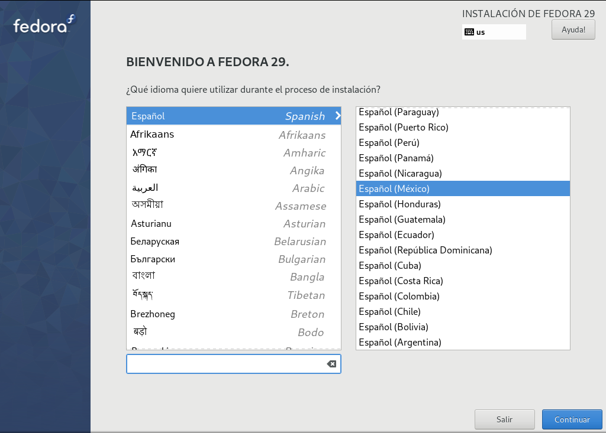

Title: Instalación de Fedora Workstation 29, parte 1
Slug: fedora-workstation-29-parte-01
Summary: A través de esta serie de imágenes se vislumbra la instalación de Fedora 29 para usarse como estación de trabajo con el entrono gráfico KDE.
Tags: fedora, gnu linux
Date: 2019-01-01 12:22
Modified: 2019-01-01 12:22
Category: apuntes
Preview: preview.png

### Advertencia

Los comandos escritos en estos apuntes tienen el poder de borrar los archivos y sistemas operativos. **Siempre es recomendable tener un respaldo de sus archivos más importantes y hacer este procedimiento en un dispositivo de almacenamiento vacío.** Su servidor sólo comparte sus experiencias y no se hace responsable de los resultados.

**Las imágenes fueron obtendidas a partir de hacer la instalación en una virtualización.** Por lo que notará el tamaño de las particiones es muy pequeña, por debajo del mínimo recomendado. Sea libre de ajustar el tamaño de las particiones a medida de su dispositivo y necesidades.

### Descargue Fedora 29

Fedora ofrece los archivos ISO para instalar en [getfedora.org](https://getfedora.org/). Para acelerar la instalación del entorno gráfico KDE, baje el _spin-off_ [KDE Plasma Destop](https://spins.fedoraproject.org/kde/).

### Transfiera a una memoria USB

Averigüe con `fdisk` cuál dispositivo es la memoria USB

    # fdisk -l

Si la memoria USB es `/dev/sdX` y descargó el ISO `Fedora-KDE-Live-x86_64-29-1.2.iso`, ejecute

    # dd if=Fedora-KDE-Live-x86_64-29-1.2.iso of=/dev/sdX status=progress

Este proceso es lento. Tenga paciencia. Cuando acabe el comando, asegúrese de que se haya copiado todo ejecutando

	# sync

Apague el equipo. Si tiene un disco duro nuevo, instálelo.

Encienda y desde el arranque del BIOS o UEFI elija la memoria como medio de arranque.

### Instale

Elija `Test this media & start Fedora-KDE-Live 29` para comprobar que los datos en el dispositivo de almacenamiento no estén corruptos. Si ya lo probó con anterioridad, elija `Start Fedora-KDE-Live 29`.

Así tendrá un entorno "vivo" de Fedora 29 KDE. De doble clic a `Install to Hard Drive`.

Elija Español y su país.

El **Resumen de la Instalación** nos muestra cuatro secciones a revisar o modificar. Elija `Destino de la instalación`.

Por defecto se detecta el dispositivo de almacenamiento y está habilitada la **Configuración de almacenamiento** en **Automática**. Yo recomiendo activar `Personalizada` y de clic en `Hecho`.

Por medio del **Particionado manual** tendremos completo control sobre cómo se hará la instalación. De clic en `Pulse aquí para crearlas automáticamente` para que el instalador nos ponga su recomendación.

Como mínimo, debe haber una partición de arranque _boot_, la raíz del Fedora Linux y el área de intercambio _swap_. Se usa el moderno **LVM** para organizar el almacenamiento. De clic en `Modificar...` del **Grupo Del Volumen**.

Cambie el nombre del **grupo de volúmenes** por una palabra simple que lo identifique. Y lo más importante, cambie el **Tamaño de la política** por `Lo mayor posible`. Esto hace que **LVM** use todo el espacio del dispositivo.

Ajuste el tamaño de las particiones y cree las que necesite, recomiendo:

* La raíz de Fedora Linux con 48 GB, mínimo 16 GB.
* El área de intercambio _swap_ desde una vez al doble de su memoria RAM.
* Su _home_ como lo que necesite.
* Deje espacio libre en su **Grupo del volumen**. Puede necesitar crear nuevas particiones en el futuro.

Al presionar el botón `Hecho` aparecerá una ventana que advierte los cambios que se harán al dispositivo. Revise y de clic en `Aceptar cambios` para aplicarlos.

Salvo que requiera hacer otros ajustes, como cambiar la distribución del teclado o el huso horario, de clic en `Empezar instalación`.

Durante la instalación, defina la contraseña de _root_ y cree un usuario.

Defina la contraseña _root_.

Cree un nuevo usuario. Active la casilla `Hacer de este usuario un administrador` para que pueda ejecutar órdenes con `sudo`.

Terminada la instalación, de clic en el botón `Salir`.

Recuerde que está en el arranque "vivo" desde la memoria USB, así que reinicie para arrancar con el nuevo Fedora Linux.

¡Listo! Conozca, use y disfrute su nueva instalación de Fedora 29 Workstation con KDE. No deje de hacer las actualizaciones de software.

En la [segunda parte de esta guía]({filename}/apuntes/fedora-workstation-29-parte-02/fedora-workstation-29-parte-02.md), se publicarán los comandos para instalar software adicional.
