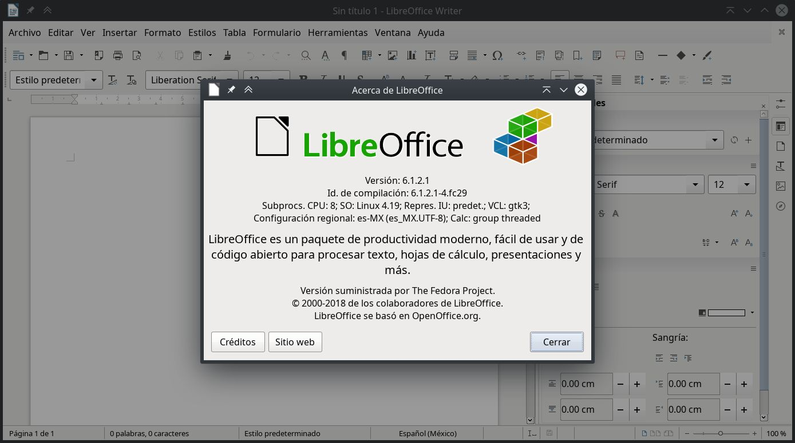
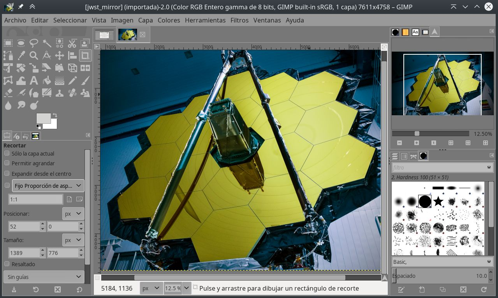
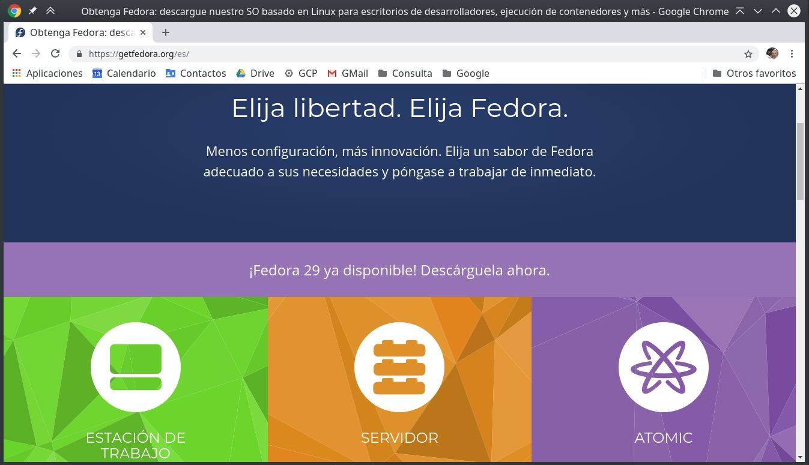
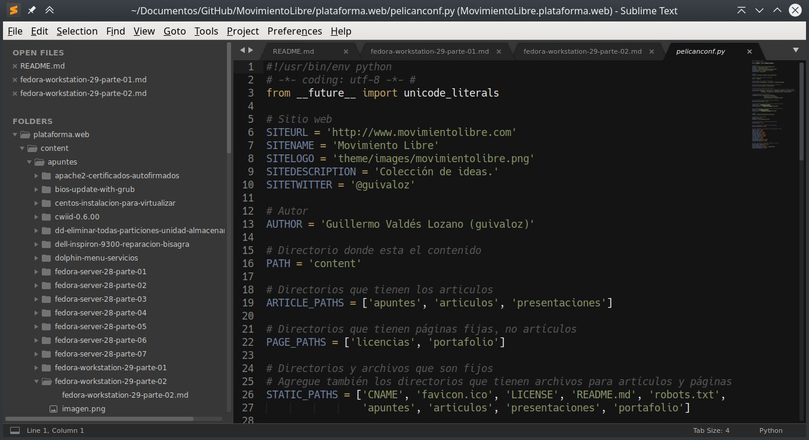
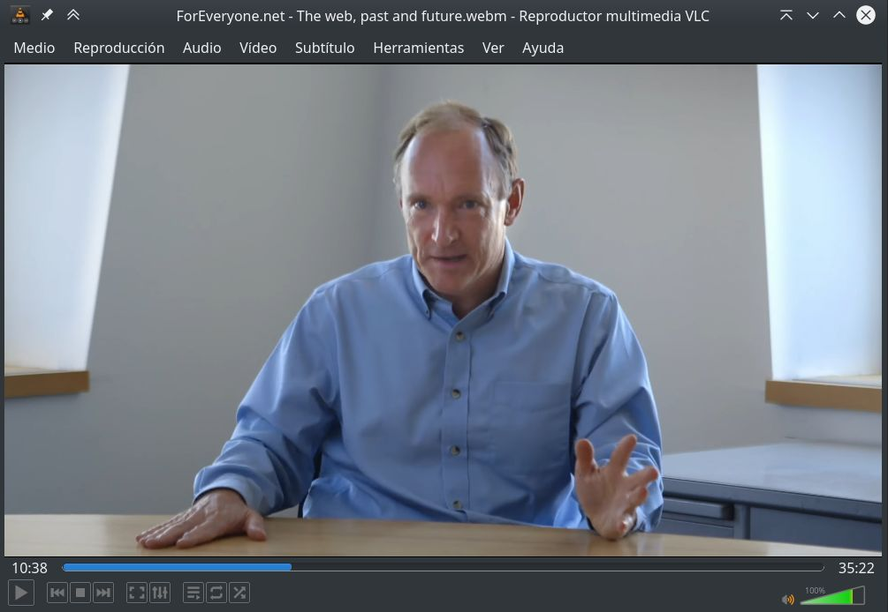

Title: Instalación de Fedora Workstation 29, parte 2
Slug: fedora-workstation-29-parte-02
Summary: Listo los comandos de instalación del software (preferido por el autor) en Fedora Linux 29 con KDE.
Tags: fedora, gnu linux
Date: 2019-01-05 17:40
Modified: 2019-02-07 22:04
Category: apuntes
Preview: preview.png
Image: imagen.jpg

En este apunte sencillamente listo los comandos que irán instalando el software de mi elección personal. Luego de instalar [Fedora Workstation con KDE]({filename}/apuntes/fedora-workstation-29-parte-01/fedora-workstation-29-parte-01.md). Primero hacemos una actualización...

    # dnf upgrade

Y reiniciamos...

    # systemctl reboot

Instale LibreOffice y los programas cliente para PostgreSQL...

    # dnf group install --with-optional LibreOffice
    # dnf install libreoffice-help-es libreoffice-langpack-es
    # dnf install libreoffice-postgresql
    # dnf install postgresql

Instale LaTeX...

    # dnf search texlive-scheme
    # dnf install texlive-scheme-tetex
    # dnf install texlive-collection-latexextra
    # dnf install texlive-collection-pstricks
    # dnf install texlive-babel-spanish texlive-babel-spanish-doc texlive-hyphen-spanish
    # dnf install texlive-babel-english texlive-babel-english-doc texlive-hyphen-english
    # fmtutil --all -sys

Instale Python...

    # dnf group install --with-optional "Python Classroom"
    # dnf group install --with-optional "Python Science"

Instale utilerías diversas...

    # dnf install system-storage-manager
    # dnf install pwgen
    # dnf install youtube-dl
    # dnf install hwinfo

Instale software de KDE...

    # dnf install kate
    # dnf install filelight
    # dnf install umbrello
    # dnf install krename

Instale soporte para impresoras HP...

    # dnf install hplip

Instale GIMP...

    # dnf install gimp

Instale Inkscape...

    # dnf install inkscape

Instale temas de decoración de ventanas de GTK...

    # dnf install clearlooks-phenix-gtk2-theme clearlooks-phenix-gtk3-theme

Instale tipografías...

    # dnf install liberation-fonts
    # dnf install bitstream-vera-sans-fonts bitstream-vera-serif-fonts bitstream-vera-sans-mono-fonts
    # dnf install terminus-fonts

Instale el lector y convertidor de libros electrónicos Calibre...

    # dnf install calibre

Prepare los repositorios adicionales...

    # dnf install fedora-workstation-repositories
    # dnf repolist --all

Instale Google Chrome y sus tipografías...

    # dnf config-manager --set-enabled google-chrome
    # dnf update
    # dnf install google-chrome-stable
    # dnf install google-noto-sans-fonts google-noto-serif-fonts google-noto-mono-fonts
    # dnf install google-droid-sans-fonts google-droid-serif-fonts google-droid-sans-mono-fonts
    # dnf install google-roboto-fonts google-roboto-mono-fonts google-roboto-condensed-fonts

Configure los repositorios RPM Fusion...

    # dnf install https://download1.rpmfusion.org/free/fedora/rpmfusion-free-release-$(rpm -E %fedora).noarch.rpm \
      https://download1.rpmfusion.org/nonfree/fedora/rpmfusion-nonfree-release-$(rpm -E %fedora).noarch.rpm
    # dnf update

Para mi equipo, requiero el controlador _anterior_ y binario NVIDIA...

    # dnf search nvidia-390
    # dnf install xorg-x11-drv-nvidia-390xx akmod-nvidia-390xx
    # nano /etc/X11/xorg.conf.d/00-monitor.conf
    # systemctl reboot

Instale más programas de RPM Fusion...

    # dnf install fuse-exfat exfat-utils
    # dnf install ffmpeg ffmpegthumbs
    # dnf install mplayer mencoder
    # dnf install audacity-freeworld
    # dnf install k3b-extras-freeworld
    # dnf install kdenlive frei0r-plugins
    # dnf install moc
    # dnf groupupdate Multimedia

Para usar contenedores, instale Docker, después [configure]({filename}/apuntes/fedora-docker-configuracion/fedora-docker-configuracion.md)...

    # dnf install docker
    # dnf install docker-compose

Instale Sublime Text a partir de su propio repositorio...

    # rpm -v --import https://download.sublimetext.com/sublimehq-rpm-pub.gpg
    # dnf config-manager --add-repo https://download.sublimetext.com/rpm/stable/x86_64/sublime-text.repo
    # dnf update
    # dnf install sublime-text

Instale Libvirtd...

    # dnf group install 'Virtualización' --with-optional

Instale Steam, a partir de RPM Fusion...

    # dnf config-manager --set-enabled rpmfusion-nonfree-steam
    # dnf install steam

Instale VLC, con complementos desde RPM Fusion...

    # dnf install vlc
