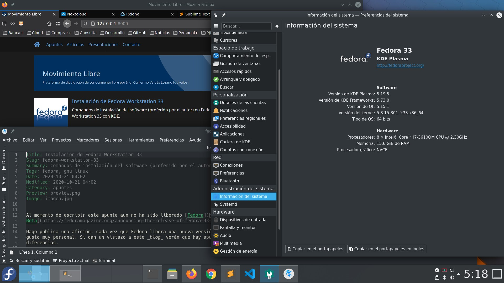

Title: Instalación de Fedora Workstation 33
Slug: fedora-workstation-33
Summary: Comandos de instalación del software (preferido por el autor) en Fedora Workstation 33 con KDE.
Tags: fedora, gnu linux
Date: 2020-10-21 05:20
Modified: 2020-11-01 16:20
Category: apuntes
Preview: preview.png
Image: fedora-33-kde.jpg

**ACTUALIZADO:** Ya está disponible [Fedora](https://getfedora.org/) en su versión 33; que entre sus novedades usa [BTRFS](https://es.wikipedia.org/wiki/Btrfs) por defecto como sistema de archivos.

Hago pública una afición: cada vez que Fedora libera una nueva versión, hago una instalación nueva desde _formatear_ hasta restaurar (y revisar) mi _home_. Es mi gusto muy personal. Si dan un vistazo a este _blog_ verán que hay apuntes con los pasos de las versiones anteriores; al compararlos podremos observar ligeras diferencias.

## Instalación de Fedora 33

Luego de instalar [Fedora 33 Spin con KDE Plasma](https://spins.fedoraproject.org/es/kde/) con una memoria USB hacemos una actualización...

    $ sudo dnf --refresh check-update
    $ sudo dnf update

Y reiniciamos...

    # systemctl reboot

## El Spin de Fedora KDE Plasma viene muy completo

Sólo necesito pocas utilerías del sistema...

    $ sudo dnf install system-storage-manager
    $ sudo dnf install pwgen youtube-dl hwinfo htop

Y otras cercanas a KDE...

    $ sudo dnf install kate filelight krename

De parte de las herramientas para gráficas instalamos [GIMP](https://www.gimp.org/) e [Inkscape](https://inkscape.org/)...

    $ sudo dnf install gimp
    $ sudo dnf install inkscape

Si tiene colección de libros electrónicos use [Calibre](https://calibre-ebook.com/)...

    $ sudo dnf install calibre

Si necesita virtualizar recomiendo [Libvirt](https://libvirt.org/)...

    $ sudo dnf group install 'Virtualización' --with-optional

## Instalar software para contenedores

Fedora dejó atrás a Docker e impulsa los contenedores con [Podman](https://podman.io/)...

    $ sudo dnf group install 'Administración de contenedores'

## Instalar Google Chrome

Hay que instalar repositorios extras...

    $ sudo dnf install fedora-workstation-repositories
    $ sudo dnf update
    $ sudo dnf repolist --all

Luego activar el repositorio...

    $ sudo dnf config-manager --set-enabled google-chrome
    $ sudo dnf update

E instalar [Google Chrome](https://www.google.com/intl/es/chrome/)...

    $ sudo dnf install google-chrome-stable

Aproveche para agregar tipografías...

    $ sudo dnf install google-roboto-condensed-fonts google-roboto-fonts google-roboto-mono-fonts
    $ sudo dnf install google-droid-fonts-all

## Instalar Visual Studio Code

Microsoft a dado al mundo del Software Libre a [Visual Studio Code](https://code.visualstudio.com/) que es un entorno de desarrollo muy completo.

Según la documentación oficial se debe configurar el repositorio así...

    $ sudo rpm --import https://packages.microsoft.com/keys/microsoft.asc
    $ ls /etc/yum.repos.d/
    $ sudo sh -c 'echo -e "[code]\nname=Visual Studio Code\nbaseurl=https://packages.microsoft.com/yumrepos/vscode\nenabled=1\ngpgcheck=1\ngpgkey=https://packages.microsoft.com/keys/microsoft.asc" > /etc/yum.repos.d/vscode.repo'
    $ cat /etc/yum.repos.d/vscode.repo

E instalar con...

    $ sudo dnf check-update
    $ sudo dnf install code

**ACTUALIZADO:** Para desarrollar software con Python installo **Python Classroom** para tener varias versiones y herramientas adicionales...

    $ sudo dnf groupinstall "Python Classroom"

## Instalar Sublime Text

[Sublime Text](https://www.sublimetext.com/) es un editor de código de pago, minimalista y poderoso...

    $ sudo rpm -v --import https://download.sublimetext.com/sublimehq-rpm-pub.gpg
    $ sudo dnf config-manager --add-repo https://download.sublimetext.com/rpm/stable/x86_64/sublime-text.repo
    $ sudo dnf update
    $ sudo dnf install sublime-text

## Instalar LibreOffice

Indispensable tener la suite de ofimática...

    $ sudo dnf group install --with-optional LibreOffice
    $ sudo dnf install libreoffice-help-es libreoffice-langpack-es

## Instalar LaTeX

Así como las herramientas profesionales de [LaTeX](https://en.wikibooks.org/wiki/LaTeX) para crear documentos y [TexStudio](https://www.texstudio.org/) como editor...

    $ sudo dnf install texlive-scheme-tetex
    $ sudo dnf install texlive-collection-latexextra
    $ sudo dnf install texlive-collection-pstricks
    $ sudo dnf install texlive-babel-spanish texlive-babel-spanish-doc texlive-hyphen-spanish
    $ sudo dnf install texlive-babel-english texlive-babel-english-doc texlive-hyphen-english
    $ sudo dnf install texstudio

## RPM Fusion

Software de terceros que no se encuentra en los repositorios de Fedora, se descarga desde RPM Fusion. En particular instalo reproductores y editores de video...

    $ sudo dnf install https://mirrors.rpmfusion.org/free/fedora/rpmfusion-free-release-$(rpm -E %fedora).noarch.rpm https://mirrors.rpmfusion.org/nonfree/fedora/rpmfusion-nonfree-release-$(rpm -E %fedora).noarch.rpm
    $ sudo dnf update
    $ sudo dnf install ffmpeg ffmpegthumbs
    $ sudo dnf install mpv
    $ sudo dnf install kdenlive frei0r-plugins

## Clientes para la nube

Nuevos aliados en esta instalación es el cliente de escritorio para [Nextcloud](https://nextcloud.com/)...

    $ sudo dnf install nextcloud-client

Y el comando [RClone](https://rclone.org/) para sincronizar con múltiples servicios de la nube...

    $ sudo dnf install rclone
