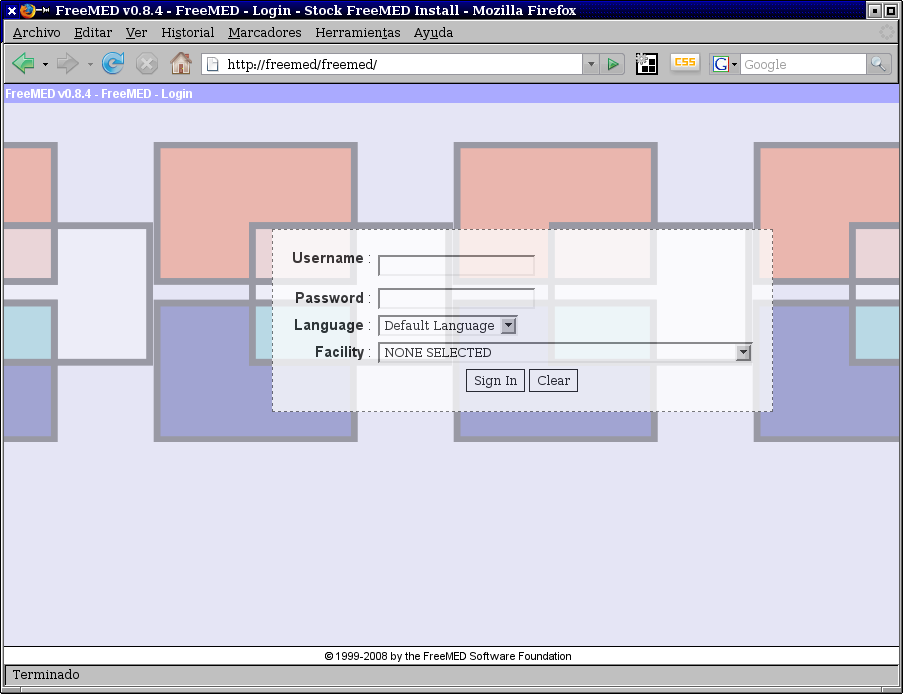
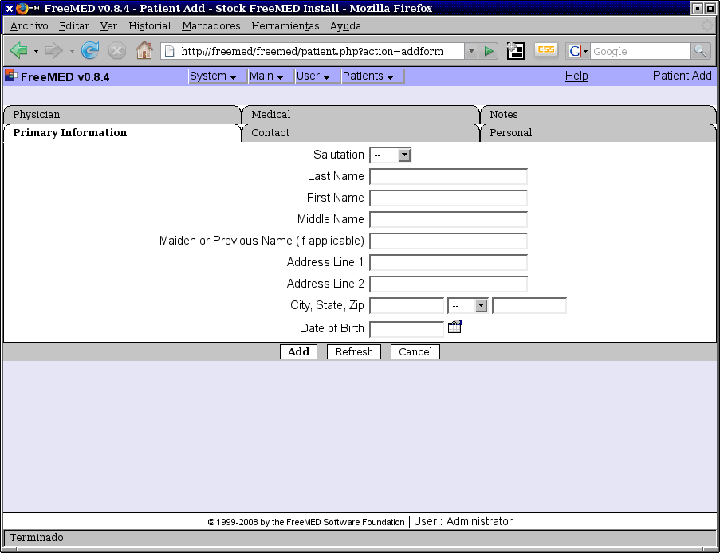
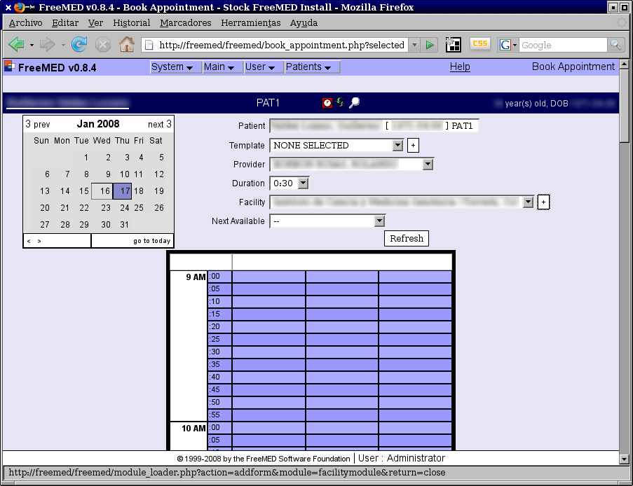
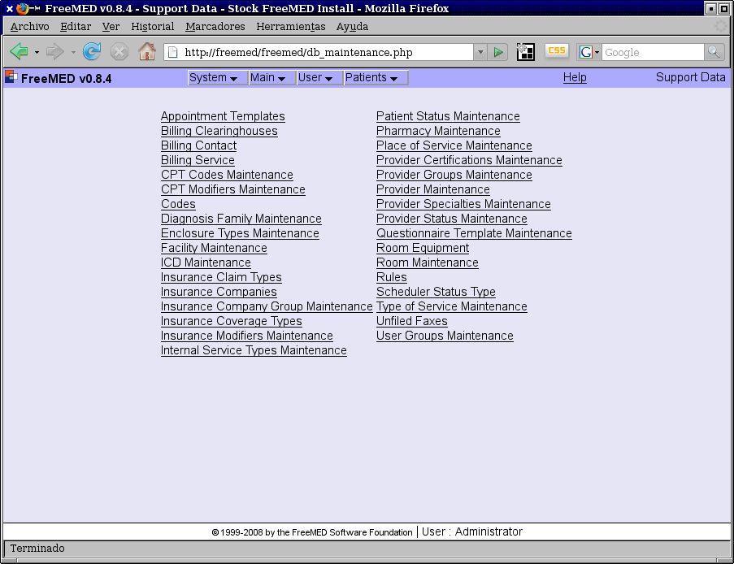
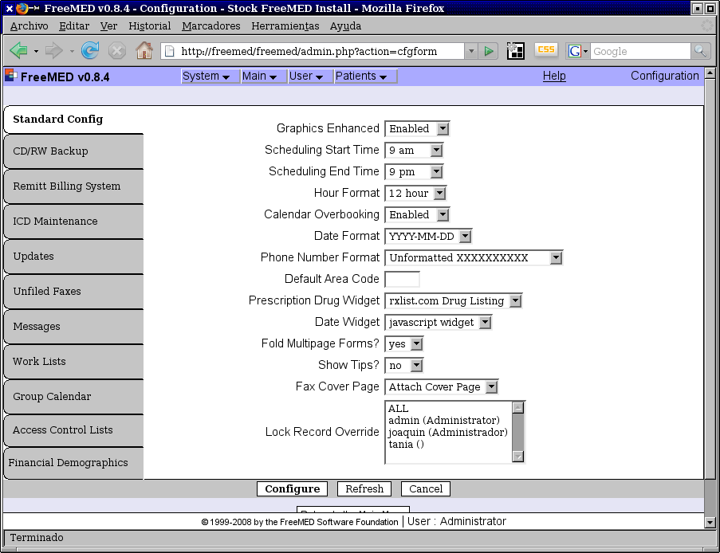
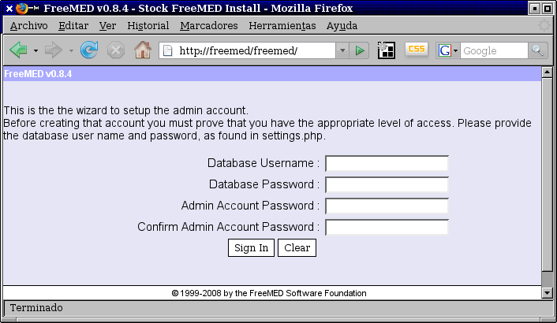
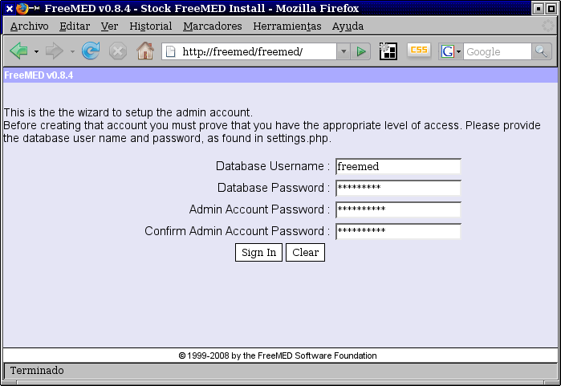
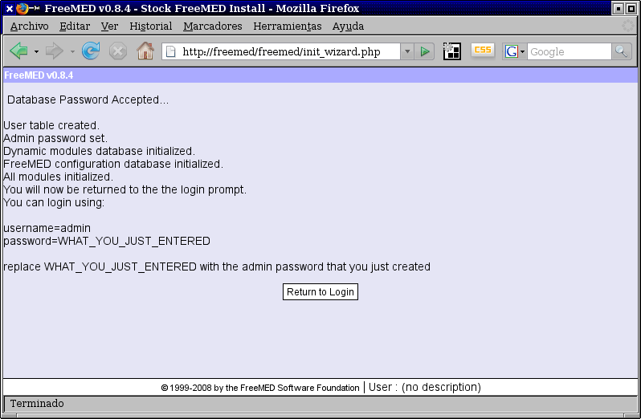
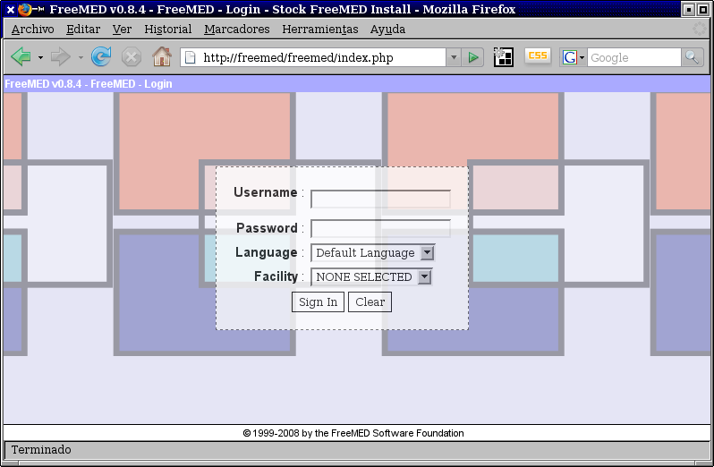

Title: Instalación de FreeMED en Debian Etch
Slug: freemed-instalacion
Summary: La instalación del FreeMED, una aplicación web basada en PHP, MySQL y Apache que sirve para administrar las citas de los pacientes con sus médicos.
Tags: php
Date: 2008-01-16 19:10
Modified: 2008-01-16 19:10
Category: apuntes
Preview: php.png

**ACTUALIZACION** Freemed ya es compatible con PHP5 y MySQL5, [Más información aquí](http://www.freemedsoftware.org/node/187).

No cabe duda que el mundo del software libre es vasto y que podemos encontrar respuesta a problemas particulares. Todos nos hemos preguntado alguna vez: ¿tendrá alguien más mi problema? ¿ya habrá una solución en software libre?.

Les explicaré a continuación la instalación del [FreeMED](http://freemed.org/), una aplicación web basada en **PHP**, **MySQL** y **Apache** que sirve (en principio) para administrar las citas de los pacientes con sus médicos. He aquí unas imágenes del mismo:

El proyecto se ve maduro, tiene un código genial y es usado en varios países. Pero tiene en este momento dos desventajas: el sistema está programado en **PHP 4** (incompatible con el más nuevo PHP 5) y necesita invariablemente el **MySQL 4** (falla con MySQL 5). Tiene traducción al español, aunque se le notan varios errores en ello.

Mi gusto personal es que los servidores tengan instalada la distribución [Gentoo](http://www.gentoo.org/). Pero los líderes de Gentoo han removido al PHP 4 de sus repositorios, por la sencilla razón de que *PHP 4 está _sentenciado a muerte_*: en un futuro muy próximo se le dejará de dar mantenimiento. Lamentablemente tenemos al día de hoy un enorme número de buenos sistemas en PHP 4 que necesitan ser migrados al PHP 5 si es que quieren _mantenerse vivos_ en los años venideros. Uno de tantos es el FreeMED. Ni modo, la mejor opción para este sistema es [Debian](http://www.debian.org/) no es Gentoo.

El otro problema es que **necesita MySQL 4**, por que los comandos SQL que usa fallarán al tratar de insertar fechas en MySQL 5. No aparece MySQL 4 en Debian Lenny, así que tendremos que usar **Debian Etch**.

Vamos a partir de que tenga instalado Debian Etch en su equipo, a partir de un disco de instalación por red (CD de network install), ya que no es obligado tener interfaz gráfica en el servidor...

### Instalaciones

Instale Apache 2, MySQL, PHP 4, TeTeX y Subversion:

    # aptitude update
    # aptitude install apache2 libapache2-mod-php4 php4-cgi mysql-server-4.1 php4-mysql imagemagick tetex-bin tetex-extra subversion

### Cree el usuario y la base de datos para el FreeMED en MySQL

Si necesita establecer la contraseña del usuario root en MySQL:

    # mysqladmin -u root password ROOTPASSWD

Ingrese a MySQL como root:

    # mysql -u root -p
    Enter password:******

Otorgue (y en consecencia se creará el usuario) a freemed los privilegios totales en esa base de datos:

    > GRANT ALL ON freemed.* TO freemed@localhost IDENTIFIED BY 'FREEMEDPASSWD';

Salga de MySQL con:

    > EXIT

### Baje el FreeMED

Debe instalarse FreeMED en /usr/share/freemed. Tenga paciencia con el comando *svn*, ya que puede tardar varios minutos en mostrar actividad.

    # mkdir /usr/share/freemed
    # cd /usr/share
    # svn co http://svn.freemedsoftware.org/freemed/branches/0.8.x freemed

Cambie los permisos de todos los archivos del FreeMED al usuario del Apache:

    # chown -Rf www-data:www-data freemed

### Configure el Apache

Edite la directiva DirectoryIndex de Apache para que tome por defecto primero a index.php y luego a los demás:

    # nano -w /etc/apache2/mods-available/dir.conf

Contenido:

    <IfModule mod_dir.c>
        DirectoryIndex index.php index.html index.cgi index.pl index.xhtml
    </IfModule>

Necesitamos declararle al Apache dónde se encuentra el sistema FreeMED, así que modificaremos su configuración:

    # nano -w /etc/apache2/sites-available/default

A continuación muestro parte del contenido en _default_ para que usted haga las modificaciones necesarias, cuidando que no se afecten otros sitios o aplicaciones web que estén también en su servidor:

    NameVirtualHost *
    <VirtualHost *>
        # Puede hacer que cualquier petición a / sea redirigida a /freemed/
        <Directory /var/www/>
            Options Indexes FollowSymLinks MultiViews
            AllowOverride None
            Order allow,deny
            Allow from all
            # La siguiente instrucción hace lo comentado previamente:
            RedirectMatch ^/$ /freemed/
        </Directory>
        # Aplicación web FreeMED
        Alias /freemed/ /usr/share/freemed/
        <Directory /usr/share/freemed/>
            Options Indexes FollowSymLinks MultiViews
            AllowOverride None
            Order allow,deny
            Allow from all
        </Directory>
    </VirtualHost>

Reinicie el Apache para que se apliquen los cambios que hemos hecho

    # /etc/init.d/apache2 restart

### Configure FreeMed

    # nano -w /usr/share/freemed/lib/settings.php

Modifique los siguientes comandos:

    define ('DB_HOST', "localhost");          // database (SQL) host location
    define ('DB_NAME', "freemed");            // database name
    define ('DB_USER', "freemed");            // SQL server username
    define ('DB_PASSWORD', "FREEMEDPASSWD");  // SQL server password
    define ('HOST', 'freemed');               // host name for this system
    define ('BASE_URL', '/freemed');          // offset (i.e. http://here/package)

Si el servidor no tiene instalada la interfaz gráfica, y por lo tanto, no tiene instalado un navegador de internet, necesitará autorizar que el script de instalación sea ejecutado desde otra estación de trabajo modificando la siguiente línea, use la IP del equipo donde entrará por primera vez a FreeMED:

    define ('INIT_ADDR',"192.168.1.66");  // this is the only IP address that can run the init wizard...

### Hostname

Como uso un modem 2Wire de Infinitum que es un ruteador y un ligero DNS, necesito que se pueda accesar a la aplicación web escribiendo http://freemed desde cualquier estación de trabajo. Modifique el archivo de configuración del dhclient3:

    # nano -w /etc/dhcp3/dhclient.conf

Y modifique esta línea:

    send host-name "freemed"

Y reinicie el servidor. Entre a la página _home_ del módem 2Wire para confirmar que el _hostname_ del servidor sea freemed.

### Script de instalación

Visite la página del sistema por el navegador, http://freemed/. Si todo va bien, el sistema se dará cuenta que es ejecutado por primera vez.

Escriba el nombre de la base de datos (que llamamos igual _freemed_) y la contraseña que haya declarado para el usuario _freemed_. También debe escribir en dos ocasiones la contraseña del administrador del sistema. Procure tomar nota y evite confundirse. Tenga en mente que el sistema operativo, los servicios y los sistemas pueden tener sus propios usuarios y contraseñas.

Así se crearán y poblarán las tablas de la base de datos. La instalación estará terminada.

En la pantalla de ingreso, use como nombre de usuario *admin* y escriba la contraseña del administrador:

Estaré aprendiendiendo el uso de este sistema. Esperen comentarios futuros.
