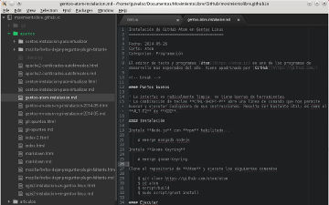

Title: Instalación de Atom en Gentoo Linux
Slug: gentoo-atom-instalacion
Summary: El editor Atom es uno de los programas para el desarrollo de software más esperados del año.
Tags: gentoo linux, desarrollo
Date: 2014-05-26 15:00
Modified: 2014-05-26 15:00
Category: apuntes
Preview: atom.png

El editor [Atom](https://atom.io) es uno de los programas para el desarrollo de software más esperados del año. Viene _apadrinado_ por [GitHub](https://github.com/) y con la colaboración de cientos o miles de programadores quienes lo enriquecen fácilmente gracias a su estructura modular. El proceso de instalación, aunque sugiere Ubuntu, se aplica también para Gentoo Linux.

### Puntos buenos

* La interfaz es radicalmente limpia: no tiene barras de herramientas.
* La combinación de teclas **CTRL-SHIFT-P** abre una línea de comando que nos permite buscar y ejecutar cualquiera de sus instrucciones. Resulta ser bastante útil; es como el **ALT-F2** de **KDE**.

### Instalación

Instale **Node.js** con **npm** habilitado...

    # emerge nodejs

Instale **Gnome Keyring**

    # emerge gnome-keyring

Clone el repositorio de **Atom** y ejecute los siguientes comandos

    $ git clone https://github.com/atom/atom
    $ cd atom
    $ script/build
    $ sudo script/grunt install

### Ejecutar

Lo mejor es usar su explorador de archivos Dolphin/Thunar/Nautilus y solicitar una terminal en el directorio de su interés. En ésta ejecute:

    $ atom

Así el directorio desde donde se haya lanzado, será el directorio base para Atom. Llama la atención que detecta la presencia de un repositorio Git si es que lo tiene en la presente ubicación.

### Referencias

* [Atom](https://atom.io)
* [Atom repositorio](https://github.com/atom/atom)
* [Atom Linux build instructions](https://github.com/atom/atom/blob/master/docs/build-instructions/linux.md)
