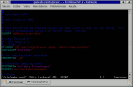
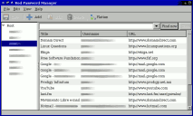
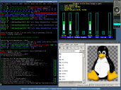
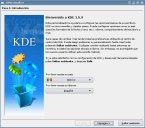

Title: Mi instalación personal de Gentoo Linux, segunda parte (actualizado 2008-nov)
Slug: gentoo-linux-mi-instalacion-personal-2
Summary: En este manual vamos rumbo a tener un entorno de escritorio KDE y los paquetes preferidos de su servidor.
Tags: gentoo linux
Date: 2008-11-15 21:05
Modified: 2008-11-15 21:05
Category: apuntes
Preview: preview.jpg

Algo de lo mucho que me maravilla del [Software Libre](http://es.wikipedia.org/wiki/Portal:Software_libre) es la gran cantidad y variedad de aplicaciones que existen en éste, las hay para todas las necesidades y gustos. Ante tal diversidad, en algunas ocasiones nos podemos sentir desorientados, en el sentido de decidir cuáles aplicaciones nos conviene instalar.

Podemos imaginarnos que el Software Libre es un gran bosque, donde nosotros como exploradores nos aventuramos en él, descubrimos lugares facinantes y compartimos nuestras experiencias.

Lo que pretendo con este manual, es mostrarles mi ruta preferida en este bosque, es decir, paso a paso cómo voy instalando mis aplicaciones preferidas hasta llegar a tener mi entorno de trabajo habitual. Debo dar mérito a muchos usuarios como ustedes que me han mostrado muchos de estos paquetes. También a los buscadores como [Google](http://www.google.com.mx/) y a los foros de discusión como buena fuente de información para conocer las aplicaciones libres.

Claro que aquí están impresas mis preferencias personales. En el Software Libre, todos tenemos la libertad de elegir las aplicaciones que queramos usar. Tome Usted de este manual la información que más le convenga...

### Sobre esta segunda parte

En la [primera parte](gentoo-linux-mi-instalacion-personal-1.html) de este manual hemos logrado instalar Gentoo Linux a un nivel *básico*, esto es, que podemos arrancar con éste y llegar a la consola en modo texto.

Si la meta de nuestra nueva instalación es tener un servidor de archivos, web, base de datos o _firewall_, instalaríamos sólo los paquetes necesarios para ello, por ejemplo, para un servidor *LAMP* instalamos *Apache*, *MySQL* y *PHP*. Al configurarlos y ponerlos en marcha tendrá listo un servidor eficiente y rápido con Gentoo Linux.

En cambio, en este manual vamos rumbo a tener un entorno de escritorio KDE y los paquetes preferidos de su servidor. Serán más pasos que si fuéramos a instalar un servidor.

### Cómo instalar un nuevo Gentoo Linux usando la instalación anterior

Tal como fue en la [primera parte](gentoo-linux-mi-instalacion-personal-1.html) podemos continuar instalando la _nueva instalación_ mientras trabajamos en la _anterior instalación_. Gracias a que todo lo podemos hacer en una terminal.

Para ello, hice este sencillo _bash script_ para *montar las particiones de la nueva instalación*. Ajuste las definiciones de las particones (/dev/sdaN) a las correspondientes en su equipo. Debe primero crear el directorio */mnt/gentoo*. Ejecútelo como _root_.

    #!/bin/bash
    echo Montando...
    mount /dev/sda6 /mnt/gentoo
    mount /dev/sda3 /mnt/gentoo/usr/portage
    mount /dev/sda1 /mnt/gentoo/boot
    mount /dev/sda2 /mnt/gentoo/home
    mount /dev/sda7 /mnt/gentoo/mnt/anterior
    mount -t proc none /mnt/gentoo/proc
    mount -o bind /dev /mnt/gentoo/dev
    cp /etc/resolv.conf /mnt/gentoo/etc/
    echo Listo.
    mount | grep /mnt/gentoo

Despúes de ejecutarlo, hago el _chroot_ y actualizo las variables del entorno.

    # chroot /mnt/gentoo /bin/bash
    # env-update
    # source /etc/profile
    # export PS1="(chroot) $PS1"

Listo. Puede continuar la instalación.

Le advierto que si dentro del _chroot_ arranca un _demonio o servicio_ éste pudiera tener conflictos con los _demonios_ del sistema que esté usando. Por ejemplo, si dentro del _chroot_ arranco el *PostgreSQL* y también lo tengo corriendo en el otro sistema, entonces ambos solicitarán los mismos puertos *TCP* para comunicarse y uno de los dos fallará. Así pues, le recomiendo que sólo instale y configure; cuando reinicie el equipo y entre en su nueva instalación podrá probar sus _demonios_.

Si quiero abandonar el _chroot_ ejecuto *exit*.

    # exit

Y ejecuto este otro _bash script_ para *desmontar las particiones*.

    #!/bin/bash
    echo Desmontando...
    umount /mnt/gentoo/dev
    umount /mnt/gentoo/proc
    umount /mnt/gentoo/mnt/anterior
    umount /mnt/gentoo/home
    umount /mnt/gentoo/boot
    umount /mnt/gentoo/usr/portage
    umount /mnt/gentoo
    echo Listo.
    mount | grep /mnt/gentoo

### Cambio el _profile_

Instalo *eselect*, que es un programa para revisar y cambiar ciertas configuraciones del sistema; entre ellas el _profile_ establecido.

    # emerge eselect

Por defecto, el stage *stage3-i686-2008.0.tar.bz2* usa un _profile_ genérico. Para ver el profile en uso, ejecuto:

    # eselect profile show
    Current make.profile symlink:
      /usr/portage/profiles/default/linux/x86/2008.0

Para listar todos los _profiles_ disponibles, ejecuto:

    # eselect profile list
    Available profile symlink targets:
      [1]   default-linux/x86/2006.1
      [2]   default-linux/x86/2006.1/desktop
      [3]   default-linux/x86/2007.0
      [4]   default-linux/x86/2007.0/desktop
      [5]   hardened/x86/2.6
      [6]   selinux/2007.0/x86
      [7]   selinux/2007.0/x86/hardened
      [8]   default/linux/x86/2008.0 *
      [9]   default/linux/x86/2008.0/desktop
      [10]  default/linux/x86/2008.0/developer
      [11]  default/linux/x86/2008.0/server
      [12]  hardened/linux/x86

Como nuestro fin es Gentoo Linux con entorno de escritorio completo, vamos a seleccionar el _profile_ *desktop*.

    # eselect profile set default/linux/x86/2008.0/desktop

Y reviso para asegurarme del cambio:

    # eselect profile show
    Current make.profile symlink:
      /usr/portage/profiles/default/linux/x86/2008.0/desktop

### Configuraciones adicionales para el _portage_

En */etc/make.conf* se definen los parámetros de compilación de los paquetes que vayan a instalar. La variable *USE* está formada por una serie de banderas o _flags_ que habilitan o deshabilitan opciones de la compilación de los paquetes.

Las opciones que escriba en la variable *USE* dependerán de muchos factores, desde los componentes de hardware hasta el uso fina que le vaya a dar al equipo. Por ejemplo, yo prefiero *no usar _arts_* el cual es el demonio de sonido del KDE. No funciona tan bien como desearía; aunque su desactivación me deja sin ningún sonido para los avisos del KDE; prefiero un entorno silencioso y configurar ALSA como la salida del sonido.

Este es el contenido de mi archivo */etc/make.conf*

    #
    # /etc/make.conf
    #
    # Dell Inspiron 9300
    #

    # This should not be changed unless you know exactly what you are doing.  You
    # should probably be using a different stage, instead.
    CHOST="i686-pc-linux-gnu"

    # Intel(R) Pentium(R) M processor 1.73GHz
    #   CPU Family : 6
    #   Model      : 13
    CFLAGS="-O2 -march=pentium-m -pipe -fomit-frame-pointer"
    CXXFLAGS="${CFLAGS}"

    # Dos compilaciones paralelas
    MAKEOPTS="-j2"

    # Conservar compilaciones
    FEATURES="buildpkg fixpackages"
    PKGDIR=/usr/portage/packages

    # Idioma
    LINGUAS="es"

    #
    # Variable USE
    #
    USE="-arts -gnome -kerberos a52 aac aalib amr amrnb amrwb apache2 bluetooth \\
    cups curl css dts dv dvb ffmpeg flac ftp gd gtk ieee1394 imagemagick java \\
    joystick kde laptop lame matroska mmx mmxext mtp php ppd pcmcia postgres \\
    qt3 qt4 ruby samba sse sse2 theora threads v4l v4l2 vcd wifi x264 \\
    xscreensaver xvid"

    # Xorg
    INPUT_DEVICES="keyboard mouse synaptics joystick evdev"
    VIDEO_CARDS="radeon vesa"

    # Apache 2
    APACHE2_MODULES="actions alias auth_basic authn_anon authn_default \\
    authn_file authz_default authz_groupfile authz_host authz_owner authz_user \\
    autoindex cache deflate dir disk_cache env expires file_cache filter \\
    include info log_config logio mem_cache mime mime_magic negotiation \\
    rewrite setenvif status unique_id vhost_alias"

    # Servidor de paquetes
    #PORTDIR=/usr/portage
    #DISTDIR=${PORTDIR}/distfiles
    #SYNC=rsync://SERVIDOR/gentoo-portage
    #FETCHCOMMAND="rsync rsync://SERVIDOR/gentoo-packages/\${FILE} ${DISTDIR}"

En */etc/portage/package.use* doy cambios en la variable USE a programas en particular.

    # HAL con soporte para Dell Inspiron 9300
    sys-apps/hal dell

    # Sin GTK+
    sys-devel/gcc -gtk
    media-libs/imlib -gtk

    # Sin gd
    sys-libs/glibc -gd

    # Java plug-in para los navegadores de internet
    dev-java/sun-jdk nsplugin

    # Krdc con remote desktop
    kde-base/krdc rdesktop

    # LaTeX con componentes extra
    app-text/texlive extra

    # wxGTK es usado por Audacity. Sin GStreamer
    x11-libs/wxGTK -gstreamer

    # KMPlayer debe usar solo MPlayer y Xine
    media-video/kmplayer -gstreamer mplayer xine

    # XSane es para que Gimp pueda usar el scanner
    media-gfx/xsane gimp

    # i8kutils requiere tk para monitorear la temperatura
    app-laptop/i8kutils tk

En */etc/portage/package.keywords* doy permiso a Gentoo Linux que instale las versiones inestables de ciertos paquetes.

    # KPowerSave
    sys-power/kpowersave

    # Mozilla Firefox 3.0
    net-libs/xulrunner
    dev-libs/nspr
    dev-libs/nss
    www-client/mozilla-firefox

    # Para usar el scanner HP Scanjet 4070 necesito el driver hp3900
    media-gfx/sane-backends

### Servidor gráfico: el Xorg

La primer instalación es el servidor [X.org](http://www.x.org/) que constituye el motor gráfico, para la posterior instalación del (o los) entornos gráficos. Así como algunas tipografías libres.

    # emerge xorg-x11
    # rc-update add dbus default
    # emerge freefonts terminus-font corefonts

Debe de configurar *xorg.conf* de acuerdo a su equipo. Yo ya tengo listo mi archivo [xorg.conf](xorg.conf) para mi Dell Inspiron 9300 con chip ATI M22. En esta instrucción hago una copia de la instalación anterior.

    # cp /mnt/anterior/etc/X11/xorg.conf /etc/X11/

Para probar que X.org funcione bien, instale y ejecute un gestor de ventanas ligero, le recomiendo [FluxBox](http://fluxbox.sourceforge.net/).

    # emerge fluxbox

Una forma para usar Fluxbox es crear un archivo llamado *.xinitrc* con el nombre del ejecutable. Este archivo debe de estar en el *home* del usuario. Estando listo, arranque las X's con FluxBox ejecutando *startx*.

    $ echo "fluxbox" > ~/.xinitrc
    $ startx

Muy en particular para la Dell Inspiron 9300 instalo estas utilerías propias para el hardware que tengo:

    # emerge radeontool
    # emerge i8kutils

### Base de datos: PostgreSQL

Mi base de datos preferida es el [PostgreSQL](http://www.postgresql.org/), el cual instalo con:

    # emerge postgresql
    # emerge --config =postgresql-8.0.15
    # rc-update add postgresql default

Puede arrancar el _demonio_ para dar de alta a un usuario del PostgreSQL (si está cargado sólo el nuevo sistema, recuerde lo mencionado en "Para hacer una nueva instalación mientras sigue usando la anterior").

    # /etc/init.d/postgresql start

Como _root_ cámbiese al usuario del sistema *postgres*:

    # su - postgres

Para crear el usuario *guivaloz* con cualidades para crear nuevas bases de datos y nuevos usuarios en el PostgreSQL

    $ createuser -a -d -P -E guivaloz
    $ exit

Si es paranoico, modifique la capacidad de ingresar como el usuario *postgres* para que *NO* ingrese.

    # usermod -s /sbin/nologin postgres

Pruebe que tenga acceso a las bases de datos con la cuenta de usuario.

    $ psql -l
          Listado de base de datos
      Nombre   |  Dueño   | Codificación
    -----------+----------+--------------
     template0 | postgres | UNICODE
     template1 | postgres | UNICODE
    (2 filas)

### Servicios para el desarrollo de aplicaciones web

Instalo el servidor de páginas web [Apache](http://httpd.apache.org/) y luego el lenguaje de programación [PHP](http://www.php.net/).

    # emerge apache
    # emerge php

### Java

Instalo el *Java* en este punnto, de una vez, ya que es una dependencia que me solicitarán los navegadores de internet. También me interesa el desarrollo en este lenguaje de programación.

    # emerge virtual/jre

### Samba

*Samba* es una implementación libre del protocolo de archivos compartidos de Microsoft Windows. Esta instalación jalará además los paquetes *CUPS* y *GTK+*.

    # emerge samba

### Más instalaciones previas a la instalación del KDE

Los [Dock Applications](http://www.dockapps.org/) son pequeños programas que en su mayoría trabajan como monitores del equipo. Son herencia del gestor de ventanas [Window Maker](http://es.wikipedia.org/wiki/Window_Maker) y consumen muy pocos recursos.

Mis preferidos son el monitor de la carga del procesador, de la memoria, y varios de redes. Los instalo con:

    # emerge wmcpuload wmmemmon wmnd wmifinfo wmwifi

Para controlar el muro de fuego, instalo el ejecutable que me permite controlarlo:

    # emerge iptables

Instalo el lenguaje de programación [Ruby](http://www.ruby-lang.org/) junto con la gema [RedCloth](http://whytheluckystiff.net/ruby/redcloth/) que uso en el [CMS de Movimiento Libre](http://cms.movimientolibre.com/):

    # emerge ruby eruby rubygems redcloth

[VIM](http://www.vim.org/) es un excelente editor de texto en consola:

    # emerge vim

Para ver fotografías, me gusta el [GQView](http://gqview.sourceforge.net/) el cual es ligero y rápido.

    # emerge gqview

Para guardar mis contraseñas uso el [KED Password Manager](http://kedpm.sourceforge.net/)

    # emerge kedpm

En el siguiente _screenshot_ verá al gestor de ventanas *FluxBox* con algunas aplicaciones que he instalado. Es más cómodo seguir instalando en este entorno, simplemente por que la terminal nos muestra más información.

### Base del KDE

Instalo el [HAL](http://www.freedesktop.org/Software/hal) que de hecho lo requiere el KDE. HAL es una capa de abstracción de hardware software que permite a las aplicaciones de escritorio tengan acceso a información de hardware.

    # emerge hal
    # rc-update add hald default

Al instalar *HAL* se crea el grupo *plugdev* al cual deben de agregarse los usuarios para poder montar dispositivos de almacenamiento externo (como las memorias USB). Así que agrego mi cuenta habitual a ese grupo.

    # gpasswd -a guivaloz plugdev

Instalo la base del KDE y la capacidad multilingüe del mismo con:

    # emerge kdebase-meta kde-i18n

Luego edito el archivo /etc/conf.d/xdm

    # nano -w /etc/conf.d/xdm

Configuro que al encender el equipo, arranquen las X's y se cargue el gestor gráfico *KDM* cambiando la siguiente línea:

    DISPLAYMANAGER="kdm"

Luego configuramos que se inicien las X's al encender el equipo.

    # rc-update add xdm default

Reinicie el equipo y pruebe su _nueva instalación_. *Bienvenido a KDE*.

 

En la [tercera parte de este manual](gentoo-linux-mi-instalacion-personal-3.html) continuaré con la instalación de mis aplicaciones favoritas.
