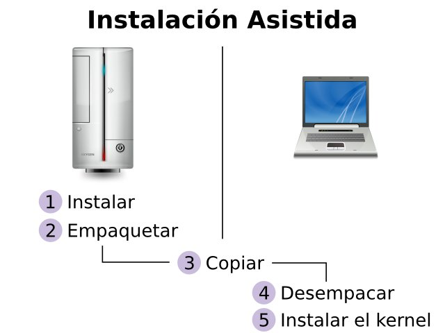

Title: Gentoo Linux en una netbook (2010, parte 1)
Slug: gentoo-linux-mi-instalacion-personal-2010-parte-1
Summary: Documento paso a paso la instalación de Gentoo Linux en una netbook con procesador Intel Atom N280.
Tags: gentoo linux
Date: 2010-11-20 10:40
Modified: 2010-11-20 10:40
Category: apuntes
Preview: preview.jpg

Después de varios meses de tener una instalación completa de [KDE](http://www.kde.org/) en mi _netbook_ comenzé a pensar de que el poderoso y grande ambiente gráfico le restaba potencial a mi equipo. Era frecuente que el administrador de archivos Dolphin demorara algunos segundos en cargar. También la carga y velocidad de respuesta de la suite de información personal (PIM), en particular de [KMail](http://pim.kde.org/), era lenta.

El concepto de una _netbook_ involucra un procesador versátil y modesto. El [Intel Atom](http://es.wikipedia.org/wiki/Intel_Atom) fue diseñado con ese fin, hereda mucha tecnología de la familia Pentium y consume poca energía para prolongar la duración de la carga en un equipo portátil. Pero **no** se trata de un procesador de alto rendimiento. Recordemos que fue _Windows XP_ y no _Windows Vista_ el que apareció preinstalado en las _netbooks_ a la venta, por obvias razones.

Antes de buscar la reinstalación, me pregunté... ¿de verdad necesito vistosos elementos en mi escritorio?, ¿vale la pena que [Plasma](http://www.kde.org/workspaces/plasmadesktop/) me consuma desde el 5% al 50% de mi procesador y en consecuencia más carga de mi batería?. Fue entonces que decidí arriesgarme, y tomar un entorno más simple, más rápido, que me consumiera menos recursos.

Siguiendo los pasos de esta guía, lograremos tener un sistema [Gentoo Linux](http://www.gentoo.org/) con tres opciones gráficas de trabajo:

* [Fluxbox](http://www.fluxbox.org/) es un gestor de ventanas muy ligero.
* [XFCE4](http://www.xfce.org/) es un entorno gráfico ligero con una buena cantidad de comodidades.
* [Compiz](http://www.compiz.org/) es un gestor de ventanas modular con efectos espectaculares.

Aclaro que lo que sigue es solo una guía; los pasos que su servidor ha ejecutado. Usted tiene la libertad de tomar el rumbo que guste. No deje de consultar la [Documentación Oficial de Instalación](http://www.gentoo.org/doc/en/handbook/) de Gentoo.

A continuación, documento paso a paso la instalación de Gentoo Linux en una _netbook_ con procesador **Intel Atom N280**. Le informo que los comandos con # son ejecutados con el super-usuario **root**, que de hecho, son la mayoría.

### Instalación asistida

No dudo que una _netbook_ pueda compilar todos los paquetes que necesito instalar para mi escritorio con Gentoo Linux; pero tardaría mucho, mucho tiempo. Es por ello que le paso esa labor a un equipo más poderoso; que lo haga en menos tiempo.

Ante esto... si los equipos son distintos... ¿funcionará lo que compile uno en el otro?. Para ello hay que revisar las similitudes y diferencias entre los procesadores de ambos equipos. Revise en [Gentoo Wiki](https://wiki.gentoo.org/) el documento [Safe CFlags](https://wiki.gentoo.org/wiki/Safe_Cflags) el cual muestra los parámetros recomendados de compilación para cada procesador.

Afortunadamente, en el momento de escribir esta guía, tanto el **Intel DualCore** como el **Atom 230, 330 N-Series** tienen los mismos parámetros de compilación:

    CHOST="i686-pc-linux-gnu"
    CFLAGS="-march=prescott -O2 -fomit-frame-pointer -pipe"
    CXXFLAGS="${CFLAGS}"

También es posible hacer compilación asistida si el procesador del equipo _poderoso_ tiene la misma arquitectura y/o es más _nuevo_ que el de los equipos de destino. Cuestión de probarlo. Por ejemplo, las compilaciones hechas con parámetros para el **VIA C7** en el _Intel DualCore_ me han funcionado:

    CHOST="i686-pc-linux-gnu"
    CFLAGS="-march=i686 -mmmx -msse -msse2 -msse3 -O2 -pipe -fomit-frame-pointer"
    CXXFLAGS="${CFLAGS}"

Para hacer una instalación asistida elija una ubicación en el disco duro del equipo _poderoso_ con suficiente espacio; lo necesario para contener el sistema completo y los archivos que descargue. Para dar una cifra, sugiero unos 8 GB libres. En mi equipo _poderoso_ uso /mnt/archivos/instalaciones para ese fin. Voy a crear ahí un directorio con el nombre _prescott_:

    # cd /mnt/archivos/instalaciones
    # mkdir prescott

### Use el stage más reciente

Mi sitio predilecto para descargar el _stage_ es en el [Oregon State University - Open Source Lab](http://osuosl.org/) en éste URL: [http://gentoo.osuosl.org/releases/](http://gentoo.osuosl.org/releases/). Note que parece un nuevo _stage_ frecuentemente. **Le recomiendo que siempre use el stage más nuevo**. Cuando escribí esta guía, bajé el _stage_ **x86** del 9 de noviembre de 2010:

    # cd /mnt/archivos/software/gentoo
    # wget http://gentoo.osuosl.org/releases/x86/current-stage3/stage3-i686-20101109.tar.bz2
    # wget http://gentoo.osuosl.org/releases/x86/current-stage3/stage3-i686-20101109.tar.bz2.CONTENTS
    # wget http://gentoo.osuosl.org/releases/x86/current-stage3/stage3-i686-20101109.tar.bz2.DIGESTS
    # wget http://gentoo.osuosl.org/releases/x86/current-stage3/stage3-i686-20101109.tar.bz2.DIGESTS.asc

Compruebe la integridad de los archivos descargados con...

    # md5sum -c stage3-i686-20101109.tar.bz2.DIGESTS

Desempaque.

    # cd /mnt/archivos/instalaciones/prescott
    # tar xvf /mnt/archivos/software/gentoo/stage3-i686-20101109.tar.bz2

Monte _dev_ y _proc_.

    # mount -t proc none /mnt/archivos/instalaciones/prescott/proc
    # mount -o bind /dev /mnt/archivos/instalaciones/prescott/dev

Copie la configuración de resolución de nombres. Esto es necesario para cuando el Gentoo esté _enjaulado_ por _chroot_, así sabrá cual es el _DNS_ de su red.

    # cp /etc/resolv.conf /mnt/archivos/instalaciones/prescott/etc/

Ingrese a al _stage_ con _chroot_.

    # chroot /mnt/archivos/instalaciones/prescott /bin/bash
    # env-update
    # source /etc/profile
    # export PS1="(prescott) $PS1"

### Configure

Edite /etc/make.conf

    # nano -w /etc/make.conf

Para el cual sugiero el siguiente contenido...

    #
    # /etc/make.conf
    #
    # Para Intel Prescott (Dual Core, Atom) de 32 bits
    #

    # WARNING: Changing your CHOST is not something that should be done lightly.
    # Please consult http://www.gentoo.org/doc/en/change-chost.xml before changing.
    CHOST="i686-pc-linux-gnu"

    #
    # Netbook con Intel Atom N280 @ 1.66 GHz
    #
    CFLAGS="-march=prescott -O2 -fomit-frame-pointer -pipe"
    CXXFLAGS="${CFLAGS}"

    # Puede hacer tres compilaciones en paralelo
    MAKEOPTS="-j3"

    # Espaniol como lengua
    LINGUAS="es es_MX"

    # Aceptar todas las licencias
    ACCEPT_LICENSE="*"

    #
    # Use Flags
    #

    # Intel Dual Core, Atom
    USE="acpi laptop mmx mmxext sse sse2 ssse3 threads"

    #
    # Servidor Portage
    #
    SERVIDOR_PORTAGE=otroequipo.tured.lan
    PORTDIR=/usr/portage
    DISTDIR=${PORTDIR}/distfiles
    SYNC=rsync://${SERVIDOR_PORTAGE}/gentoo-portage
    FETCHCOMMAND="rsync rsync://${SERVIDOR_PORTAGE}/gentoo-distfiles/\\${FILE} ${DISTDIR}"

Observe el final de /etc/make.conf donde configuro que las descargas se hagan desde _otroequipo.tured.lan_. Sustituya éste por el nombre de un equipo o por la dirección IP del equipo que comparta su _portage_ con el _daemon rsyncd_. En cambio, si no usa un equipo para compartir el _portage_ entonces omita las cinco últimas líneas para que las descargas se hagan desde internet.

Configure /etc/locale.gen

    # nano -w /etc/locale.gen

Con este contenido...

    # EEUU
    en_US ISO-8859-1
    en_US.UTF-8 UTF-8

    # Espania
    es_ES ISO-8859-1
    es_ES.UTF-8 UTF-8
    es_ES@euro ISO-8859-15

    # Mexico
    es_MX ISO-8859-1
    es_MX.UTF-8 UTF-8

Luego ejecute...

    # locale-gen

Descargue el _portage_.

    # mkdir /usr/portage
    # emerge --sync

Vamos a crear un nuevo archivo llamado _02locales_:

    # nano -w /etc/env.d/02locales

El archivo /etc/env.d/02locales contiene los parámetros de nuestro idioma y región:

    #
    # /etc/env.d/02locales
    #
    LANG="es_MX.UTF-8"
    LANGUAGE="es_MX.UTF-8"
    LC_ALL="es_MX.UTF-8"

Configure la zona horaria con:

    # nano -w /etc/conf.d/clock

Esta configuración hace que se ajuste la hora al iniciar o terminar el [Horario de verano](http://es.wikipedia.org/wiki/Horario_de_verano) conocido en el idioma inglés como _Daylight Saving Time_ (DST).

    TIMEZONE="Mexico/General"

Configure el mapa de caracteres de la terminal con:

    # nano -w /etc/conf.d/consolefont

Para tener un mayor soporte de caracteres uso:

    CONSOLEFONT="lat9v-16"

Configure el mapa del teclado con:

    # nano -w /etc/conf.d/keymaps

La gran mayoría de los teclados de computadoras de México funcionan con:

    KEYMAP="la-latin1"

Pero hay también un gran número de teclados españoles, se distinguen por tener la tecla "Ç", para esos hay que usar:

    KEYMAP="es"

Configure el nombre del equipo con:

    # nano -w /etc/conf.d/hostname

Recargue (de nuevo) las variables del entorno para asegurarnos que se apliquen los cambios hechos hasta el momento.

    # env-update
    # source /etc/profile
    # export PS1="(prescott) $PS1"

### ¿Quiere recompilar todo?

Es su decisión tener todos los paquetes del _stage_ compilados a sus parámetros en _make.conf_. Si así lo desea; ejecute _emerge -e world_. Pero le advierto que toma bastante tiempo. Si no quiere hacerlo, no hay problema, simplemente cada paquete nuevo que instale o actualice será compilado con los parámetros de _make.conf_.

    # emerge -pe world
    # emerge -e world

### Kernel Linux

Instale _ccache_.

    # emerge ccache
    # ccache -M 2G
    # export PATH="/usr/lib/ccache/bin:${PATH}"

Descargue el _kernel_.

    # emerge gentoo-sources
    # cd /usr/src/linux

Si ya he compilado la misma versión con anterioridad, copie el archivo _.config_ al directorio /usr/src/linux

    # make menuconfig
    # make
    # make modules_install

Como se trata de una compilación asistida, no voy a decirle que ejecute _make install_ para instalar el kernel; eso lo haré cuando haya copiado la instalación al equipo final. Lo verá en la siguiente parte de esta guía.

### Configure la tabla de particiones

Edite /etc/fstab

    # nano -w /etc/fstab

Este es un ejemplo de /etc/fstab

    # <fs>      <mountpoint>    <type>    <opts>          <dump/pass>
    /dev/sda1   /boot           ext2      noauto,noatime  1 2
    /dev/sda2   /home           ext4      defaults        0 1
    /dev/sda3   /mnt/respaldos  ext4      noauto          0 0
    /dev/sda5   none            swap      sw              0 0
    /dev/sda6   /mnt/anterior   ext4      noauto          0 0
    /dev/sda7   /mnt/ubuntu     ext4      noauto          0 0
    /dev/sda8   /               ext4      noatime         0 1
    /dev/sda9   /usr/portage    reiserfs  defaults        0 1
    /dev/sda10  /tmp            reiserfs  noatime         0 1
    /dev/sda11  /mnt/archivos   ext4      defaults        0 1

### Fin de la primera parte

Termina aquí la primera parte con una instalación de Gentoo Linux configurada y con un _kernel_ preparado. En la [segunda parte](gentoo-linux-mi-instalacion-personal-2010-parte-2.html), cambiaremos el _profile_ a _desktop_ e iremos instalando las aplicaciones favoritas de su servidor.

[Vaya a la Segunda parte.](gentoo-linux-mi-instalacion-personal-2010-parte-2.html)
