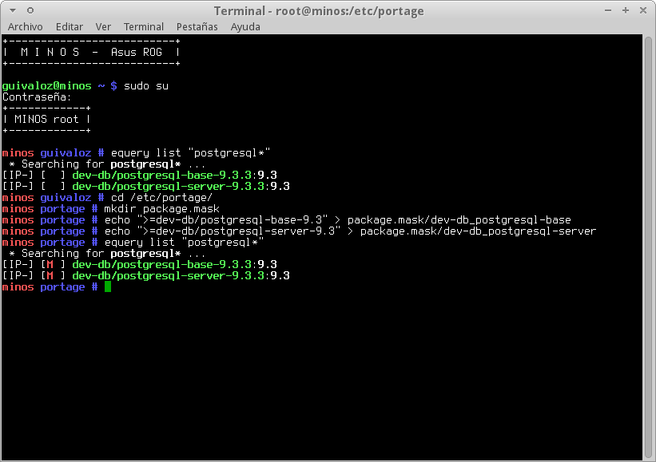

Title: Enmascarar paquetes en Gentoo Linux
Slug: gentoo-portage-enmascarar
Summary: Para evitar que una determinada versión de un paquete de software se instale en Gentoo Linux podemos enmascararlo.
Tags: gentoo linux
Date: 2014-07-26 13:00
Modified: 2014-07-26 13:00
Category: apuntes
Preview: preview.png

Para evitar que una determinada verisón de un paquete de software se instale en Gentoo Linux podemos _enmascararlo_.

Por ejemplo, necesito quedareme con PostgreSQL versión 9.2, aunque la versión 9.3 ya está marcada como estable. La razón es que las extensiones PostGIS estables son para la versión 9.3 de PostgreSQL.

Primero, verifico que tengo instalada la 9.3...

    # equery list "postgresql*"
     * Searching for postgresql* ...
    [IP-] [  ] dev-db/postgresql-base-9.3.3:9.3
    [IP-] [  ] dev-db/postgresql-server-9.3.3:9.3

Así que aprovecho las nuevas características del Portage para enmascarar. Creo un directorio llamado **package.mask** en **/etc/portage**:

    # cd /etc/portage/
    # mkdir package.mask

Y en dos archivos de texto, escribo la expresión **>=categoría/paquete-nn.nn**

    # echo ">=dev-db/postgresql-base-9.3" > package.mask/dev-db_postgresql-base
    # echo ">=dev-db/postgresql-server-9.3" > package.mask/dev-db_postgresql-server

Dichas expresiones equivalen a decir: _enmascara todas las versiones iguales o mayores a 9.3 del PostgreSQL_.

Verifico...

    minos portage # equery list "postgresql*"
     * Searching for postgresql* ...
    [IP-] [M ] dev-db/postgresql-base-9.3.3:9.3
    [IP-] [M ] dev-db/postgresql-server-9.3.3:9.3

Ahora sí, puedo desinstalar la versión 9.3 e instalar la 9.2 sin temor que me la cambie en un futuro.
