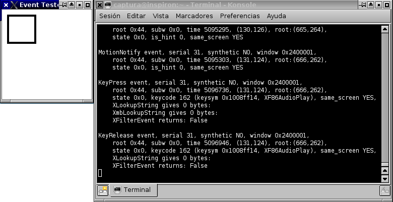

Title: Cómo configurar los botones multimedia en KDE
Slug: kde-amarok-botones-multimedia
Summary: Quienes usamos GNU/Linux nos vemos en la necesidad de hacer la configuración de los botones multimedia forma manual.
Tags: gentoo linux, kde
Date: 2007-12-20 00:25
Modified: 2007-12-20 00:25
Category: apuntes
Preview: preview.jpg

Este manual está actualizado. Para la computadora portátil **Dell Inspiron 9300** con **Debian Lenny**, [KDE](http://www.kde.org) como entorno de escritorio y [Amarok](http://amarok.kde.org) como reproductor de audio.

Gran parte de las computadoras de escritorio y portátiles modernos tienen botones _multimedia_, si este equipo viene con Windows instalado de fábrica, estos botones ya estarán configurados. Quienes usamos GNU/Linux nos vemos en la necesidad de hacer esta configuración de forma manual.

### Configuración de las X's

El primer paso es revisar que tengamos bien configuradas las X's. Muestro a continuación el segmento del archivo de configuración /etc/X11/xorg.conf para un teclado en español y latinoamericano. Para modificar el archivo xorg.conf se necesita ser root.

    Section "InputDevice"
        Identifier      "Generic Keyboard"
        Driver          "kbd"
        Option          "CoreKeyboard"
        Option          "XkbRules"      "xorg"
        Option          "XkbModel"      "pc105"
        Option          "XkbLayout"     "latam"
    EndSection

Las X's correctamente configuradas _deberán entregar un código_ cuando sea presionado un botón multimedia.

### Descubriendo los _scancodes_

Vamos a ejecutar el programa *xev*, que es una utilería de las X's. Inicie su sesión como un usuario normal en KDE, abra una terminal y ejecute el comando:

    $ xev

Este programa muestra una pequeña ventana blanca y en la terminal se pueden ver los textos de salida. Mientras corra, estará atento a cualquier tecla o movimiento del ratón, mandando información del evento a la terminal.

Coloque el puntero sobre la ventana blanca del *xev*, vaya presionando uno por uno los botones multimedia y tomando nota de los _keycodes_.

Como ejemplo, cuando presiono el botón de _Play/Pausa_ me aparece dos bloques de datos, de cuando presiono el botón y cuando lo libero:

    KeyPress event, serial 31, synthetic NO, window 0x2400001,
        root 0x44, subw 0x0, time 4421581, (88,247), root:(351,455),
        state 0x0, keycode 162 (keysym 0x0, NoSymbol), same_screen YES,
        XLookupString gives 0 bytes:
        XmbLookupString gives 0 bytes:
        XFilterEvent returns: False

    KeyRelease event, serial 31, synthetic NO, window 0x2400001,
        root 0x44, subw 0x0, time 4421760, (88,247), root:(351,455),
        state 0x0, keycode 162 (keysym 0x0, NoSymbol), same_screen YES,
        XLookupString gives 0 bytes:
        XFilterEvent returns: False

Observe el tercer renglón de cada bloque, el botón de _Play/Pausa_ tiene el *keycode 162*, pero no hay un _caracter_ asociado al mismo por que muestra *NoSymbol*.

Cuando el botón nos da su *keycode* pero no tiene un *caracter* asociado, debemos configurar el *keycode* al *caracter* que creamos conveniente. Esto es justo lo que haremos en la siguiente sección.

### Estableciendo los caracteres para los _keycode_ no definidos.

Vamos a crear un archivo de configuración en su directorio *home* con el nombre *.xmodmaprc* (nombre recomendado por el manual del *xmodmap*) con las claves y su equivalencia para las X's. He aquí la muestra:

    keycode 160 = XF86AudioMute
    keycode 174 = XF86AudioLowerVolume
    keycode 176 = XF86AudioRaiseVolume
    keycode 162 = XF86AudioPlay
    keycode 144 = XF86AudioPrev
    keycode 153 = XF86AudioNext
    keycode 164 = XF86AudioStop

Procedemos a probar si esta configuración es correcta. Para cargar esta configuración y revisarla con *xev* ejecute en una terminal:

    $ xmodmap ~/.xmodmaprc
    $ xev

Al presionar de nuevo el botón de _Play/Pausa_ vemos que el _caracter_ está correctamente asignado:

    KeyPress event, serial 31, synthetic NO, window 0x2400001,
        root 0x44, subw 0x0, time 5096736, (131,124), root:(666,262),
        state 0x0, keycode 162 (keysym 0x1008ff14, XF86AudioPlay), same_screen YES,
        XLookupString gives 0 bytes:
        XmbLookupString gives 0 bytes:
        XFilterEvent returns: False

    KeyRelease event, serial 31, synthetic NO, window 0x2400001,
        root 0x44, subw 0x0, time 5096946, (131,124), root:(666,262),
        state 0x0, keycode 162 (keysym 0x1008ff14, XF86AudioPlay), same_screen YES,
        XLookupString gives 0 bytes:
        XFilterEvent returns: False

### Haciendo que la configuración se cargue al iniciar la sesión.

En este punto tenemos las asiganciones *keycode* a *caracter*, pero debemos cargarlas manualmente cada vez que encendemos el equipo.

Para no ser invasivos al sistema operativo, vamos a crear un _Bash script_ que ejecute el comando *xmodmap* y cargue la configuración cada vez que iniciamos la sesión de usuario. KDE tiene un directorio *Autostart* para cada usuario.

Para crear este _Bash script_ abra una terminal y escriba:

    $ cd ~/.kde/Autostart/
    $ nano -w botones-multimedia.sh

El script *botones-multimedia.sh* simplemente va ejecutar el programa *xmodmap* con un parámetro, el archivo de configuración que hemos creado:

    #!/bin/bash
    xmodmap ~/.xmodmaprc

Guarde los cambios y salga del editor. Haga este script ejecutable con el comando *chmod*:

    $ chmod a+x botones-multimedia.sh
    $ exit

Cierre su sesión del KDE y vuelva a entrar. Abra una nueva terminal y ejecute *xev* de nuevo para presionar cada botón multimedia y revisar que todos ellos tengan su caracter correcto.

### Descubriendo los comandos DCOP para Amarok

La Dell Inspiron 9300 tiene los botones Play/Pausa, Anterior (previous), Siguiente (next) y Stop (detener). Los cuales vamos a configurar para que controlen al Amarok.

Necesitamos conocer los comandos DCOP que nos permitan controlar la reproducción de audio en Amarok. Para ello, abra una terminal y ejecute el siguiente comando:

    $ dcop amarok player

Nos entregará una larga lista de operadores. Tome nota de los que quiera controlar con los botones multimedia. En mi equipo he elegido los siguientes:

    void next()
    void playPause()
    void prev()
    void stop()

Ejecute Amarok y pruebe cada comando DCOP (observe que van sin paréntesis):

    $ dcop amarok player next
    $ dcop amarok player playPause
    $ dcop amarok player prev
    $ dcop amarok player stop

Tome nota de los comandos DCOP para Amarok que quiera configurar para sus botones multimedia.

### Descubriendo los comandos DCOP para kMix

Ahora viene una situación muy particular de mi computadora portátil Dell Inspiron 9300: necesito ajustar dos controles de volumen, por que un volumen es el de las bocinas delanteras y el otro de las traseras y bajos.

Primero descubro los operadores DCOP de la aplicación Kmix ejecutando el siguiente comando:

    $ dcop kmix Mixer0

De entre todos elijo los tres siguientes. Como verán, son los que me incrementarán, decrementarán y silenciarán los volúmenes.

    void increaseVolume(int deviceidx)
    void decreaseVolume(int deviceidx)
    void toggleMute(int deviceidx)

Cada uno necesita como parámetro un número entero que se refiere al _control_ a alterar. En mi caso, las bocinas principales son 0 y las de los bajos son 1.

Entonces, para incrementar el volumen ejecuto:

    $ dcop kmix Mixer0 increaseVolume 0; dcop kmix Mixer0 increaseVolume 1

Para decrementar el volumen:

    $ dcop kmix Mixer0 decreaseVolume 0; dcop kmix Mixer0 decreaseVolume 1

Y para silenciar/des-silenciar:

    $ dcop kmix Mixer0 toggleMute 0; dcop kmix Mixer0 toggleMute 1

### Creando las acciones para Amarok.

Ejecute *Centro de control*, vaya al apartado *Regional y Accesibilidad*, luego a *Introducir acciones*.

Con el fin de mantener organizadas las nuevas acciones, le recomiendo que cree un nuevo grupo. Presione el botón *Nuevo grupo* y como nombre del mismo escriba *Botones multimedia*.

Para agregar una nueva acción presione *Nueva acción*, luego escriba el nombre que prefiera. Establezca que el tipo de acción es *Acceso rápido de teclado -> LLamada a DCOP (simple)*.

Vaya al apartado *Acceso rápido de teclado*, de clic en el botón para definir la tecla y presione el botón multimedia que corresponda a la acción que esté creando.

Vaya al apartado *Preferencias de llamada a DCOP* y llene los campos correspondientes para comunicarse con la aplicación amarok.

Repita este proceso por cada botón multimedia que requiera su acción.

### Creando las acciones para Kmix.

En el mismo grupo vamos a agregar las tres acciones para incrementar, decrementar y silenciar los volúmenes.

Presione *Nueva acción*. Como la órden ejecuta dos comandos, vamos a definir *Tipo de la acción* como *Acceso rápido de teclado -> Orden/URL (simple)*:

Vaya al apartado *Acceso rápido de teclado*, de clic en el botón para definir la tecla y presione el botón multimedia que corresponda a la acción que esté creando.

Y en *Preferencias de orden/URL*, escriba los dos comandos, separados por ";"

### Pruebe sus botones multimedia.

Notará que toda esta configuración es a nivel del usuario, por lo que si hay varias cuentas definidas en un equipo, será necesario copiar los archivos *.xmodmap* *botones-multimedia.sh* a cada directorio *home* y también declarar las acciones.

Vale la pena dedicarle algunos minutos a relizar este procedimiento. A la larga se ahorrará muchos movimientos y clicks de ratón usando en su lugar los botones multimedia. ¡Disfrute de la comodidad de controlar su música!
