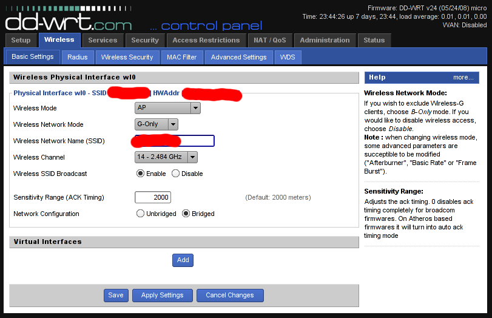

Title: Kernel Linux 2.6.29 para Dell Inspiron 9300 con Gentoo Linux
Slug: kernel-linux-2.6.29
Summary: El Kernel Linux versión 2.6.29 fue liberado por Linus Torvalds en marzo de 2009. Entre muchas novedades, otorga un soporte inicial del nuevo sistema de archivos Btrfs.
Tags: gentoo linux, kernel linux
Date: 2009-06-17 21:45
Modified: 2009-06-17 21:45
Category: apuntes
Preview: preview.jpg

El [Kernel Linux](http://www.linux.org/) versión 2.6.29 fue liberado por [Linus Torvalds](http://es.wikipedia.org/wiki/Linus_Torvalds) en marzo de 2009. Entre muchas novedades, otorga un _soporte inicial_ del nuevo sistema de archivos [Btrfs](http://es.wikipedia.org/wiki/Btrfs). Cuando el *Btrfs* sea considerado como _estable_ se espera que sustituya por completo al [Ext](http://es.wikipedia.org/wiki/Ext3).

[Tux](http://es.wikipedia.org/wiki/Tux), la mascota de Linux, se ha tomado tres meses sábaticos. La mascota de la versión 2.6.29 es [Tuz](http://en.wikipedia.org/wiki/Tux#Tuz). _Tuz_ es un [Demonio de Tazmania](http://es.wikipedia.org/wiki/Sarcophilus_harrisii) con un antifaz en forma de pico.

La razón de esta nueva imagen es promover las labores de conservación de esta especie. Su población ha disminuido significativamente por un [tumor facial](http://es.wikipedia.org/wiki/Sarcophilus_harrisii#Tumor_facial_de_los_demonios), enfermedad mortal para estos animales. Más información en [Save The Tasmanian Devil](http://tassiedevil.com.au/).

Regresando al software libre, hace un par de semanas esta versión del Linux (en concreto *gentoo-sources-2.6.29-r5*) fue marcada como _estable_ en el _portage_ de [Gentoo Linux](http://www.gentoo.org/). A continuación describo la configuración y compilación de este kernel para la portátil Dell Inspiron 9300...

### Descarga

Como es habitual para *Gentoo Linux*, actualizamos primero el _portage_.

    # emerge --sync

Ejecutamos *emerge* con el parámetro "p" que nos dirá la versión que pretendería instalar de *gentoo-sources*.

    # emerge -pu gentoo-sources

Si estamos de acuerdo, instalamos el código fuente del kernel.

    # emerge -u gentoo-sources

Encontraremos el código fuente en el directorio /usr/src

    # ls -l /usr/src/
    lrwxrwxrwx  1 root root   22 jun 11 20:19 linux -> linux-2.6.29-gentoo-r5
    drwxr-xr-x 22 root root 4096 jun 11 20:19 linux-2.6.29-gentoo-r5

Haga el enlace "linux" al "linux-2.6.29-gentoo-r5" manualmente si no lo tiene.

Nos cambiamos al directorio de las nuevas fuentes del kernel.

    # cd /usr/src/linux

Esta es una representación gráfica del tamaño de los archivos contenidos en */usr/src/linux-2.6.29-gentoo-r5*

### _Hackear_ el controlador ipw2200

Por defecto, la tarjeta inalámbrica Intel ipw2200 me permite usar *11 canales*. Es posible cambiar este parámetro a *14 canales*.

Con este cambio y con un _punto de acceso_ en el canal 14 podrá establecer una comunicación fuera del rango de los equipos nacionales. En pocas palabras, una capa más de seguridad. Por ejemplo, un *LinkSys WRT54G* con *DD-WRT* me permite usar el canal 14:

Hay dos formas de cambiar este parámetro a *14*: alterando el EEPROM de la tarjeta inalábrica o cambiando el código fuente del controlador de la tarjeta antes de compilar el kernel. Le mostraré la segunda opción.

Por medio del editor *vim* cargue el código fuente del controlador.

    # vim drivers/net/wireless/ipw2x00/ipw2200.c

Busque el texto *EEPROM_COUNTRY_CODE*. Para ello teclee "/", la cadena a buscar *EEPROM_COUNTRY_CODE* y presione _ENTER_.

    /EEPROM_COUNTRY_CODE

Lo anterior nos llevará a la línea del código del controlador que toma el valor de la locación geográfica fijada en la fábrica.

Observe el siguiente fragmento donde la línea con "-" es la original y la línea con "+" es la cambiada. Presione "i" para editar el texto y efectúe el cambio a "ZZR".

     for (j = 0; j < ARRAY_SIZE(ipw_geos); j++) {
    -    if (!memcmp(&priv->eeprom[EEPROM_COUNTRY_CODE],
    +        if (!memcmp("ZZR",
                 ipw_geos[j].name, 3))
         break;
     }

Para terminar de editar, presione _ESC_ para salir del modo de edición. Luego, para guardar y salir teclee dos puntos, "w", "q" y _ENTER_.

La región "ZZR" nos permite los 14 canales en redes 802.11bg. En el archivo _README_ del controlador se encuentra la siguiente tabla sobre las regiones y canales que utilizan:

                                              Supported channels
    Code    Geography                       802.11bg        802.11a

    ---     Restricted                      11               0
    ZZF     Custom US/Canada                11               8
    ZZD     Rest of World                   13               0
    ZZA     Custom USA & Europe & High      11              13
    ZZB     Custom NA & Europe              11              13
    ZZC     Custom Japan                    11               4
    ZZM     Custom                          11               0
    ZZE     Europe                          13              19
    ZZJ     Custom Japan                    14               4
    ZZR     Rest of World                   14               0
    ZZH     High Band                       13               4
    ZZG     Custom Europe                   13               4
    ZZK     Europe                          13              24
    ZZL     Europe                          11              13

### Configurar el kernel

Para configurar el kernel Linux usando la interfaz *ncurses* y estando en el directorio del kernel mismo ejecute el siguiente comando.

    # make menuconfig

A partir de aquí estamos trabajando en la configuración, habilitando y deshabilitando opciones.

La portátil *Dell Inspiron 9300* tiene un procesador *Intel Pentium-M*, así que deshabilito el soporte multi-procesador y selecciono "Pentium M" como la _familia_ del procesador. Note también que he habilitado como módulo a "Dell laptop support" que me permite monitorear la temperatura y controlar la velocidad de los ventiladores.

    Processor type and features
    [ ] Symmetric multi-processing support
        Processor family (Pentium M)
    <M> Dell laptop support

Habilito las características de ahorro de energía y de variación de la frecuencia del procesador.

    Power management and ACPI options
    CPU Frequency scaling
    [*] CPU Frequency scaling
    [*]   Enable CPUfreq debugging
    <*>   CPU frequency translation statistics
    [*]     CPU frequency translation statistics details
           Default CPUFreq governor (ondemand)
    -*-   'performance' governor
    <*>   'powersave' governor
    <*>   'userspace' governor for userspace frequency scaling
    -*-   'ondemand' cpufreq policy governor
    <*>   'conservative' cpufreq governor
          *** CPUFreq processor drivers ***
    <*>   ACPI Processor P-States driver

Esta portátil tiene una ranura *PCMCIA* con la cual conecto una segunda tarjeta inalámbrica con chip *Atheros*.

    Bus options (PCI etc.)
    <M> PCCard (PCMCIA/CardBus) support
    <M>   16-bit PCMCIA support
    [*]     Load CIS updates from userspace (EXPERIMENTAL)
    [*]     PCMCIA control ioctl (obsolete)
    -*-   32-bit CardBus support
    *** PC-card bridges ***
    <M>   CardBus yenta-compatible bridge support

Deshabilito el soporte para *IPv6* ya que en la práctica no he tenido necesidad de usarlo. Habilito las opciones para *IP Tables* que me permiten configurar un _muro de fuego_.

    Networking support --->
    < >   The IPv6 protocol
    [*] Network packet filtering framework (Netfilter) --->
    [ ]   Advanced netfilter configuration
    Core Netfilter Configuration --->
    -*- Netfilter LOG over NFNETLINK interface
    <*> Netfilter connection tracking support
    [*]   Connection tracking security mark support
    <*>   FTP protocol support
    <*>   IRC protocol support
    <*>   SIP protocol support
    <*>   Connection tracking netlink interface
    -*- Netfilter Xtables support (required for ip_tables)
    <*>   "CONNSECMARK" target support
    <*>   "MARK" target support
    <*>   "NFLOG" target support
    <*>   "SECMARK" target support
    <*>   "TCPMSS" target support
    <*>   "conntrack" connection tracking match support
    <*>   "mark" match support
    <*>   "state" match support
    IP: Netfilter Configuration --->
    <*> IPv4 connection tracking support (required for NAT)
    [*]   proc/sysctl compatibility with old connection tracking
    <*> IP tables support (required for filtering/masq/NAT)
    <*>   Packet filtering
    <*>     REJECT target support
    <*>   LOG target support
    <*>   ULOG target support
    <*>   Full NAT
    <*>     MASQUERADE target support
    <*>   Packet mangling

Tengo una llave *bluetooth* que conecto por USB.

    Networking support --->
    --- Bluetooth subsystem support
    <M>   L2CAP protocol support
    <M>   SCO links support
    <M>   RFCOMM protocol support
    [*]     RFCOMM TTY support
    <M>   BNEP protocol support
    [*]     Multicast filter support
    [*]     Protocol filter support
    <M>   HIDP protocol support
          Bluetooth device drivers  --->
          <M> HCI USB driver

Tanto el disco duro como el lector de DVD funcionan bajo *SATA*. Opciones que habilito.

    Device Drivers --->
    <*> Serial ATA (prod) and Parallel ATA (experimental) drivers  --->
    [*]   ATA ACPI Support
    [*]   SATA Port Multiplier support
    <*>   AHCI SATA support
    [*]   ATA SFF support
    <*>     Intel ESB, ICH, PIIX3, PIIX4 PATA/SATA support

Habilito mis dispositivos de red: la alámbrica (Broadcom 440x/47xx), la inalámbrica (Intel PRO/Wireless 2200BG) y la inalámbrica PCMCIA (Atheros 5xxx).

    Device Drivers --->
    [*] Network device support  --->
    [*]   Ethernet (10 or 100Mbit)  --->
    <*>   Broadcom 440x/47xx ethernet support
        Wireless LAN  --->
    [*] Wireless LAN (IEEE 802.11)
    <M>   Atheros 5xxx wireless cards support
    <M>   Intel PRO/Wireless 2200BG and 2915ABG Network Connection
    [*]     Enable promiscuous mode
    -*-       Enable radiotap format 802.11 raw packet support
    [*]       Enable creation of a RF radiotap promiscuous interface
    [*]     Enable QoS support

Dentro de "Input device support" se encuentra "User level driver support" un módulo que me permite usar el [Wiimote](http://es.wikipedia.org/wiki/Wiimote con la computadora).

    Device Drivers --->
    Input device support  --->
    -*- Generic input layer (needed for keyboard, mouse, ...)
    -*-   Support for memoryless force-feedback devices
    <*>   Polled input device skeleton
    -*-   Mouse interface
    <M>   Joystick interface
    <*>   Event interface
    -*-   Keyboards  --->
    [*]   Mice  --->
    [*]   Joysticks/Gamepads  --->
    [ ]   Tablets  --->
    [ ]   Touchscreens  --->
    [*]   Miscellaneous devices  --->
          <M>   User level driver support

Habilito el soporte *I2C* para el chip *Intel 82801* presente en la Dell Inspiron 9300.

    Device Drivers --->
    -*- I2C support  --->
    <*>   I2C device interface
    [*]   Autoselect pertinent helper modules
          I2C Hardware Bus support  --->
          <*> Intel 82801 (ICH)

Mi portátil tiene una tarjeta de video *ATI Radeon Mobility X300 (M22)* la cual *no* es de alto desempeño gráfico. Me ha satisfecho el controlador libre, mismo que se configura en el kernel.

    Device Drivers --->
    Graphics support  --->
    <*> /dev/agpgart (AGP Support)  --->
    <*>   ATI chipset support
    <*> Direct Rendering Manager (XFree86 4.1.0 and higher DRI support)
    <*>   ATI Radeon
    [*] Backlight & LCD device support  --->
    <*>   Lowlevel Backlight controls
    <*>     Generic (aka Sharp Corgi) Backlight Driver

El dispositivo de sonido de esta portátil es *Intel AC97*.

    Device Drivers --->
    <*> Sound card support  --->
    <M>   Advanced Linux Sound Architecture  --->
    <M>   Sequencer support
    <M>     Sequencer dummy client
    <M>   OSS Mixer API
    <M>   OSS PCM (digital audio) API
    [*]     OSS PCM (digital audio) API - Include plugin system
    [*]   OSS Sequencer API
    [*]   Dynamic device file minor numbers
    [*]   Support old ALSA API
    [*]   Verbose procfs contents
    [*]   Generic sound devices  --->
          [*]   AC97 Power-Saving Mode
          (0)     Default time-out for AC97 power-save mode
    [*]   PCI sound devices  --->
          <M>   Intel/SiS/nVidia/AMD/ALi AC97 Controller

Es indispensable el soporte *USB*. Una opción que recomiendo activar es "USB selective suspend/resume and wakeup" que permite al equipo portátil ahorrar energía en lo que a dispositivos USB se refiere.

    Device Drivers --->
    [*] USB support  --->
    <*>   Support for Host-side USB
    [*]     USB verbose debug messages
    [*]     USB announce new devices
    [*]     USB device filesystem
    [*]     USB selective suspend/resume and wakeup
    <*>     USB Monitor
    <*>     EHCI HCD (USB 2.0) support
    <*>     OHCI HCD support
    <*>     UHCI HCD (most Intel and VIA) support
    <M>   USB Modem (CDC ACM) support
    <*>   USB Printer support
    <*>   USB Mass Storage support
    [*]   The shared table of common (or usual) storage devices

Habilito el controlador del lector de tarjetas *SD*.

    Device Drivers --->
    <M> MMC/SD/SDIO card support  --->
    <M>   MMC block device driver
    [*]     Use bounce buffer for simple hosts
    <M>   Secure Digital Host Controller Interface support
    <M>     SDHCI support on PCI bus
    <M>       Ricoh MMC Controller Disabler  (EXPERIMENTAL)

Luego de haber habilitado los dispositivos de red, regreso a habilitar las opciones de "Wireless" en "Networking support".

    [*] Networking support  --->
    [*]   Wireless  --->
    {M}   Improved wireless configuration API
    [ ]     cfg80211 regulatory debugging
    [*]     nl80211 new netlink interface support
    [*]   Old wireless static regulatory definitions
    -*-   Wireless extensions
    [*]     Wireless extensions sysfs files
    {M}   Common routines for IEEE802.11 drivers
    [ ]   lib80211 debugging messages
    <M>   Generic IEEE 802.11 Networking Stack (mac80211)
    [*]     Enable mac80211 mesh networking (pre-802.11s) support
    -*-     Enable LED triggers
    [ ]     Export mac80211 internals in DebugFS

La sección "File systems" es sumamente importante. Sencillamente, si se intenta cargar un GNU/Linux desde una partición con un sistema de archivos no soportado, nos ocasionaría un _kernel panic_. Note que aquí aparece el nuevo sistema de archivos *Btrfs*.

    File systems  --->
    <*> Second extended fs support
    <*> Ext3 journalling file system support
    <*> Reiserfs support
    < > Btrfs filesystem (EXPERIMENTAL) Unstable disk format
    [*] Dnotify support
    [*] Inotify file change notification support
    [*]   Inotify support for userspace
    [*] Quota support
    [*]   Report quota messages through netlink interface
    <*> Quota format v2 support
    <*> Kernel automounter version 4 support (also supports v3)
        CD-ROM/DVD Filesystems  --->
        <*> ISO 9660 CDROM file system support
        [*]   Microsoft Joliet CDROM extensions
        [*]   Transparent decompression extension
        DOS/FAT/NT Filesystems  --->
        <*> MSDOS fs support
        <*> VFAT (Windows-95) fs support
        Pseudo filesystems  --->
        -*- /proc file system support
        [*]   /proc/kcore support
        [*]   /proc/vmcore support (EXPERIMENTAL)
        [*] Virtual memory file system support (former shm fs)
        [*]   Tmpfs POSIX Access Control Lists
        [*] HugeTLB file system support
    [*] Network File Systems  --->
        <*>   CIFS support (advanced network filesystem, SMBFS successor)
        Partition Types  --->
        [ ] Advanced partition selection
    -*- Native language support  --->
        (utf8) Default NLS Option
        <*>   Codepage 437 (United States, Canada)
        <*>   ASCII (United States)
        <*>   NLS ISO 8859-1  (Latin 1; Western European Languages)
        <*>   NLS UTF-8

Es necesario habilitar las siguientes opciones para usar redes *WiFi* cifradas como *WEP* y *WPA*.

    -*- Cryptographic API  --->
          *** Crypto core or helper ***
    -*-   Cryptographic algorithm manager
    <*>   Authenc support
          *** Block modes ***
    <*>   CBC support
    {*}   ECB support
          *** Hash modes ***
    <*>   HMAC support
    -*-   MD5 digest algorithm
    {M}   Michael MIC keyed digest algorithm
    <*>   SHA1 digest algorithm
          *** Ciphers ***
    -*-   AES cipher algorithms
    <*>   AES cipher algorithms (i586)
    {*}   ARC4 cipher algorithm
    <*>   DES and Triple DES EDE cipher algorithms
          *** Random Number Generation ***
    [ ]   Hardware crypto devices  --->

Para terminar, vaya a la pantalla inicial de la configuración y elija *Exit*.

Le preguntará *Do you wish to save your new kernel configuration?* a lo que debemos responder *YES* de lo contrario perderemos todos los cambios hechos.

### Compilar

De vuelta en la terminal, ejecutamos *make* para compilar.

    # make

### Instalar

El siguiente paso en instalar los _módulos_. Si hubiera una instalación de esta misma verisón del kernel hay que eliminar los módulos anteriores antes de instalar los nuevos.

    # rm -rf /lib/modules/2.6.29-gentoo-r5
    # make modules_install

Como tengo una partición para el arranque, la monto y elimino los archivos de alguna instalación anterior de esta misma versión del kernel.

    # mount /boot
    # rm /boot/config
    # rm /boot/config-2.6.29-gentoo-r5
    # rm /boot/System.map
    # rm /boot/System.map-2.6.29-gentoo-r5
    # rm /boot/vmlinuz
    # rm /boot/vmlinuz-2.6.29-gentoo-r5

Ejecuto *make install* para que me copie *vmlinuz*, *System.map* y *config* a /boot

    # make install

Edito la configuración del gestor de arranque *Grub* para tener la opción de este nuevo kernel.

    # nano /boot/grub/grub.conf

Mi archivo *grub.conf* es así...

    #
    # /boot/grub/grub.conf
    #

    default 0
    timeout 3
    splashimage=(hd0,0)/boot/grub/splash.xpm.gz

    title Gentoo Linux - KDE 3.5.9 - 2.6.29-r5 NUEVO
    root (hd0,0)
    kernel /vmlinuz-2.6.29-gentoo-r5 root=/dev/sda7 resume=/dev/sda5

Puede necesitar cargar algunos módulos cada vez que arranque el equipo. Eso se configura en el archivo /etc/modules.autoload.d/kernel-2.6

    # nano /etc/modules.autoload.d/kernel-2.6

En /etc/modules.autoload.d/kernel-2.6 tengo:

    # Dell Inspiron, monitor temperatura y ventiladores
    i8k

    # Tarjeta PCMCIA
    yenta_socket

    # Lector de tarjetas SD
    mmc_core
    ricoh_mmc

    # Red inalámbrica Intel IPW2200
    ipw2200

    # WiiMote
    uinput

La configuración de la tarjeta de sonido reside en el archivo /etc/modprobe.d/alsa

    # nano /etc/modprobe.d/alsa

Y lo tengo con este contenido apropiado para la *Intel AC97*...

    #
    # /etc/modprobe.d/alsa
    #

    # ALSA portion
    alias char-major-116 snd
    # OSS/Free portion
    alias char-major-14 soundcore

    #
    # Intel AC97
    #
    # ALSA portion
    alias snd-card-0 snd-intel8x0
    # OSS/Free portion
    alias sound-slot-0 snd-card-0

    # OSS/Free portion - card #1
    alias sound-service-0-0 snd-mixer-oss
    alias sound-service-0-1 snd-seq-oss
    alias sound-service-0-3 snd-pcm-oss
    alias sound-service-0-8 snd-seq-oss
    alias sound-service-0-12 snd-pcm-oss

    alias /dev/mixer snd-mixer-oss
    alias /dev/dsp snd-pcm-oss
    alias /dev/midi snd-seq-oss

    # Set this to the correct number of cards.
    options snd cards_limit=1

Después de modificar estos archivos refresque los módulos a cargar con *update-modules*.

    # update-modules

Reinicie el equipo y pruebe su kernel 2.6.29.

### Revisión del controlador ipw2200 _hackeado_

Para revisar la carga del controlador de la tarjeta inalámbrica ipw2200 ejecute...

    $ dmesg | grep ipw

Si aparece "Detected geography ZZR (14 802.11bg channels, 0 802.11a channels)" tendrá su controlador _hackeado_.

    $ dmesg | grep ipw
    [    4.641026] ipw2200: Intel(R) PRO/Wireless 2200/2915 Network Driver, 1.2.2kmprq
    [    4.641029] ipw2200: Copyright(c) 2003-2006 Intel Corporation
    [    4.641090] ipw2200 0000:03:03.0: PCI INT A -> GSI 17 (level, low) -> IRQ 17
    [    4.663652] ipw2200: Detected Intel PRO/Wireless 2200BG Network Connection
    [    4.663693] eth1 (ipw2200): not using net_device_ops yet
    [    4.663697] ipw2200 0000:03:03.0: firmware: requesting ipw2200-bss.fw
    [    5.121085] ipw2200: Detected geography ZZR (14 802.11bg channels, 0 802.11a channels)

Otra forma de comprobar esto es ejecutando *iwlist _dispositivo_ channel*:

    # iwlist eth1 channel
    eth1      14 channels in total; available frequencies :
        Channel 01 : 2.412 GHz
        Channel 02 : 2.417 GHz
        Channel 03 : 2.422 GHz
        Channel 04 : 2.427 GHz
        Channel 05 : 2.432 GHz
        Channel 06 : 2.437 GHz
        Channel 07 : 2.442 GHz
        Channel 08 : 2.447 GHz
        Channel 09 : 2.452 GHz
        Channel 10 : 2.457 GHz
        Channel 11 : 2.462 GHz
        Channel 12 : 2.467 GHz
        Channel 13 : 2.472 GHz
        Channel 14 : 2.484 GHz
        Current Frequency=2.412 GHz (Channel 1)

Le deseo un desempeño exitoso en su nuevo kernel.
