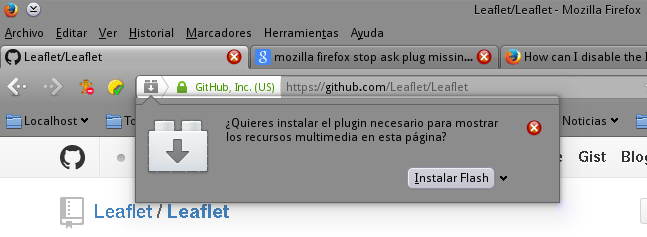
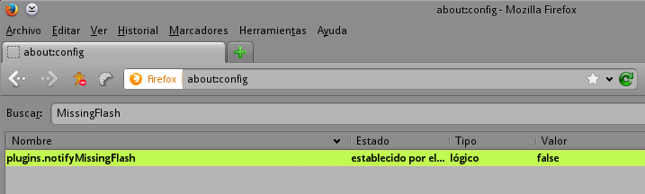

Title: Mozilla Firefox | Dejar de preguntar por plugin Adobe Flash
Slug: mozilla-firefox-dejar-preguntar-plugin-faltante
Summary: Quienes hemos optado por no instalar el Adobe Flash nos encontramos ante la situación de que Mozilla Firefox nos pregunte si lo queremos instalar al entrar a cada sitio web que lo use.
Tags: software libre
Date: 2014-02-03 19:30
Modified: 2014-02-03 19:30
Category: apuntes
Preview: firefox-icon.png

Quienes hemos optado por no instalar el Adobe Flash nos encontramos ante la situación de que Mozilla Firefox nos pregunte si lo queremos instalar al entrar a cada sitio web que lo use. Esto resulta muy molesto por las decenas de veces que damos clic en la equis de la _ventana emergente_ para cerrarla.

### Solución

* Escriba en la barra de dirección **about:config** y presione **Enter**.
* Acepte el mensaje de advertencia que le aparece
* Use el campo **Buscar** para encontrar la opción **plugins.notifyMissingFlash**
* Cambie el valor de ésta opción a **false** dando doble clic en la misma

