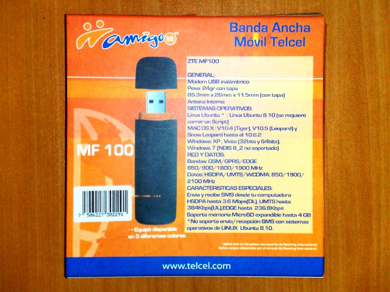

Title: Internet 3G con Telcel ZTE MF100
Slug: telcel-zte-mf100
Summary: Listo los programas a instalar y las configuraciones necesarias para que el ZTE MF100 de Telcel funcione en Gentoo Linux.
Tags: gentoo linux
Date: 2011-01-20 12:50
Modified: 2011-01-20 12:50
Category: apuntes
Preview: preview.jpg

Me vi con la necesidad de tener conectividad a Internet en cualquier parte de la ciudad. Así que opté por contratar un servicio de Internet vía la red de telefonía celular.

Como se imaginarán, su servidor requiere que el dispositivo de comunicación funcione con GNU/Linux; así que elegí el [ZTE](http://www.ztemobile.com.mx/) MF100, el cual, según la caja, funciona con [Ubuntu](http://www.ubuntu.com/) 8.1. Den clic en las siguientes imágenes para verlas a mayor tamaño.

Lamentablemente la guía impresa no da ningún paso para Ubuntu. Ni siquiera en el sitio web del fabricante hay una guía al respecto.

Por lo que a continuación describiré los programas a instalar y las configuraciones necesarias para que el *ZTE MF100* de [Telcel](http://www.telcel.com/) funcione en [Gentoo Linux](http://www.gentoo.org/). No dudo que esta información sea útil para otras distribuciones.

Como es costumbre, los comandos con # son ejecutados por *root*, mientras que los comandos con $ son ejecutados con un usuario común.

### Configuración del Kernel Linux

Es necesario tener habilitado el soporte *PPP* en el kernel; así como el controlador *GSM/CDMA*. Note que también es necesario marcar como módulo el *USB Mass Storage support* porque los actuales dispositivos USB para Internet 3G también tienen una ranura para una *MicroSD de memoria Flash*.

     Device Drivers  --->
       [*]  Network device support  --->
         <M>  PPP (point-to-point protocol) support
           <M>  PPP support for async serial ports
           <M>  PPP support for sync tty ports
           <M>  PPP Deflate compression
           <M>  PPP BSD-Compress compression
           <M>  PPP MPPE compression (encryption)
           <M>  PPP over Ethernet
       [*]  USB support  --->
         <M>  USB Mass Storage support
         [*]  The shared table of common (or usual) storage devices
         <M>  USB Serial Converter support  --->
           [*]  USB Generic Serial Driver
             <M>  USB driver for GSM and CDMA modems

Si no se usa *USB Mass Storage support* como módulo, podría aparecer el dispositivo sólo como una unidad de almacenamiento; y en consecuencia, no se vería el dispositivo de comunicación.

### Instale USB Mode Switch

El software [USB_ModeSwitch](http://www.draisberghof.de/usb_modeswitch/) es una herramienta que sirve para controlar esta _doble cara_ que presenta el dispositivo; la de ser dispositivo de red y dispositivo de almacenamiento al mismo tiempo.

    # emerge usb_modeswitch

### Revise la configuración de Udev

Revise la versión de [Udev](http://www.kernel.org/pub/linux/utils/kernel/hotplug/udev.html) con el comando *equery*:

    # equery list udev
    [ Searching for package 'udev' in all categories among: ]
    * installed packages
    [I--] [  ] sys-fs/udev-151-r4

Afortunadamente, la versión que ven de *Udev* tiene la configuración lista para manipular el dispositivo *ZTE* cuando se conecta. Vea el contenido de *40-usb_modeswitch.rules* sin peligro de alterarlo con:

    $ less /lib/udev/rules.d/40-usb_modeswitch.rules

Ahí encontrará las siguientes líneas:

    # ZTE devices
    ATTRS{idVendor}=="19d2", ATTRS{idProduct}=="2000", RUN+="usb_modeswitch '%b/%k'

Lo que hace es ejecutar *usb_modeswitch* cuando un dispositivo *ZTE* (vendedor _19d2_ y producto _2000_) se conecta.

### Revise que se cargue correctamente al conectarse

Conecte el dispositivo. Espere a que la luz led del mismo quede en color verde y estable. Luego revise los últimos mensajes del kernel con el comando *dmesg*:

    $ dmesg

Por ejemplo, la carga exitosa muestra mensajes como los siguientes:

    $ dmesg | grep modem
    USB Serial support registered for GSM modem (1-port)
    option 1-8:1.0: GSM modem (1-port) converter detected
    usb 1-8: GSM modem (1-port) converter now attached to ttyUSB0
    option 1-8:1.1: GSM modem (1-port) converter detected
    usb 1-8: GSM modem (1-port) converter now attached to ttyUSB1
    option 1-8:1.3: GSM modem (1-port) converter detected
    usb 1-8: GSM modem (1-port) converter now attached to ttyUSB2
    option: v0.7.2:USB Driver for GSM modems

Vea que en la lista de módulos cargados aparezcan *usbserial* y *usb_wwan*:

    $ lsmod

Debe haber uno o varios dispositivos en el directorio */dev* como *ttyUSB1*, *ttyUSB2* y/o *ttyUSB3*.

    $ ls -l /dev/ttyUSB*

Continúe con este manual si son exitosas estas pruebas. Si no, revise de nuevo hasta conseguirlo.

### Agregue su usuario al grupo uucp

Como habrá notado, los *ttyUSB* son propiedad de *root* y del grupo *uucp*. Agregue su usuario al grupo *uucp* con el siguiente comando, sustituyendo _NOMBREDEUSUARIO_ por el suyo:

    # gpasswd -a NOMBREDEUSUARIO uucp

### Instale wvdial

Necesitamos instalar el software [WvDial](http://alumnit.ca/wiki/?WvDial) para realizar la rutina de conexión.

    # emerge wvdial

Como dependecias, instalará también *net-dialup/ppp*, *virtual/c++-tr1-functional* y *net-libs/wvstreams*.

### Configure wvdial

Ejecute el programa de configuración automática de WvDial con el comando:

    # wvdialconf

Éste creará un nuevo archivo */etc/wvdial.conf* en base a lo que se detecte en el hardware. Pero es muy probable que *no sea suficiente* y deberá hacer modificaciones adicionales por el modelo del dispositivo, las capacidades de la red y los parámetros de su proveedor.

Edite el archivo con el sencillo editor *nano*:

    # nano /etc/wvdial.conf

El contenido de este archivo es texto con la típica sintaxis de los archivos *ini*. Lo que sigue es la configuración que para el *Internet 3G de Telcel en México*:

    [Dialer Defaults]
    Init1 = ATZ
    Init2 = ATQ0 V1 E1 S0=0 &C1 &D2 +FCLASS=0
    Init3 = AT+CGDCONT=1,"IP","internet.itelcel.com"
    Stupid Mode = on
    Modem Type = Analog Modem
    Modem = /dev/ttyUSB2
    Baud = 460800
    ISDN = 0
    Phone = *99#
    Username = webgprs
    Password = webgprs2002

Destaco de este archivo:

* Que he agregado la línea *Init3* con parámetros propios para Telcel.
* Debe usarse el modo _estúpido_ :D por lo que está en *on*.
* Para mi ZTE MF100 accedo al modem por */dev/ttyUSB2*. Pruebe los otros *ttyUSB* si aparece el error *The PPP daemon has died: A modem hung up the phone (exit code = 16)*.
* La velocidad *Baud* está al tope. Al conectarse verá la velocidad establecida.
* Los valores de *Phone*, *Username* y *Password* son propios de Telcel.

### Conéctese

Para conectarse, abra una terminal y ejecute:

    # sudo wvdial

Mantenga esa terminal abierta. Abra otra y observe el dispositivo *ppp0* que es creado al conectarse a la red con:

    $ sudo ifconfig ppp0

Éste comando también sirve para monitorear la cantidad de información recibida y enviada. De forma manual, puede tomar nota de lo que consume antes de desconectar el dispositivo y así cuidar de no exceder el límite del proveedor.

Para terminar la conexión, vaya a la terminal donde ejecutó *wvdial*, presione CTRL-C, espere a que termine y desconecte el dispositivo.
