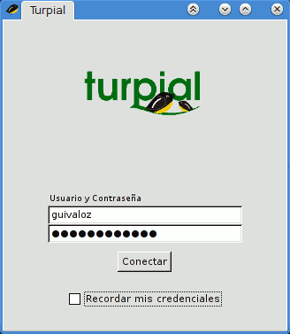
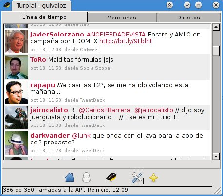

Title: Instalación de Turpial (cliente de Twitter) en Gentoo Linux
Slug: twitter-turpial
Summary: Turpial es un proyecto que busca ser un cliente alternativo para Twitter. Está escrito en Python, tiene como meta ser una aplicación con bajo consumo de recursos y que se integre al escritorio del usuario pero sin renunciar a ninguna funcionalidad.
Tags: gentoo linux, software libre
Date: 2010-10-18 14:00
Modified: 2010-10-18 14:00
Category: apuntes
Preview: turpial-icon.png

[Turpial](http://turpial.org.ve/) es un proyecto que busca ser un cliente alternativo para Twitter. Está escrito en *Python*, tiene como meta ser una aplicación con bajo consumo de recursos y que se integre al escritorio del usuario pero sin renunciar a ninguna funcionalidad. Es software libre de origen venezolano, liberado bajo la licencia GPL 3.

### 1) Descargue

La última versión al escribir este artículo es la 1.3.4 y lo encontrará en:

    http://code.google.com/p/turpial/

### 2) Desempaque

Como está hecho en Python no se requiere compilación o instalación (es opcional). Desempaque con:

    $ tar xvf turpial-1.3.4.tar.gz

### 3) Instale las dependencias

Según el archivo *README.rst* se necesitan los siguientes paquetes:

    python >= 2.5
    python-simplejson >= 1.9.2
    python-gtk2 >= 2.12
    python-notify >= 0.1.1
    python-pygame >= 1.7
    python-pybabel >= 0.9.1
    python-gtkspell >= 2.25.3
    python-webkit
    python-setuptools

Si usa Ubuntu o Debian lea el mismo archivo *README.rst* donde se detalla la instalación de los paquetes anteriores.

Para Gentoo Linux podemos asegurar que Python está instalado por defecto. Así que, como root, revisamos cuáles paquetes nos faltan con:

    # emerge -pv simplejson pygtk notify-python pygame Babel gtkspell-python pywebkitgtk setuptools

Tras la revisión, en mi caso particular veo que:

* Ya tengo instalado *pygtk* y *setuptools*.
* Como uso el entorno de escritorio KDE, desactivo el soporte *gstreamer* solicitado por *webkit-gtk* (otra dependencia más) agregando *-gstreamer* a la variable *USE* en */etc/make.conf*. Si usted prefiere Gnome o usa GStreamer, no lo desactive.

Reviso de nuevo...

    # emerge -pv simplejson notify-python pygame Babel gtkspell-python pywebkitgtk

Ahora sí, a instalar los paquetes faltantes...

    # emerge simplejson notify-python pygame Babel gtkspell-python pywebkitgtk

### 4) Ejecute Turpial

Cámbiese al directorio donde desempacó Turpial, en mi caso es /mnt/archivos/software/turpial/turpial-1.3.4

    $ cd /mnt/archivos/software/turpial/turpial-1.3.4

Agregue el directorio actual (donde se encuentra turpial-1.3.4) a la variable de entorno *PYTHONPATH*. La variable de entorno *$PWD* lo tiene:

    $ export PYTHONPATH=$PWD

Ejecute con el parámetro *-i gtk* para usar la interfaz GTK+

    $ python turpial/main.py -i gtk

La primer ejecución involucra la autentificación con Twitter.

Para lanzar Turpial fácilmente, elabore un Bash Script con los pasos anteriores:

    #!/bin/sh
    cd /mnt/archivos/software/turpial/turpial-1.3.4
    export PYTHONPATH=$PWD
    python turpial/main.py -i gtk

### 5) Opcionalmente puede instalarlo de forma permanente

Para integrarlo en su GNU/Linux:

    # python setup.py install

Un dato curioso de Turpial es que su nombre es el del ave nacional de venezuela. ¿Será por ello que el programa emite cantos de ave cuando llegan nuevos _twetts_?.
