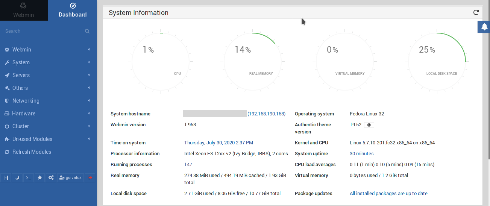

Title: Webmin instalación en Fedora Server
Slug: webmin-instalacion-fedora-server
Summary: Webmin es una herramienta de configuración de sistemas accesible vía web para sistemas Unix, como GNU/Linux y OpenSolaris. Con él se pueden configurar aspectos internos de muchos sistemas libres, como el servidor web Apache, PHP, MySQL, DNS, Samba, DHCP, entre otros.
Tags: fedora
Date: 2020-07-30 14:30
Modified: 2020-07-30 14:30
Category: Apuntes
Preview: webmin.png

Para este apunte se utilizó [Fedora Server](https://getfedora.org/es/server/) versión 32.

## Instalar Webmin

Crear un archivo para configurar el repositorio

    $ sudo nano /etc/yum.repos.d/webmin.repo

Con este contenido

    [Webmin]
    name=Webmin Distribution Neutral
    baseurl=http://download.webmin.com/download/yum
    enabled=1
    gpgcheck=1
    gpgkey=http://www.webmin.com/jcameron-key.asc

Ejecutar

    $ sudo dnf update
    $ sudo dnf install webmin

Al terminar da este mensaje

    Webmin install complete.
    You can now login to https://SERVIDOR:10000/
    as root with your root password.

## Configurar el muro de fuego

Sigue configurar el _firewall_ para que se abra el puerto 10000.

Por defecto la zona activa se llama FedoraServer

    $ sudo firewall-cmd --get-active-zones
    FedoraServer
        interfaces: enp1s0

Revise los los servicios, por defecto son...

    $ sudo firewall-cmd --zone=FedoraServer --list-services
    cockpit dhcpv6-client ssh

Por defecto no hay puertos

    $ sudo firewall-cmd --zone=FedoraServer --list-ports

Agregue el puerto 10000

    $ sudo firewall-cmd --zone=FedoraServer --add-port=10000/tcp --permanent
    $ sudo firewall-cmd --reload
    $ sudo firewall-cmd --zone=FedoraServer --list-ports

Ingresar con el navegador de internet a...

    https://SERVIDOR:10000/

## Agregar un usuario de webmin por la terminal

Como desde la instalación de Fedora Server bloqueo al usuario root es necesario crear manualmente un primer usuario de Webmin

Editar

    $ sudo nano /etc/webmin/miniserv.users

Agregar una línea con su usuario, por ejemplo 'guivaloz'

    guivaloz:x:0

Editar

    $ sudo nano /etc/webmin/webmin.acl

Copie y pegue la línea de root, cambie solo el usuario

    root:access privileges...
    guivaloz:access privileges...

Cambiar la contraseña del usuario 'guivaloz' por 'PA555W0RD'

    $ sudo /usr/libexec/webmin/changepass.pl /etc/webmin guivaloz PA555W0RD

No he encontrado una orden para recargar la configuración, así que reinicio el servidor

    $ sudo systemctl reboot

De nueva cuenta, ingresar con el navegador de internet a...

    https://SERVIDOR:10000/

Pruebe su usuario y contraseña.

## Referencias

- [Webmin Documentation Wiki](https://doxfer.webmin.com/Webmin/Main_Page)
- [Webmin FAQ](http://www.webmin.com/faq.html)
- [StackOverflow creating new admin webmin user in shell](https://stackoverflow.com/questions/36327209/creating-new-admin-webmin-user-in-shell)
