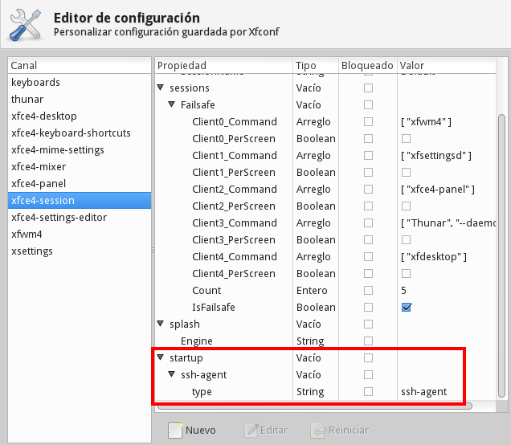

Title: XFCE4 deshabilitar agente GPG y habilitar agente SSH
Slug: xfce4-deshabilitar-agente-gpg-habilitar-agente-ssh
Summary: Cómo deshabilitar el agente GPG y en su lugar habilitar el agente SSH.
Tags: software libre
Date: 2014-08-07 09:15
Modified: 2014-08-07 09:15
Category: apuntes
Preview: preview.jpg

### Problema

En una instalación nueva de [XFCE](http://www.xfce.org/) noté que por defecto ejecutaba el agente [GPG](https://gnupg.org/documentation/manuals/gnupg/Invoking-GPG_002dAGENT.html). Al tratar de eliminar llaves SSH hubo dificultades con el programa `ssh-add` ya que su agente no estaba en ejecución.

### Solución

Para que XFCE4 lanze el agente SSH en lugar del de GPG ejecute:

    $ xfconf-query -c xfce4-session -p /startup/ssh-agent/type -n -t string -s ssh-agent

### Verifique

