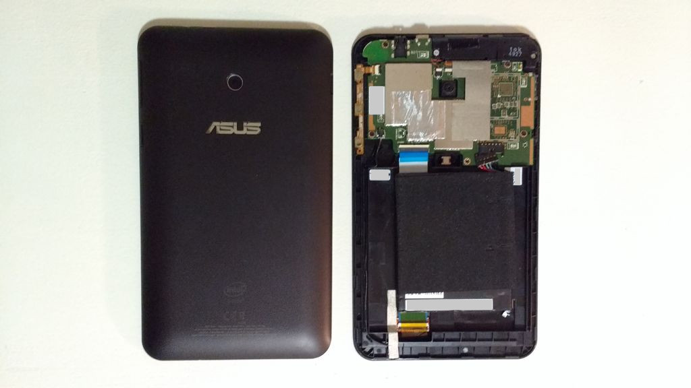
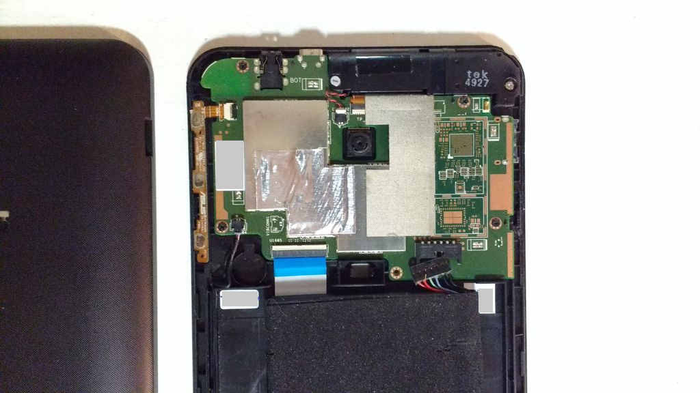
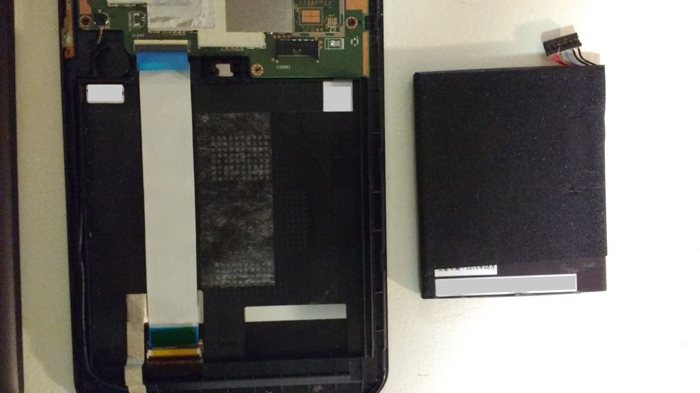
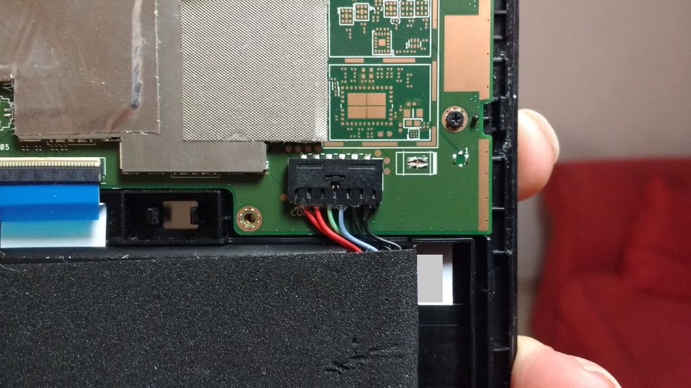
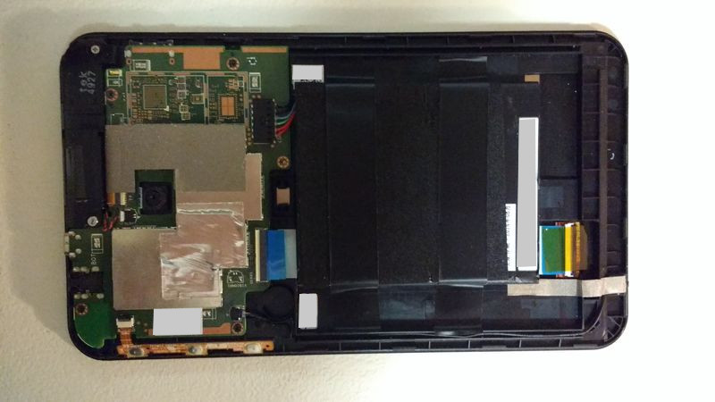

Title: Asus Reparación Memo Pad 7 ME70C
Slug: asus-reparacion-memo-pad-7-me70c
Summary: Hace días mi tablet ASUS Memo Pad 7 me180c dejó de funcionar súbitamente después de una caída de no más de medio metro. Simplemente resbaló detrás de un buró pequeño con todo y funda protectora.
Tags: hardware
Date: 2016-04-01 16:10
Modified: 2016-04-01 16:10
Category: articulos
Preview: preview.jpg

Hace días mi tablet **ASUS Memo Pad 7 me70c** dejó de funcionar súbitamente después de una caída de no más de medio metro. Simplemente resbaló detrás de un buró pequeño con todo y funda protectora; traté de encenderla, pero la pantalla siguió en negro. Al conectar el cargador sólo mostraba un breve flash blanco.

No tenía idea de lo que le hubiese pasado. Ya que físicamente su exterior estaba bien; así que dediqué tiempo a buscar información sobre cómo repararla.

En [ASUS](http://www.asus.com/) la [página de soporte](https://www.asus.com/mx/Tablets/ASUS_MeMO_Pad_7ME70C/) es muy pobre en contenido; de hecho, han descontinuado el modelo **me70c**.

Hay pocos videos en [Youtube](https://www.youtube.com/) sobre [reparación de la ASUS Memo Pad 7](https://www.youtube.com/watch?v=VGMD9uBf6ww); me dejaron la angustia de que es muy difícil de abrir. En un video mencionan la posibilidad de la batería se desconecte por una caída. Y así me pasó.

Después de varios minutos, usando un desarmador plano y _mis uñas_ pude retirar la tapa.

La batería, efectivamente estaba desconectada. **Grave error de diseño.** Porque el espacio interior es mayor que el tamaño de la pila; basta la caída perfecta para que se desconecte y uno no lo notaría hasta al tratar de encenderla.

Insisto que es **error de diseño** porque el fabricante sujeta la batería por una franja con adhesivo. El tiempo y el calor van a hacer que pierda adherencia; después la batería quedaría suelta y golpeando el interior de la tablet.

Para arreglarlo, sencillamente hay que conectar de nuevo la batería y ayudar a que se mantenga más tiempo en su lugar con cintas de aislar, como pueden ver en la última imagen.

La tapa se cierra a presión y no tiene tornillos.
