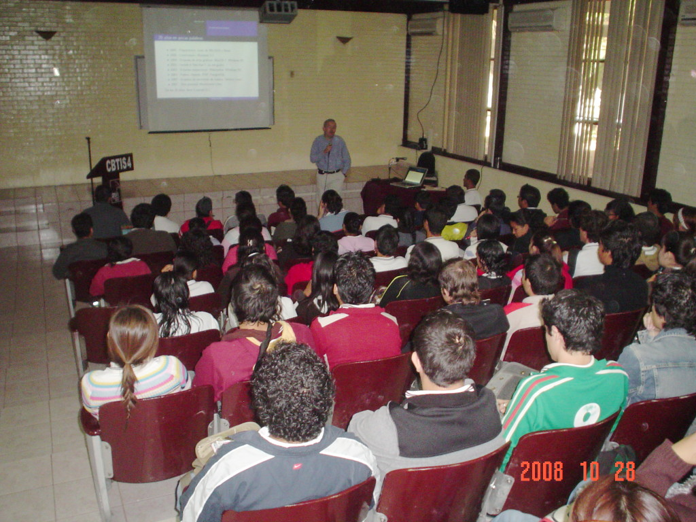
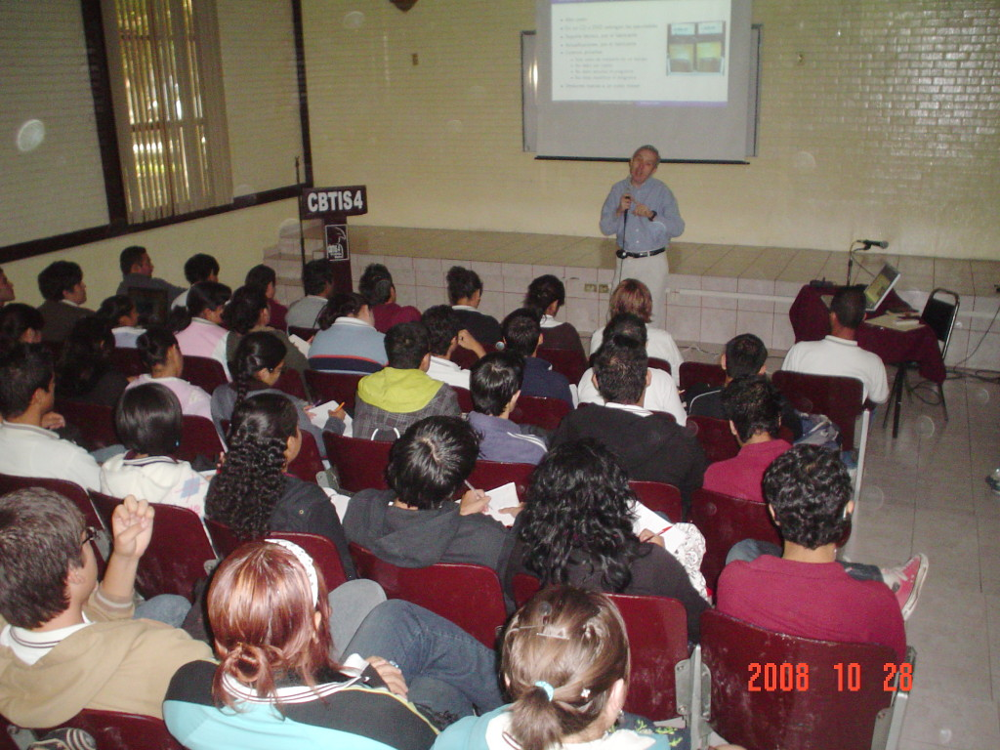
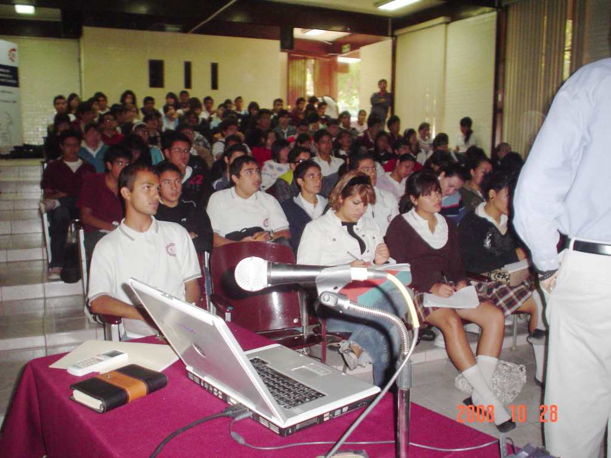

Title: Software Libre en el 35 Aniversario del CBTiS 4
Slug: cbtis4-35-aniversario-software-libre
Summary: El 28 de octubre del presente, tuve el honor de participar en los eventos que con motivo del XXXVII Aniversario del CBTiS 4 con la ponencia Software Libre.
Tags: conferencias
Date: 2008-10-28 23:00
Modified: 2008-10-28 23:00
Category: articulos
Preview: preview.jpg

El 28 de octubre del presente, tuve el honor de participar en los eventos que con motivo del **XXXVII Aniversario** del [Centro de Bachillerato Tecnológico Industrial y de Servicios No. 4 (CBTiS 4)](http://www.cbtis4.edu.mx/) con la ponencia **Software Libre**.

Al finalizar, proyectamos el mensaje de Richard Stallman, a cerca de [por qué debe usarse software libre en las instituciones educativas](http://www.youtube.com/watch?v=cnJ-rGBX9Es)

No cabe duda que estamos en un tiempo donde más gente que antes ha escuchado hablar sobre Software Libre, y espero que una gran parte de ellos estén por ser usuarios del mismo. Agradezco grandemente el entusiasmo que manifestaron los asistentes a la plática, así como las amables atenciones de los maestros y directivos del plantel. Les felicito por abrir sus puertas al Software Libre.

