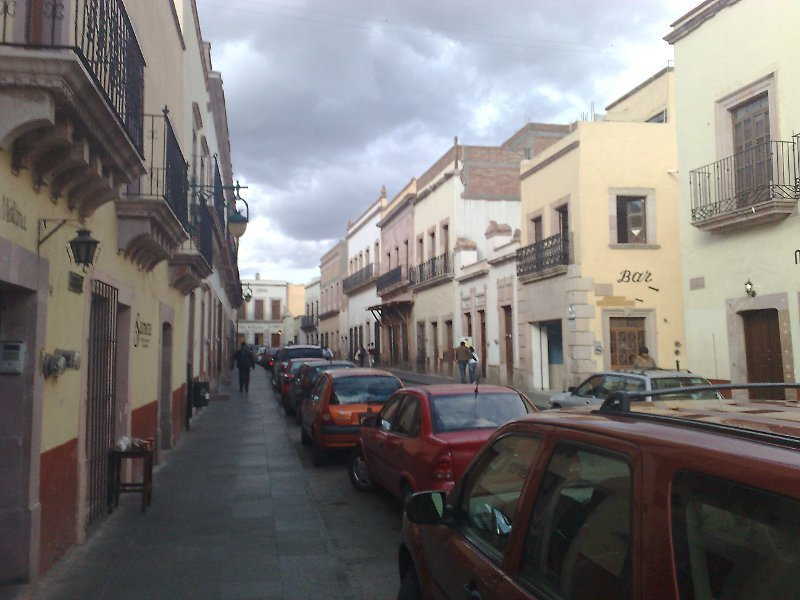

Title: Congreso Iberoamericano FOSS 1.0
Slug: congreso-iberoamericano-foss-2009
Summary: Los días 30 de noviembre y 1 de diciembre de 2009 se efectuó el Primer Congreso Iberoamericano de Software Libre. Cinco miembros del GULAG estuvimos presentes en lo que fué el evento más importante del Software Libre del año.
Tags: conferencias
Date: 2009-12-25 16:00
Modified: 2009-12-25 16:00
Category: articulos
Preview: preview.jpg

Los días 30 de noviembre y 1 de diciembre de 2009 se efectuó el [Primer Congreso Iberoamericano de Software Libre](http://www.estudiosdeldesarrollo.net/foss/). Cinco miembros del [GULAG](http://www.gulag.org.mx/) estuvimos presentes en lo que fué el evento más importante del Software Libre del año.

Es muy difícil sintetizar en pocas palabras todo lo que vivimos en esos dos días: los temas de las conferencias fueron mayoritariamente de corte social y político, los distinguidos ponentes nos dejaron impresionados con sus años de experiencia en la implantación de Software Libre en sus países, la hospitalidad fue inigualable, etc.

Les escribiré una grata experiencia. Su servidor (guivaloz) tuvo el gran honor de compartir la mesa con Corinto Meffe (Brasil), Herny Rivero (Venezuela) y Mauricio Haro (Ecuador). Terminada la comida preguntamos por el postre, nos ofrecieron un copa de helado de vainilla con guayaba. Como no teníamos idea del tamaño de la copa sólo dos personas en la mesa lo pidieron. Al llegar las dos copas se nos antojó también a los otros dos, pero la mesera nos dijo que ya se había terminado el helado. Inmediatamente, Corinto solicitó dos cucharas más para compartir las cuatro personas las dos copas de helado. Al igual que compartimos el helado, compartimos el Software Libre.

Su servidor, Guillermo Valdés tuvo el honor de participar con el tema **Virtualización con QEmu**.

El [GULAG](http://www.gulag.org.mx/) agradece a la [Universidad Autónoma de Zacatecas](http://www.uaz.edu.mx/), a la [Unidad Académica en Estudios del Desarrollo](http://www.estudiosdeldesarrollo.net/) y a **Maximinio Luna** el habernos invitado al primero de lo que seguramente será una serie de eventos trascendentes y exitosos.

