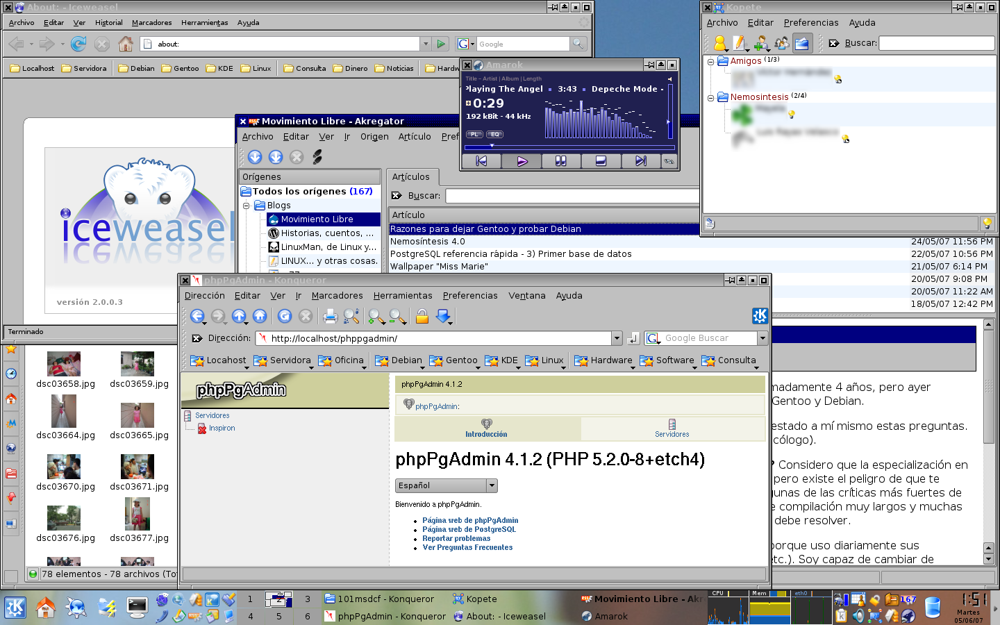

Title: Puntos buenos para Debian
Slug: debian-puntos-buenos
Summary: Con Debian he logrado una satisfactoria instalación en la cual estoy trabajando desde el jueves (¡Dios mío! llevo 4 días sin usar Gentoo en mi escritorio XD).
Tags: gnu linux
Date: 2007-06-17 00:00
Modified: 2007-06-17 00:00
Category: articulos
Preview: preview.png

Con Debian he logrado una satisfactoria instalación en la cual estoy trabajando desde el jueves (¡Dios mío! llevo 4 días sin usar Gentoo en mi escritorio XD).

Aquí agrego un screenshot en el que observarán las principales aplicaciones que he instalado hasta el momento:

Estos son los puntos buenos para Debian:

* Bajé la imagen debian-40r0-i386-kde-CD-1.iso, me llevé la agradable sorpresa de que trae la versión *3.5.5* del *KDE*.
* La instalación sin internet pone el **KDE** completo en inglés. En cambio, al hacer la instalación con internet y elegir nuestro idioma, baja todo lo necesario para tener la interfaz en español (aunque se tardó más de 4 horas).
* La configuración automática de las **X's** fue exitosa porque reconoció bien mi tarjeta de video. Aunque falta que ajuste el touchpad.
* También se instaló el **OpenOffice** y el **GIMP**, herramientas que necesito tamién :)
* Instalé el **PostgreSQL**, **Apache 2** y **PHP 5** con pocas dificultades por medio del comando aptitude.
* Ya compilé un kernel personalizado **2.6.20**

Punto malo para Debian (y me hace extrañar a Gentoo)...

* Los paquetes con "diferencias" legales no están en los repositorios convencionales, como **lame, ffmpeg** y **mplayer**. No me he aventurado en agregar repositorios alternativos, por que planeo descargar las fuentes y hacer una compilación manual de estos paquetes.

También tengo lista dos instalaciones de Gentoo Linux en el mismo equipo, una instalación mínima que me sirve para "clonarla" y otra instalación completa que llega hasta tener un bello, simple y funcional **FluxBox**.
