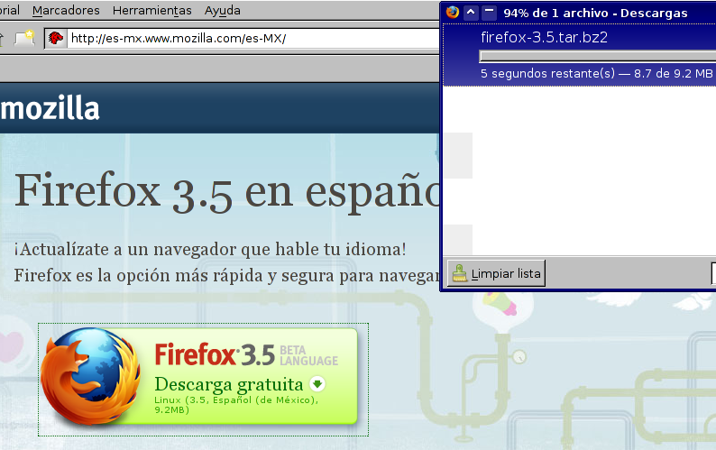
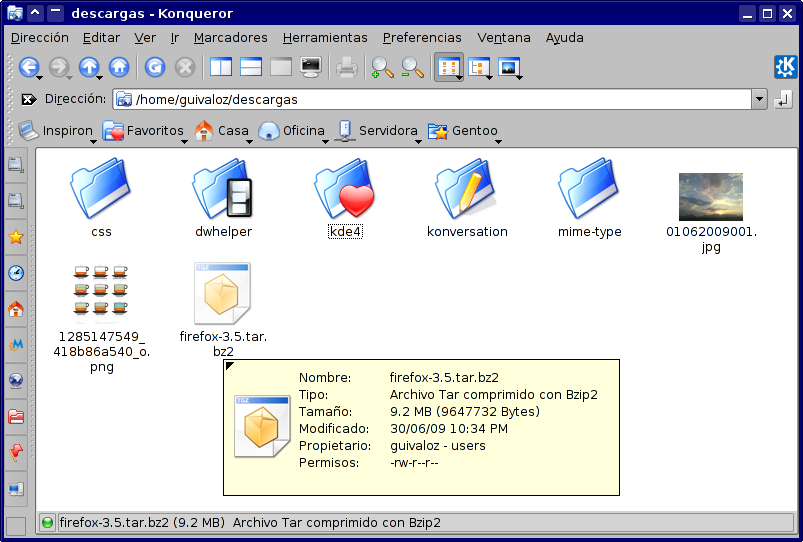
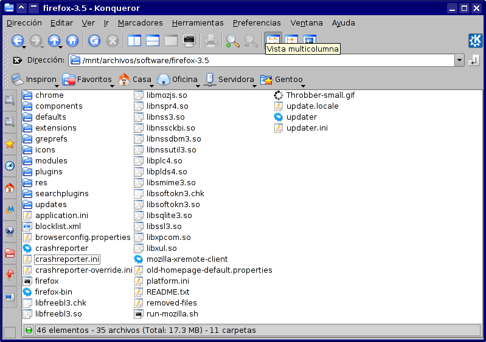
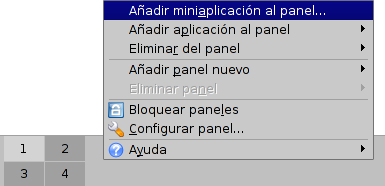
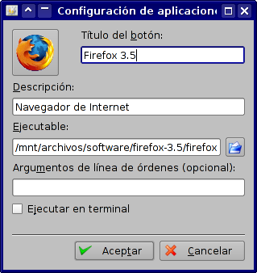
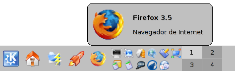
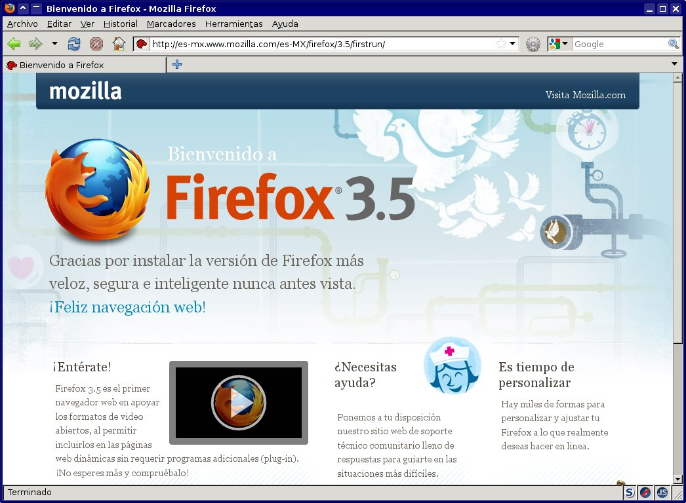
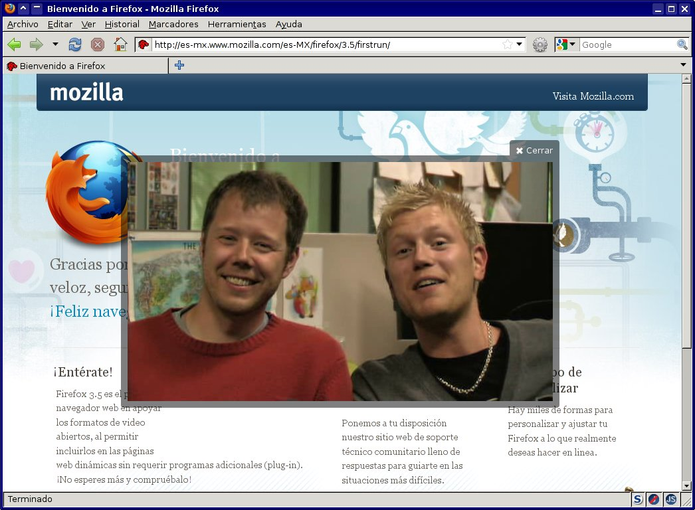

Title: Firefox 3.5
Slug: firefox-3.5
Summary: Mozilla Firefox 3.5 ya está disponible para su descarga y nos brinda muchas novedades.
Tags: software libre
Date: 2009-07-02 00:39
Modified: 2009-07-02 00:39
Category: articulos
Preview: preview.png

[Mozilla Firefox 3.5](http://es-mx.www.mozilla.com/es-MX/) ya está disponible para su descarga y nos brinda muchas novedades. Entre las que destaca:

* Ya hay versión en **Español-Mexicano**. No sólo los menús y las ventanas del programa están en nuestro idioma y región. También preferirá el lenguaje **es-MX** al ingresar a sitios multilingües.
* Más rápido que la versión 3. Ya lo estoy usando... y **¡es el doble de rápido!**.
* Implementación de los elementos **video** y **audio** de **HTML 5**, incluyendo audio codificado en **Vorbis** y vídeo codificado en **Ogg Theora** de manera nativa.
* Disponible en más de 70 idiomas.
* Herramientas mejoradas para controlar tus datos privados, incluyendo un modo privado de navegación.
* Mejor rendimiento en aplicaciones web usando el nuevo motor de **JavaScript TraceMonkey**.
* Implementación de **JSON** nativo, y múltiples hilos de ejecución web.
* Mejoras al motor de representación Gecko, incluyendo interpretación especulativa para una representación del contenido más rápida.
* Implementación de nuevas tecnologías web tales como: tipografías descargables, consultas de medios **CSS**, nuevas transformaciones y propiedades, selectores de consultas **JavaScript**, almacenamiento local de **HTML 5** de aplicaciones en modo sin conexión, texto _canvas_, perfiles **ICC**, y transformaciones **SVG**.

Copiando la publicación [Adios iceweasel, bienvenido Firefox 3.5](http://www.antoniomtz.org/?q=firefox-nuevo) de [Antonio Martínez](http://www.antoniomtz.org/) he hecho el siguiente procedimiento, paso a paso, para instalar el Firefox 3.5 de forma independiente a la distribución de GNU/Linux que use. Vea la [publicación completa](firefox-3.5.html) para mostrarle...

* Descargue el [Mozilla Firefox 3.5 en español-mexicano](http://es-mx.www.mozilla.com/es-MX/).

* Obtendrá el archivo **firefox-3.5.tar.bz2** el cual debe desempacar.

* Determine la ubicación donde desea conservar el Firefox 3.5. Puede tenerlo en su **home** y con los permisos del usuario normal. No es necesario instalarlo como **root**. Yo lo mantengo en **/mnt/archivos/software/**

* Para tener un icono en la barra de tareas del **KDE 3.5** de un clic con el botón derecho en la barra y elija **Añadir miniaplicación al panel**.

* Elija la opción **Aplicaciones No-KDE**

* Llene los campos de la ventana de diálogo **Configuración de aplicaciones no-KDE** como se muestra. El ejecutable debe ser la ruta donde se encuentran los archivos que desempacó, más el archivo **firefox**. El icono lo encontrará en **icons/mozicon50.xpm**

* Así tendrá listo el icono en la barra de tareas para ejecutarlo.

* No deje de probar las nuevas capacidades para ver video y audio... ¡sin depender del _plug-in_ *Adobe Flash*!

