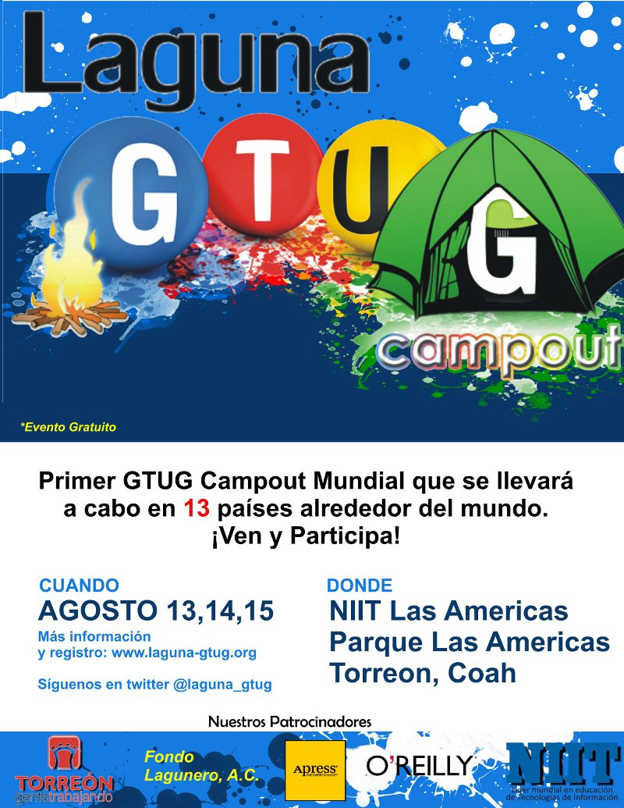

Title: GTUG Campout Laguna 2010
Slug: gtug-campout-2010
Summary: GTUG Campout es un evento de fin de semana largo en donde los participantes tienen la oportunidad de diseñar, desarrollar y demostrar una aplicación completa, elaborada durante los tres días.
Tags: desarrollo
Date: 2010-08-05 20:00
Modified: 2010-08-05 20:00
Category: articulos
Preview: gtug.jpg

**GTUG Campout** es un evento de fin de semana largo en donde los participantes tienen la oportunidad de diseñar, desarrollar y demostrar una aplicación completa, elaborada durante los tres días. El inicio de trabajos sera en [NIIT Laguna](http://www.niit-laguna.com/) el **viernes 13 de agosto**, en donde los equipos y las ideas se juntan. Los equipos tendrán el resto del fin de semana para construir sus aplicaciones antes de presentar su trabajo al público en domingo por la tarde.

### No es un típico _Hackathon_

En lugar de presentaciones o conferencias seguidas por múltiples variaciones del clásico _"Hello World"_, el Campout se trata de codificar y desarrollar una aplicación completa utilizando tecnologías de Google con un énfasis particular al uso de **HTML5**. Mientras existe la oportunidad de probar nuevas API's y aprender nuevas características, los equipos producirán una aplicación real en 2.5 días, a cambio de comida y la oportunidad de fama y fortuna si se crea una aplicación exitosa, además de varios premios.

Si te agrada el reto, [regístrate](http://www.laguna-gtug.org/) el cupo es limitado.

