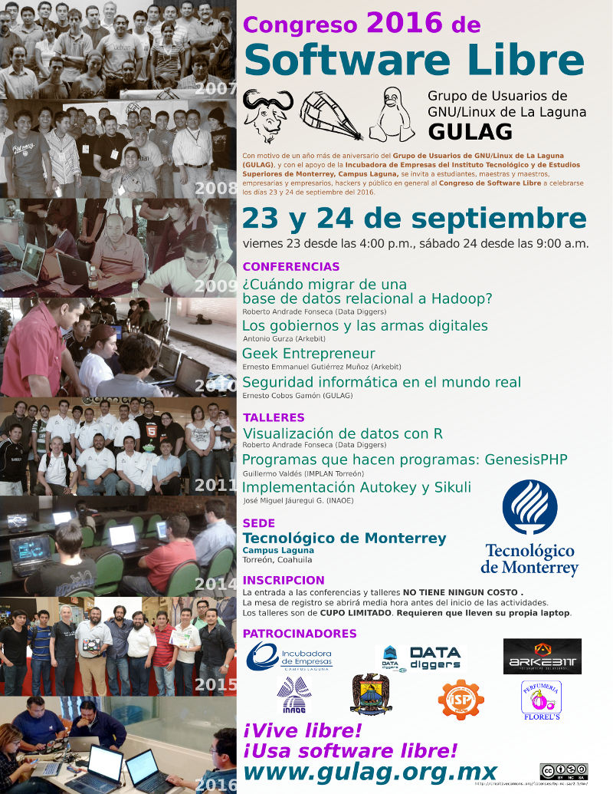
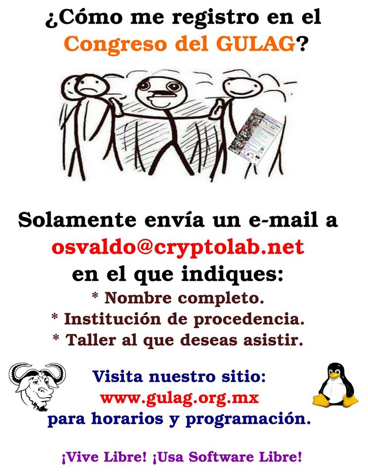

Title: GULAG Congreso 2016 - Invitación al taller GenesisPHP
Slug:gulag-congreso-2016-genesisphp-invitacion
Summary: Invitación a la primera presentación en público del software libre GenesisPHP.
Tags: gulag, php, postgresql
Date: 2016-09-23 11:15
Modified: 2016-09-23 11:15
Category: articulos
Preview: gulag.png

Atención _PHPeros_ Laguneros.

Les invito al taller **Programas que hacen programas: GénesisPHP** que tratará sobre el sistema que su servidor ha desarrollado para hacer sistemas. No sé si les vaya a ser útil o no; pero puedo asegurarles que el taller tratará conceptos avanzados de nuestro lenguaje predilecto el **PHP.**

Para llegar a los conceptos propios de desarrollo de sistemas con **GenesisPHP** les solicitamos que sus laptops traigan instalado previamente **GNU/Linux, Apache2, PHP5 y PostgreSQL8 o 9,** sea como sistema operativo base o en virtualización. Así como el cliente **GIT** para bajar el software libre desde [GitHub](https://github.com/).

El terreno por descubrir en el desarrollo de aplicaciones es enorme, por lo que su apoyo en preparación de sus equipos nos brindará más tiempo para explorar y experimentar tanto con PHP como con GenesisPHP.

Para saber más y para **descargar GenesisPHP** visite [https://github.com/guivaloz/GenesisPHP](https://github.com/guivaloz/GenesisPHP)

### Sede, fecha y lugar

* **Tecnológico de Monterrey, Campus Laguna.**
* Sábado **24 de septiembre 2016 a las 9 A.M.**
* Las conferencias se realizaran en la SALA #1 planta baja edificio CCI.
* Salón #106 planta baja Edificio ETLAC (profesional).

Muchas gracias.

**Última hora:** Me informan que la cantidad de asistentes al taller a llegado a su límite. Aun así, pueden comunicarse a [osvaldo@cryptolab.net](mailto:osvaldo@cryptolab.net) para solicitar que el mismo taller se repita en una fecha futura.

