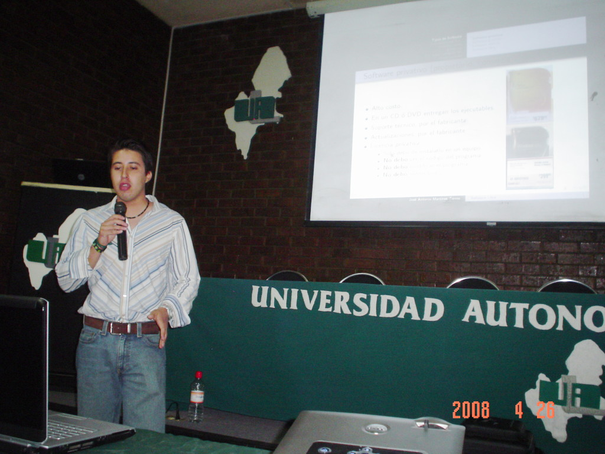
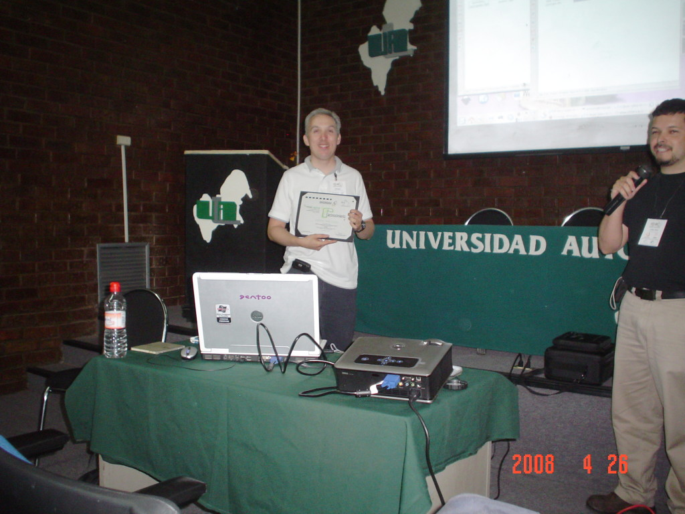
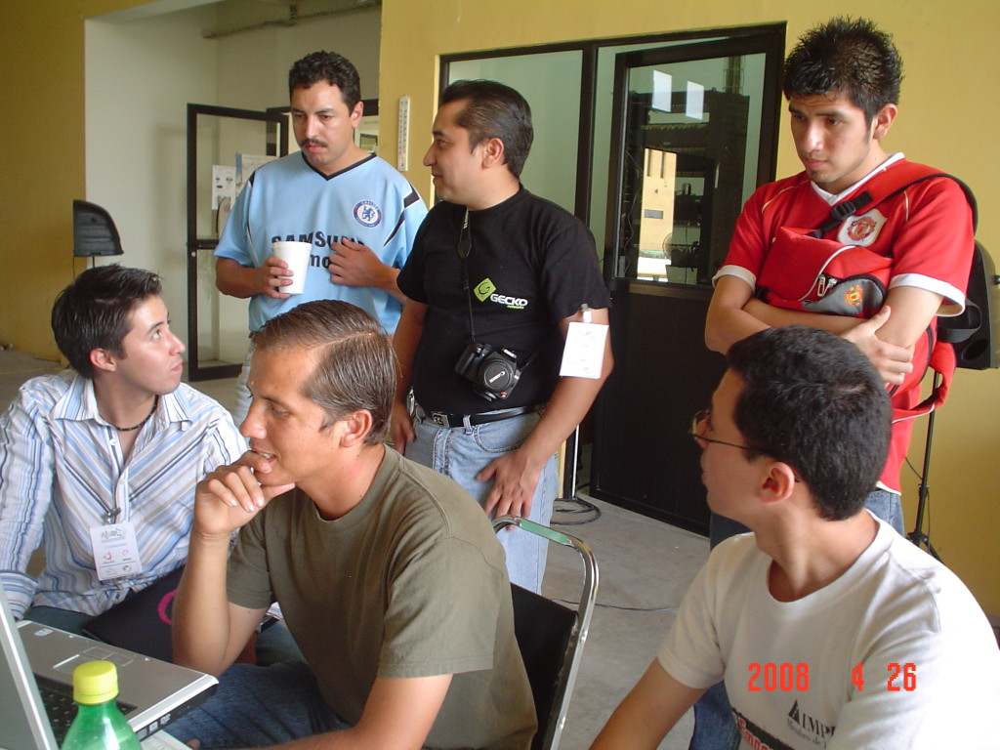
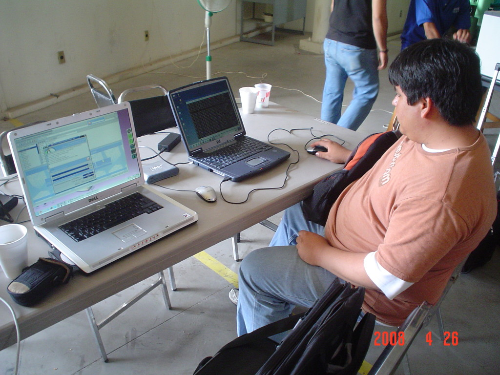
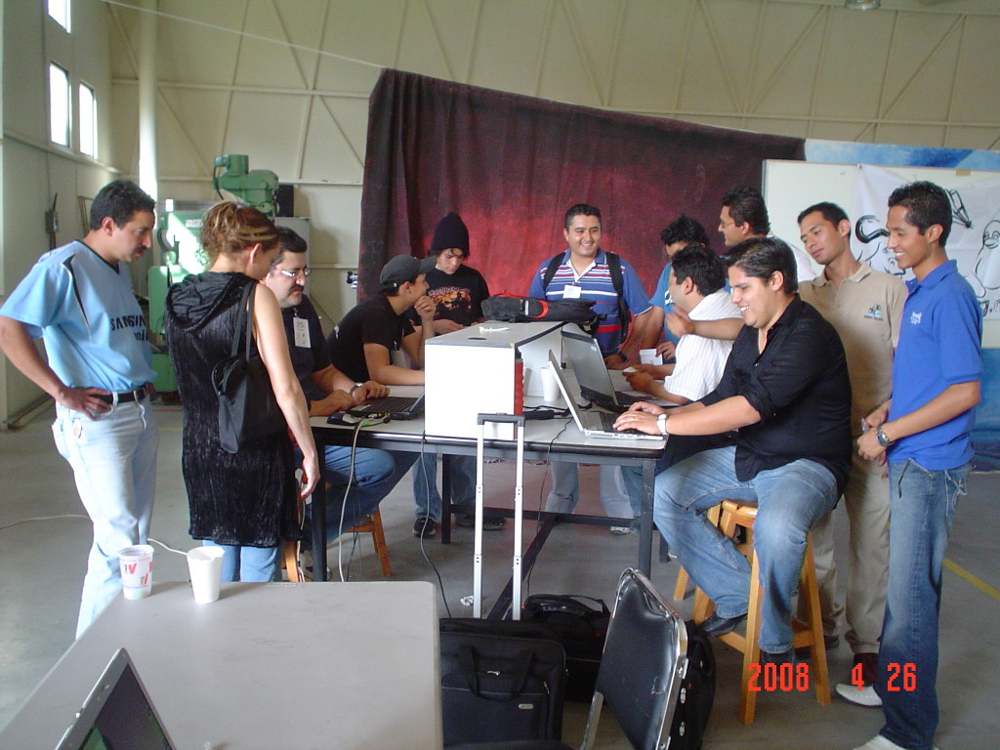
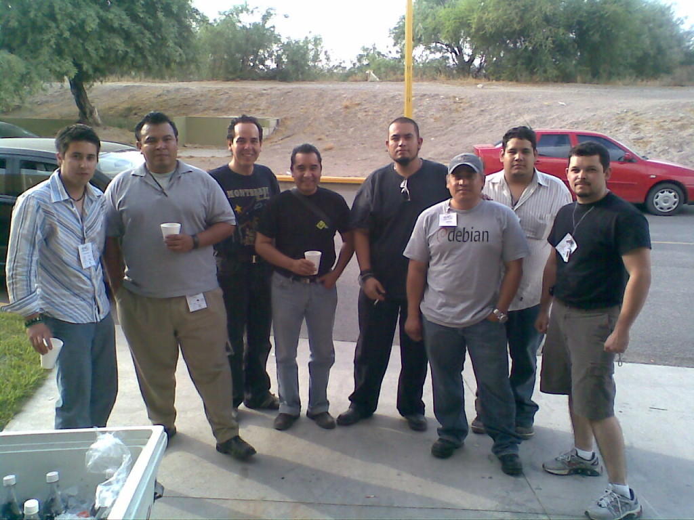
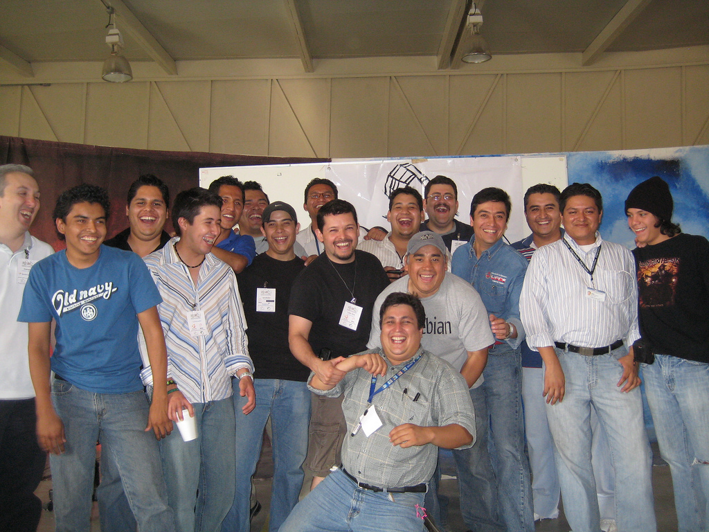

Title: FLISOL 2008
Slug: gulag-flisol-2008
Summary: El 26 de abril de 2008, se llevó acabo el FLISOL (Festival Latinoamericano de Instalación de Software Libre), el cual fué organizado por segundo año consecutivo por el Grupo de Usuarios de GNU/Linux de La Laguna y con una asistencia de más de 50 personas.
Tags: gulag, flisol
Date: 2008-05-03 08:30
Modified: 2008-05-03 08:30
Category: articulos
Preview: preview.jpg

El pasado Sábado 26 de Abril del 2008, se llevó acabo el FLISOL (Festival Latinoamericano de Instalación de Software Libre), el cual fué organizado por segundo año consecutivo por el [Grupo de Usuarios de GNU/Linux de La Laguna](http://www.gulag.org.mx) y con una asistencia de más de 50 personas.

La primer plática fué por parte de [José Antonio Martínez Torres](http://www.antoniomtz.org/) con el tema **Introducción al Software Libre**. Seguido por su servidor, Guillermo Valdez Lozano con el tema **Qué se puede hacer con el Software Libre**.

En más de 20 equipos se instaló GNU/Linux. Su servidor tuvo el gusto de hacer una instalación de [Knoppix](http://www.knoppix.net/) en una portátil con el lector de CD descompuesto. Se usó la [carga del sistema operativo por la red local](http://www.knoppix.net/wiki/KNOPPIX_Terminal_Server).

