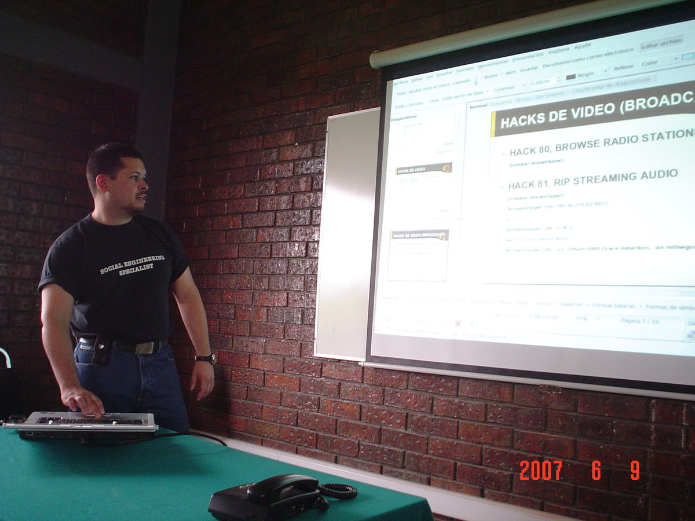

Title: Junta de la Gulag "Multimedia Hacks"
Slug: gulag-junta-multimedia-hacks
Summary: El 9 de junio de 2007, Luis Páez (lobogris) nos dió una amena e interesante plática sobre hacks de multimedia para GNU/Linux. A groso modo, explicó los comandos para ripear un CD a mp3, para convertir a varios formatos de audio y cómo ripear videos desde un DVD.
Tags: gulag
Date: 2007-06-10 00:00
Modified: 2007-06-10 00:00
Category: articulos
Preview: preview.jpg

El pasado sábado 9 de junio, Luis Páez (lobogris) nos dió una amena e interesante plática sobre hacks de multimedia para GNU/Linux.  A groso modo, explicó los comandos para ripear un CD a mp3, para convertir a varios formatos de audio y cómo ripear videos desde un DVD.  He aquí las fotos:

Al final nos mostró gran cantidad de divertidos videos. ¡Felicidades LoboGris!
