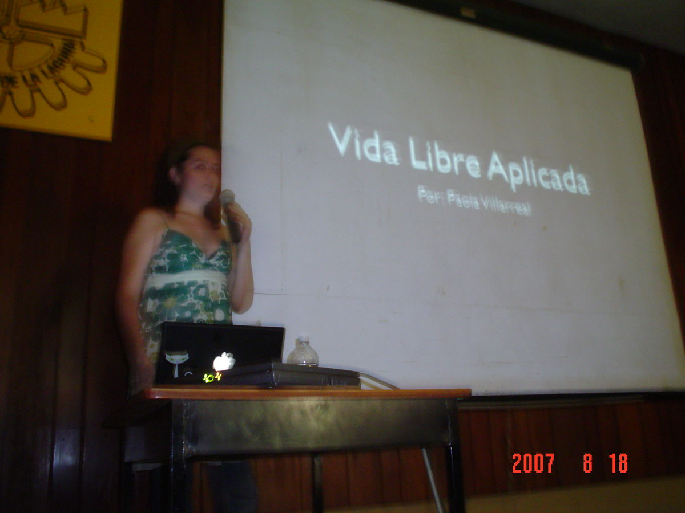

Title: Evento del Primer Aniversario del GULAG
Slug: gulag-primer-aniversario
Summary: Ponencias muy interesantes, gran camaradería y una buenísima discada es parte de lo mucho que se vivió en el evento con motivo del primer aniversario del GULAG, realizado el sábado 18 de agosto en el Instituto Tecnológico de La Laguna.
Tags: gulag
Date: 2007-08-20 20:30
Modified: 2007-08-20 20:30
Category: articulos
Preview: preview.jpg

Ponencias muy interesantes, gran camaradería y una buenísima discada es parte de lo mucho que se vivió en el evento con motivo del primer aniversario del [GULAG](http://www.gulag.org.mx), realizado el sábado 18 de agosto en el [Instituto Tecnológico de La Laguna](http://www.itlalaguna.edu.mx/).

Entre [Hugo Francisco Gonzalez Robledo](http://www.honeynet.org.mx/web/pages/Miembros) y [Miguel José Hernández y López](http://www.honeynet.org.mx/web/pages/Miembros) se tomaron un par de temas relativos a la seguridad en internet, sobre [Nepenthes](http://es.wikipedia.org/wiki/Nepenthes) y [Honeynets](http://en.wikipedia.org/wiki/Honeynet_project) respectivamente. Ambos nos demostraron que internet es un lugar hostil y las técnicas que se utilizan tanto para atrapar programas malignos como para estudiar las técnicas de los atacantes. [Paola Villareal](http://creativecommons.org.mx) nos brindó un ideal humano sobre cómo aplicar la filosofía del Software Libre a nuestra vida personal; sin duda a todos nos hizo reflexionar un momento sobre cómo podríamos mejorar nuestra forma de ser para aportar a la comunidad algo más que sólo cuestiones de la informática.

La comida, como es ya una tradición, fue una deliciosa discada en la que leoneo se lució como gran chef conocedor en la materia.

Para terminar el evento, su servidor participó impartiendo un taller práctico sobre [Inkscape](http://www.inkscape.org) sobre el cual, quiero destacar el gran entusiasmo de los asistentes, gran parte de ellos alumnos del [ITL](http://www.itlalaguna.edu.mx/) así como de quienes trabajaron arduamente en preparar los equipos de cómputo para el taller.

Gracias a los patrocinadores, las instituciones educativas, asistentes y compañeros del grupo por tan magnífico evento. ¡Felicidades al Gulag!
