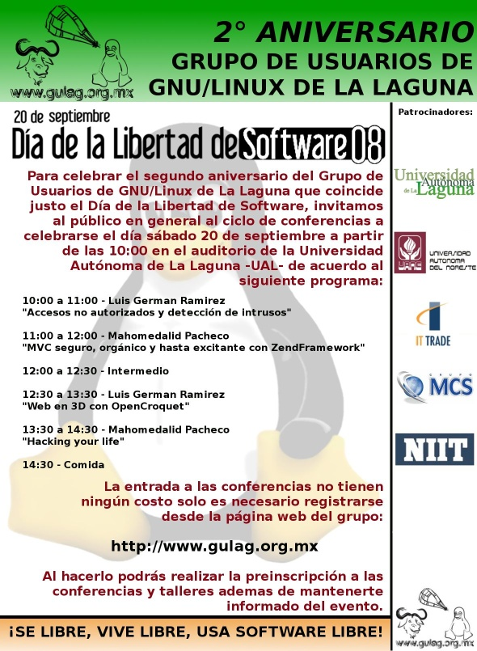

Title: Segundo Aniversario del Gulag / Software Freedom Day
Slug: gulag-segundo-aniversario
Summary: Les invitamos cordialmente al Segundo Aniversario del Grupo de Usuarios de GNU/Linux de la Laguna que celebramos justo el Día del Software Libre "Software Freedom Day". Donde distinguidos protagonistas del Software Libre en México nos compartirán sus conocimientos y experiencias.
Tags: gulag
Date: 2008-09-18 13:30
Modified: 2008-09-18 13:30
Category: articulos
Preview: gulag.png

Les invitamos cordialmente al **Segundo Aniversario del Grupo de Usuarios de GNU/Linux de la Laguna** que celebramos justo el Día del Software Libre [Software Freedom Day](http://softwarefreedomday.org/). Donde distinguidos protagonistas del Software Libre en México nos compartirán sus conocimientos y experiencias.

### Conferencistas invitados

**Luis German Ramírez** (meljux)

Es egresado de la Benemerita Universidad Autonoma de Puebla (BUAP) ha participado en diferentes eventos como el CONSOL, FSL y otros, cuya temática ha sido el Sistema Operativo GNU/Linux y el Software Libre. Actualmente trabaja en Servicios Industriales Peñoles desempeñando diferentes actividades que van desde la administración de red hasta el desarrollo web y la investigación de nuevas tecnologías. Tiene un especial interés en las tecnologías orientadas a web y el web de próxima generación, el web tridimensional.

**Mahomedalid Pacheco** (mictlan)

Desarrollador de software en [Innox](http://www.innox.com.mx/). Usuario de GNU/Linux desde 1999 con especialidades en aplicaciones web, PSP, CMMi, PHP, Javascript, Diseño de Software, MySQL.

### Fecha y Lugar

**Sábado 20 de septiembre de 2008** en la Universidad Autónoma de la Laguna (U.A.L.).

### Programa

Horario        | Evento                                                   | Ponente
---------------|----------------------------------------------------------|---------
10:00 a 11:00  | Accesos no autorizados y detección de intrusos           | Luis German Ramírez
11:00 a 12:00  | MVC seguro, orgánico y hasta excitante con ZendFramework | Mahomedalid Pacheco
12:00 a 12:30  | _Intermedio_                                             |
12:30 a 13:30  | Web3D: Sistemas de colaboración Educativa                | Luis German Ramírez
13:30 a 14:30  | Hacking your life                                        | Mahomedalid Pacheco
14:30          | _Comida_                                                 |

**Accesos no autorizados y detección de intrusos**

Son muchas las técnicas usadas por los hackers para obtener accesos no autorizados y muchos los nuevos vectores de ataque, que es necesario utilizar herramientas de automatización para la detección de intrusos y de vulnerabilidades de nuestras redes y software. En esta pláctica se explican algunas técnicas usadas por los hackers y como combatirlos usando Snort, Nessus y Ethereal.

**MVC seguro, orgánico y hasta excitante con ZendFramework**

ZendFramework _es la onda_, pero es un incomprendido. Hay que difundir este gran framework libre en PHP por los creadores de PHP para PHPeros, viendo una parte integral del framework: MVC. MVC con verdadera arquitectura, sin esos falsos parches de view (Smarty, patTemplate, etc.) y esos diseños malos de controller (CodeIgniter, etc.). MVC seguro, orgánico y excitante.

**Web3D: Sistemas de colaboración Educativa**

Los actuales sistemas de aprendizaje en línea carecen de la dimensión social que caracterizan al aprendizaje en el mundo real. Esta dimensión social puede capturarse en un sistema virtual tridimensional donde se puede simular desde el aula de clases, hasta una universidad completa: es un excelente ambiente para desarrollar actividades de manera conjunta, cada participante con una representacion virtual y con la capacidad de manipular, copiar, modificar e incluso crear objetos en espacios tridimensionales virtuales, ambientes controlados como laboratorios, y áreas donde se requiere de visualización, entrenamiento y capacitación, presentamos una plataforma para el desarrollo de sistemas de colaboración educativa en tres dimensiones.

**Hacking your life**

Inspirado en un libro que permite meter los hacks más utilizados por _gurus geeks_ en la vida real. Si aplicamos estas ideas dentro de las empresas podemos ayudar a mejorar la productividad.

### Registro

**No hay costo** para ingresar al evento.
