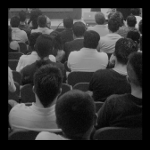
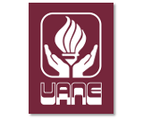
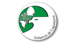

Title: Tercer Congreso Nacional de Software Libre
Slug: gulag-tercer-congreso
Summary: Con motivo del tercer aniversario del GULAG y con el fin de traer a nuestra región distinguidos ponentes del Software Libre les invitamos al Tercer Congreso Nacional de Software Libre.
Tags: gulag
Date: 2009-09-04 10:30
Modified: 2009-09-04 10:30
Category: articulos
Preview: gulag.png

Con motivo del tercer aniversario del [GULAG](http://www.gulag.org.mx/) y con el fin de traer a nuestra región distinguidos ponentes del Software Libre les invitamos al [Tercer Congreso Nacional de Software Libre](http://congreso.gulag.org.mx/). Un día donde los grandes _gurús_ nos compartirán sus experiencias, donde se impartirán talleres para poner en práctica programas libres y donde ejercermos nuestra libertad de compartir conocimientos y software.

### Conferencias

10 a.m. **KDE y México** por Guillermo Antonio Amaral Bastidas

Guillermo Amaral es el líder de KDE en México y está emprendiendo una gran labor para hacer que [KDE](http://www.kde.org/) llegue a las manos de cada individuo ya sea hombre, muyer o niño. Nos invitará a que formemos parte del _ejército_ en la lucha por la representación de los Mexicanos dentro de KDE en el mundo. Cualquiera de nosotros puede representar a KDE en la escuela, universidad o en algún evento en la ciudad o en el estado. La conferencia de Guillermo Amaral tratará sobre el fantástico KDE y el gran potencial de nosotros como Mexicanos ante el mundo como promotores de éste Software Libre.

11 a.m. **Seguridad en Entornos Web** por Rafael Bucio Velázquez

Hoy en dia, con la cantidad de información que se encuentra distribuida en internet, resulta bastante sencillo que cualquier persona normal pueda montar un sitio web, pero ¿cuantos de ellos se preocupan por la seguridad?

12 p.m. **Nubes a través de mi ventana (Cloud Computing)** por Luis German Ramírez

Son muchas las tecnologías que han hecho posible el sueño casi imposible del cómputo utilitario: SaaS, almacenamiento y ancho de banda barato, algoritmos cliente sofisticados incluyendo HTML, CSS, AJAX, REST, clientes broadband, arquitecturas orientadas a servicios (SOA), implementación de enormes infraestructuras como Google, Yahoo, Amazon y otras que proveen cómputo distribuido real, masivo y escalable; además de la virtualización comercial. ¿Qué es el cloud computing?, ¿Quién puede usarlo?, ¿Mi empresa debe migrar al cloud? Esta presentación pretende esclarecer el concepto de cloud computing, desde su definición, implementación y casos especificos con software libre.

### Talleres simultáneaos

2 p.m. **Hardening y Hacking en Linux** por Jorge Altamirano Astorga

Taller para la elaboracion de sistemas con seguridad mejorada en diversas aplicaciones: SSH, Apache, DNS, AppArmour

2 p.m. **Usando librerías gráficas con Bash** por Rafael Bucio Velázquez

Aprenderemos a crear scripts con ayuda de pequeñas librerías de GTK+. En esté taller no es necesario saber un lenguaje en específico ya que al principio veremos un concepto básico sobre la programación en Bash.

2 p.m. **Diseño gráfico con GIMP e Inkscape** por Guillermo Valdés

Conoceremos las bondades del editor de imágenes de tipo _bitmap_, el [GIMP](http://www.gimp.org/) y el programa de dibujo por vectores, el [InkScape](http://www.inkscape.org/). Usando estos dos programas libres podemos corregir imágenes, hacer composiciones, diseñar carteles y gráficos para sitios web.

### Fecha

Único día: **12 de septiembre de 2009**

### Sede

**Universidad Autónoma del Noreste** (UANE) Campus Torreón, Auditorio de usos múltiples, El Eriazo del Norte y Periférico s/n, Torreón, Coahuila, México.

### Costo y registro

El evento es GRATUITO.

### Patrocinado por

