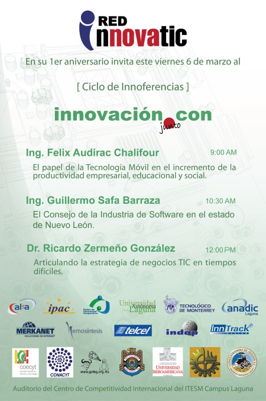

Title: InnovaTIC 1er Aniversario
Slug: innovatic-1er-aniversario
Summary: Su servidor y un grupo de personas interesadas en la Innovación Colaborativa en el tema de TIC's estamos cumpliendo un año de habernos integrado como una RED de Trabajo, InnovaTIC.
Tags: política
Date: 2009-03-03 13:00
Modified: 2009-03-03 13:00
Category: articulos
Preview: innovatic.png

Su servidor y un grupo de personas interesadas en la Innovación Colaborativa en el tema de TIC's estamos cumpliendo un año de habernos integrado como una RED de Trabajo, [InnovaTIC](http://www.innovatic.org.mx/).

En este primer año hemos conseguido integrar un grupo sólido y enfocado en desarrollo de proyectos. Debido a ello es que ya contamos con varios de ellos que han puesto en evidencia nuestra capacidad de trabajar con excelente voluntad por el bien del grupo.

Para celebrarlo hemos organizado, a manera de fiesta de aniversario, tres conferencias a desarrollarse entre las 9:00 y las 13:30 horas el día 6 de marzo de 2009. La sede son las instalaciones del Tec de Monterrey, Campus Laguna.

### Entrevista en Buffet Informativo

<audio controls>
<source src="CT_Buffet_Info_2009-03-03_innovatic.ogg" type="audio/ogg">
Your browser does not support the audio element.
</audio>

### Entrevista en Telediario Vespertino

<audio controls>
<source src="MT_Telediario_V_2009-03-05_innovatic.ogg" type="audio/ogg">
Your browser does not support the audio element.
</audio>

### Actualización

Posteriormente Luis Rayas Velasco y su servidor fueron invitados al programa Contextos de GREM. Hablamos sobre la Red InnovaTIC, el [Grupo de Usuarios de GNU/Linux de La Laguna](http://www.gulag.org.mx/) y Software Libre.

### Entrevista en Contextos

<audio controls>
<source src="GR_Contextos_2009-03-05_innovatic.ogg" type="audio/ogg">
Your browser does not support the audio element.
</audio>
