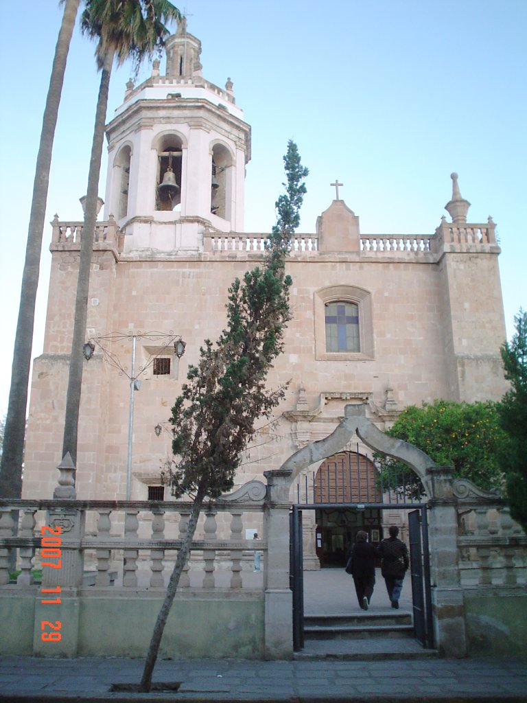

Title: Software Libre en el Instituto Tecnológico Superior Zacatecas Sur
Slug: itszas-conferencia-software-libre
Summary: Fue una grata experiencia haber participado en el 1er Foro Regional de Ingenierías Electromecánica y Sistemas organizado por el Instituto Tecnológico Superior Zacatecas Sur.
Tags: conferencias
Date: 2007-12-02 00:20
Modified: 2007-12-02 00:20
Category: articulos
Preview: preview.jpg

Fue una grata experiencia haber participado en el [1er Foro Regional de Ingenierías Electromecánica y Sistemas](http://www.itszas.edu.mx/index_archivos/foro.htm) organizado por el [Instituto Tecnológico Superior Zacatecas Sur](http://www.itszas.edu.mx/). Quedó demostrado la gran capacidad de los alumnos del ITSZaS para exponer sus proyectos, así como la iniciativa de los directivos y maestros del plantel educativo en organizar y atender el foro.

Agradezco profundamente el gran interés en la exposición [Software Libre]({filename}/presentaciones/software-libre/software-libre.md) donde manifesté, desde mi punto de vista, los beneficios que ofrece. Así como invitarlos a que usen, aprendan y compartan estos programas.

Puedo afirmar sin temor a equivocarme, que la comunidad estudiantil del ITSZaS tiene el potencial para alcanzar las grandes metas que se propongan. Deseo personalmente que algunos de los asistentes lleguen a utilizar GNU/Linux, y por qué no, que también ayuden a difundir la filosofía del software libre.

Además, quedé maravillado con la belleza de la región, y en particular con la ciudad de [Tlaltenango de Sánchez Román](http://es.wikipedia.org/wiki/Tlaltenango_de_S%C3%A1nchez_Rom%C3%A1n), Zacatecas, México.

Una ciudad pequeña pero con gran calor humano, espacios agradables, gente cortés, tranquilidad y paz. El poco tiempo que estuve en esos lugares bastó para regresar enriquecido y deseoso de vivir en una ciudad así, donde los niños juegan a sus anchas en la plaza principal, donde las calles son limpias por que así las mantienen sus habitantes, donde basta caminar unas cuantas cuadras para ir de la plaza, a la iglesia, al comercio, al banco. Aunque tome 11 horas ir desde la Comarca Lagunera a Tlaltenango... ¡regresaré gustosamente!
