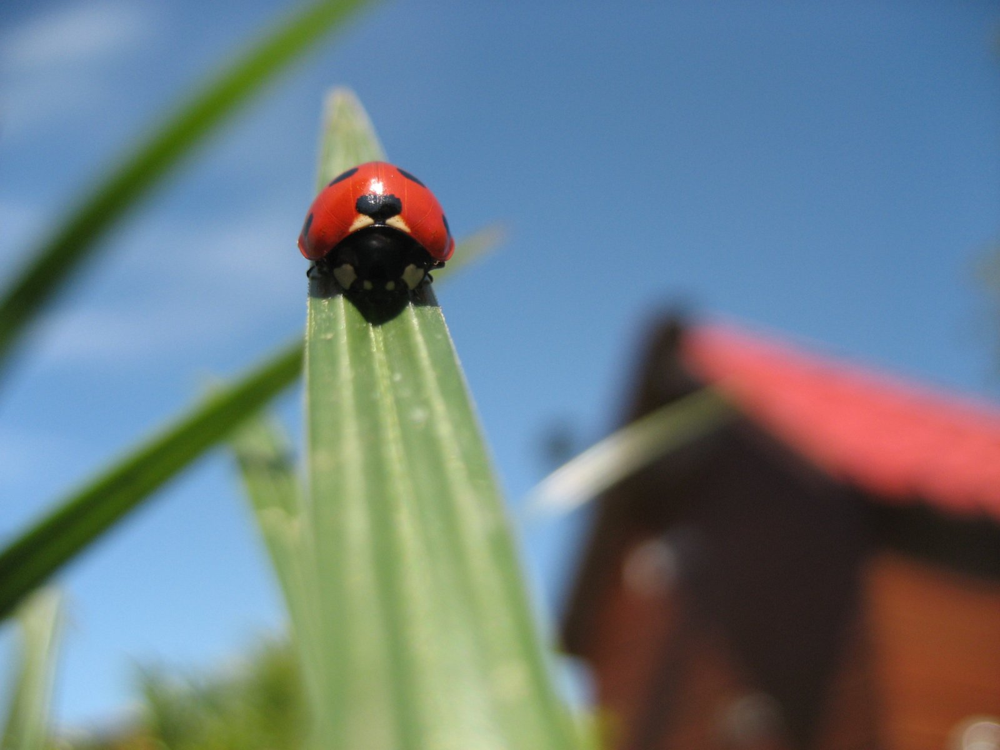

Title: Wallpaper "Miss Marie"
Slug: miss-marie
Summary: Les muestro lo que a mi gusto es uno de los mejores fondo de pantalla del tipo "naturaleza" que he encontrado.
Tags: wallpapers
Date: 2007-05-21 00:00
Modified: 2007-05-21 00:00
Category: articulos
Preview: preview.jpg

No... si pensaban que el fondo de pantalla "Miss Marie" iba a ser una bellísimia y curvilínea dama... no... están equivocados.

Por lo regular los fondos con fotografías de la creación más hermosa de Dios suelen distraer a los hombres, débiles a la carne, que intentan trabajar en estas frías máquinas, las computadoras, con las que solemos pasar más tiempo que con nuestras parejas.

Pero aunque "Miss Marie" no es de nuesta especie, me encanta, me asombra en su detalle, me pierdo en su sencillez y colorido.

Basta ya de habladuría y les muestro lo que a mi gusto es uno de los mejores fondo de pantalla del tipo "naturaleza" que he encontrado, de esos que nos tranquilizan y nos dan una sensación de bienestar:

Levanto mi sombrero al autor de esta fotografía, al Danés *ipol*, y les paso el vínculo original de donde obtuve esta imagen en [kde-look](http://www.kde-look.org/content/show.php/Miss+Marie?content=58713).
