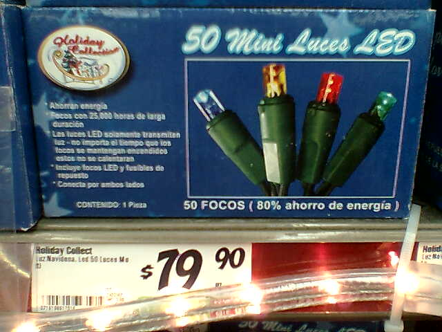
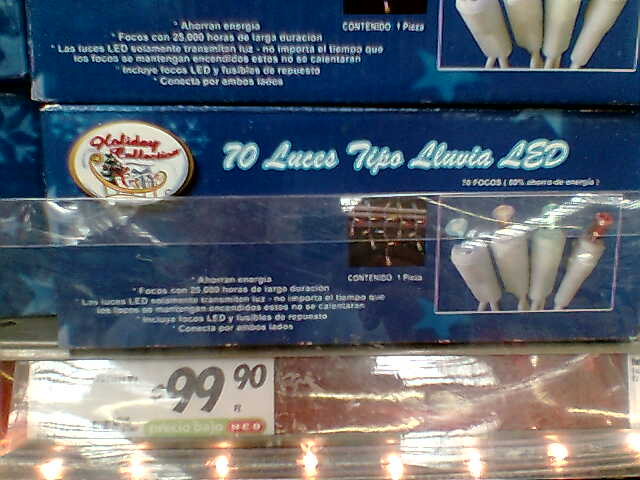
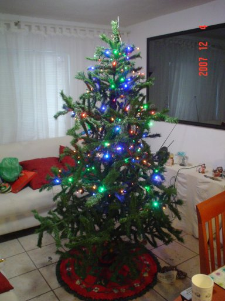

Title: Navidad a la LED... ¡que caro!
Slug: navidad-a-la-led-que-caro
Summary: Cuando comenzaro a venderse las series de luces led para navidad fueron realmente caras.
Tags: vida cotidiana
Date: 2007-12-05 10:55
Modified: 2007-12-05 10:55
Category: articulos
Preview: preview.jpg

**"¡Papá! ¡ya falta poco para Navidad!"** dice mi hija **"¿Cuándo vamos a poner el _arbolito_? ¿cuándo vamos a comprar _cosas_ para Navidad?"** Esas palabras vinendo de la niña _más dulce_ del mundo se contraponen a la labor (que veo venir, e inevitablemente llegará) de bajar todas las empolvadas cajas con las _cosas_ navideñas de los años pasados. Propuse un trato, esa noche bajaríamos las cajas y mañana armarían (Mamá y Tú) el _pinito_.

Al día siguiente... **"Debemos comprar focos para el pino."** ¿Eh?.. ¿Qué le pasó a los focos del año pasado? XD... Vino la explicación: **"El año pasado se puso _medio pino_, ahora vamos a poner el _pino completo_, NECESITAMOS más foquitos"**. Este _pino artificial_ tiene un tubo central con dos segmentos, así que puede ponerse sólo uno, logrando que la altura sea de la mitad. Pero este año el pino va a ser completo. **"Bueno, vamos mañana al _super_"**.

Recordé el post de [LinuxMan](http://linuxman.blogsome.com) titulado [Navidad a la LED](http://linuxman.blogsome.com/2007/11/25/navidad-a-la-led/) el cual planteaba la pregunta **"¿Por qué no hacen series navideñas con tecnología LED?"**. Como muchos de Ustedes (supongo), ando contagiado con la _enfermedad del ecologista_ y _trato_ que mis compras sean lo menos perjudiciales a nuestro planeta. Pero reconozco que no puedo dejar de comprar esos prácticos platos y vasos desechables, que tanto me ayudan a no lavar platos XD.

Vaya gusto que me dió encontrar en el _supermercado_ series de luces navideñas con leds en vez de focos incandecentes. La pequeña caja presume que estas luces duran miles y miles de horas, no se calientan (lo cual reduce el riesgo de incendio) y que consumen unos cuantos míseros _watts_. Pero... **¡Cuestan más del doble que los incandecentes!** e íbamos a comprar **¡4 cajas!** (por que tienen la mitad de luces que las series incandecentes) dando un total de casi **¡$320 pesos!**.

**"Bueno, todo sea en _pro_ de la ecología"**. Como he visto dos veces el documental [Una Verdad Incómoda](http://es.wikipedia.org/wiki/Una_verdad_inc%C3%B3moda) me pareció (en ese momento) que el gasto lo valía y que sería un buen ejemplo para _sermonear_ a mi hija.

Al siguiente día, antes de llegar a casa, recibo un mensaje que decía **"No alcanzaron los foquitos."** ¿Queeee? ¿200 foquitos no alcanzaron? _achis_ ¿Qué? ¿Apoco creció el pino (artificial) durante el año que pasó guardado? XD... Pues sí... Esta es la foto de un pino _que no creció_ con **200 leds ecológicos** y **$320 pesos** de inversión.

**"¿Cómo vez? ¿compraremos más series de luces led? ¿o le agregamos una serie de focos incandecentes del año pasado?"**. Mi _dolida_ cartera ya no pudo más, y optamos por la segunda opción. El arbolito navideño quedó muy bonito, excelente labor de mi mujer y mi hija, al que hemos bautizado como nuestro **pino navideño híbrido**, mitad leds, mitad focos incandecentes.

Esperaré a que pongan en _remate_ las series leds para comprar un par más :D.
