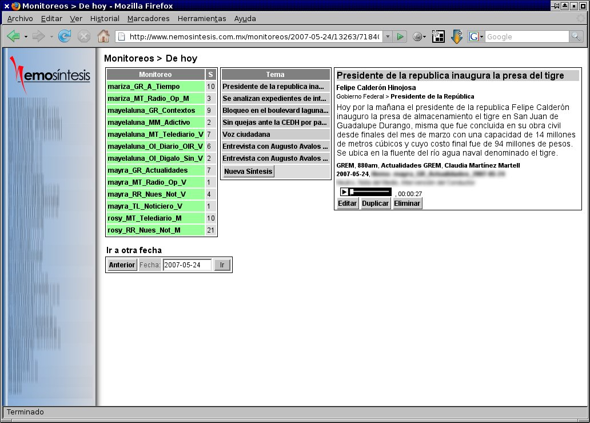

Title: Nemosíntesis 4.0
Slug: nemosintesis-4.0
Summary: Después de que termina un largo trabajo siente un agradable regocijo al ver su creación andando. Con ese gusto me complace que se haya actualizado el sistema de la empresa donde trabajo Nemosíntesis de la versión 3.2 a la 4.0.
Tags: desarrollo
Date: 2007-05-20 00:00
Modified: 2007-05-20 00:00
Category: articulos
Preview: preview.jpg

Esta nota tal vez no sea muy significativa para Usted. Pero seguramente después de que termina un largo trabajo siente un agradable regocijo al ver su creación andando. Con ese gusto me complace que se haya actualizado el sistema de la empresa donde trabajo [Nemosíntesis](http://www.nemosintesis.com.mx) de la versión 3.2 a la 4.0.

Este cambio fue en todos los aspectos, desde mejorar el diseño de la base de datos hasta solucionar nuevas exigencias que la empresa necesitaba.

Como si fuese un embarazo: Fueron 7 meses de gestación (diseñando, programando y matando dragones), terminó pesando 32,650 líneas de código aproximadamente, y utilizando sólo [POO](http://es.wikipedia.org/wiki/Programaci%C3%B3n_orientada_a_objetos). Los padrinos son [PHP](http://www.php.net), [PostgreSQL](http://www.postgresql.org), [Apache](http://httpd.apache.org/), [Quanta](http://quanta.kdewebdev.org/) y [GNU/Linux](http://www.linux.org).

Termino mostrando una foto de "mi hijo", a la cual le he puesto borroso algunos componentes que comprometen tanto trabajo:

