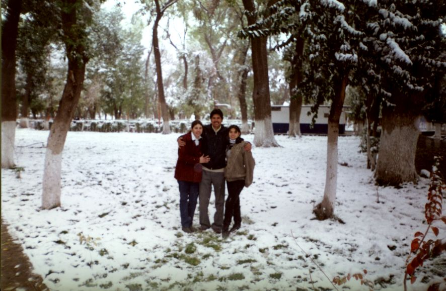
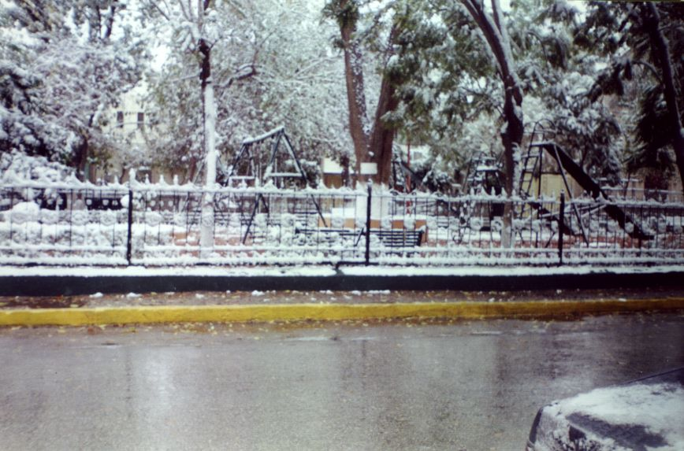
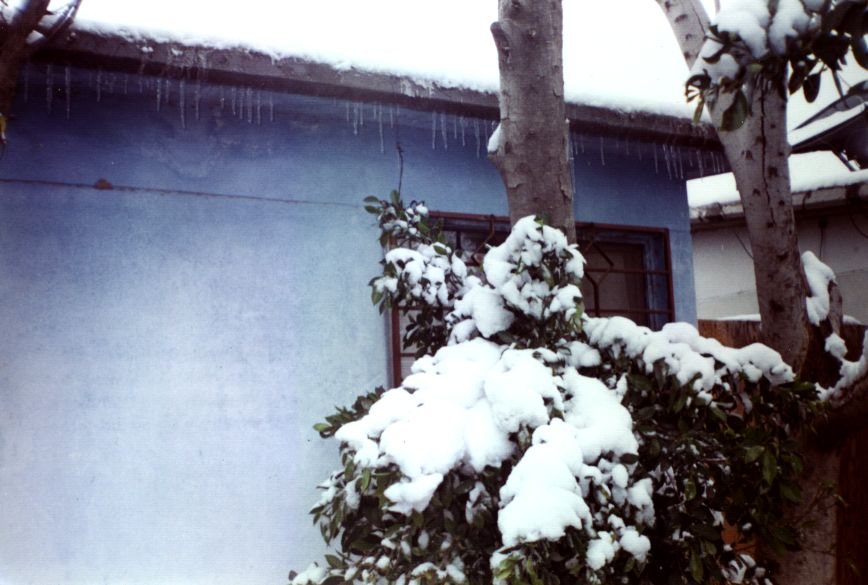
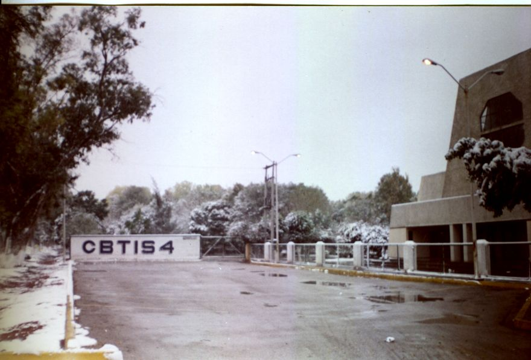
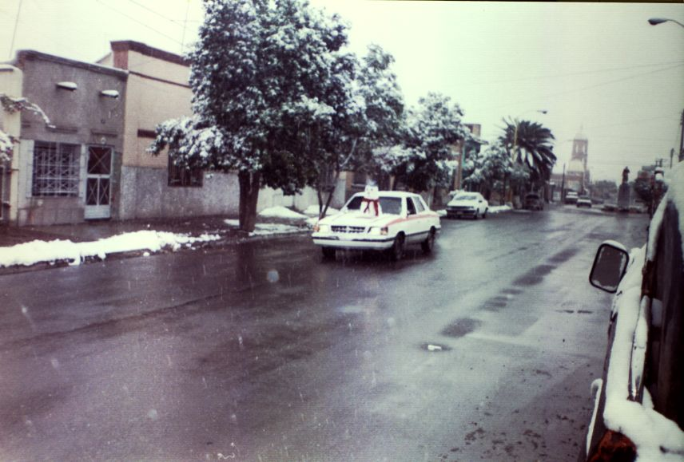
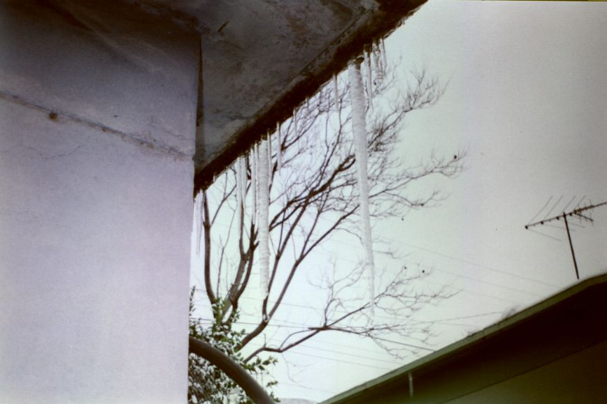
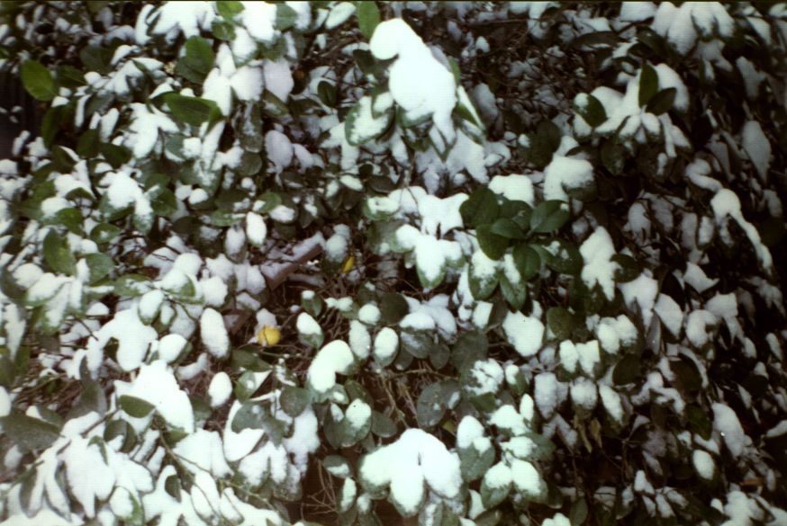
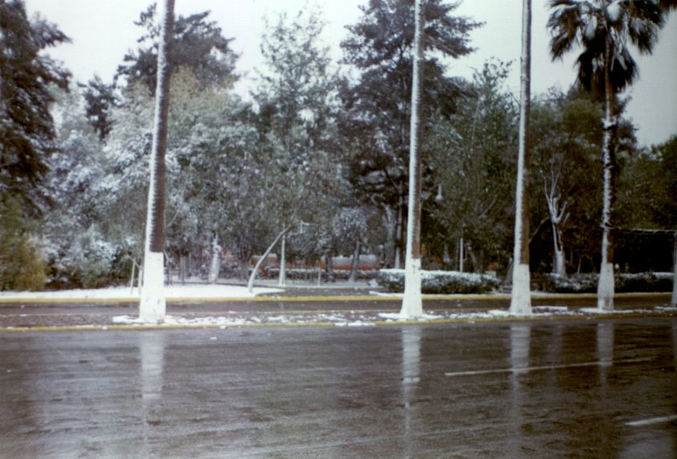
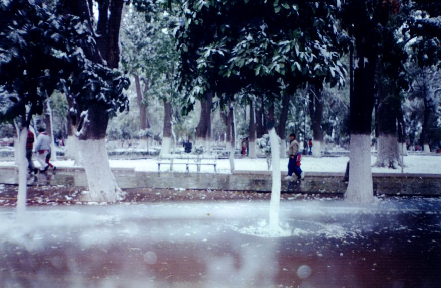
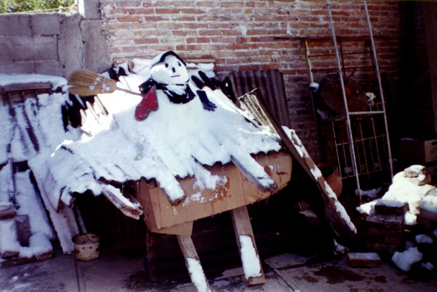

Title: Nevada de 1997
Slug: nevada-de-1997
Summary: “¡Está nevando!”, dijo mi papá. Ese día la ciudad se paralizó, no hubo clases, muchos negocios no abrieron, había pocos camiones y muchos carros no arrancaron. ¡Oh, que emoción! ¡Es la segunda vez en mi vida que veo nevar! Inmediatamente corrí por mi cámara y todo el día la pasé en la calle tomando fotos a diestra y siniestra.
Tags: vida cotidiana
Date: 2007-12-12 18:30
Modified: 2007-12-12 18:30
Author: Rosa Elena Espinoza
Category: articulos
Preview: preview.jpg

La noche del 11 de diciembre de 1997, como las 9 pm nos encontrábamos Guillermo y yo (en aquel entonces mi novio), tratando de **no** congelarnos dentro del viejo auto de mi papá (sin calefacción). Permanecíamos con las manos entrelazadas, hablando trivialidades, mirándonos a los ojos, como si nada pasara. No nos podíamos ver a diario, y ni aquel _frillazo_ podía impedir que pasáramos un momento juntos, a pesar de que cada vez más se sentía el descenso de la temperatura. En el parabrisas se veía como el viento estrellaba diminutas gotas de agua, y por un momento se me ocurrió: **¿será que irá a nevar? ... ¡¡No!! Eso aquí nunca pasa...**

La madrugada del viernes 12 de diciembre como a las cinco de la mañana escuché ruidos inusuales en la casa. La tele se escuchaba prendida, sonaban trastes en la cocina, y la _chimus_ (QEPD) arañaba la puerta de mi cuarto para que la dejara entrar. Intrigada, me levanté a ver.  **¿Que pasó? ¿Por que no fuiste a trabajar?** _pregunté_ **“¡Está nevando!”**, dijo mi papá.  Ese día la ciudad se paralizó, no hubo clases, muchos negocios no abrieron, había pocos camiones y muchos carros no arrancaron. **¡Oh, que emoción! ¡Es la segunda vez en mi vida que veo nevar!** Inmediatamente corrí por mi cámara y todo el día la pasé en la calle tomando fotos a diestra y siniestra, _quien sabe cuando volveré a ver esto_ pensaba.

Hoy exactamente diez años después, recuerdo ese día con gran añoranza. Veo aquellas fotos y me parece imposible que haya pasado una década, y aún me pregunto: **¿Cuando volveré a ver nevar aquí en la laguna?...** Aunque no descarto la posibilidad, creo que cada vez será **menos** probable. En este momento son las 11 de la mañana y en mi lugar de trabajo el aire acondicionado está prendido tratando de mantener la temperatura a 25°C.

**¡Cuanto contraste!** Este invierno romperá el récord con menos días fríos o más días calientes, _como sea_, el caso es que por aquellos años **el ecologito** un profe del tec que así le decíamos, ya advertía _tal como un fanático religioso anuncia la llegada del fin del mundo_, que todo eso del _Global Warming_ nos alcanzaría prolongando los veranos cada vez más, haciendo casi imperceptibles los otoños, y los inviernos apenas si tendrían los suficientes días fríos, para hacernos sentir el espíritu navideño.

