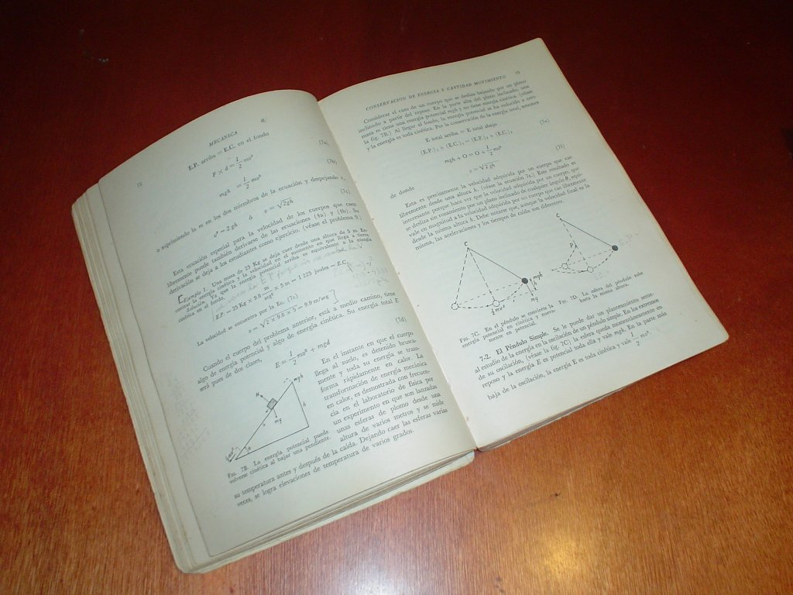

Title: Nueva imagen y logotipo para Movimiento Libre
Slug: nueva-imagen-2009
Summary: He dedicado varios días para renovar al sitio de Movimiento Libre. La gran pregunta que tuve en mi cabeza fué... ¿qué logotipo se podría elaborar para Movimiento Libre?.
Tags: vida cotidiana
Date: 2009-07-22 23:59
Modified: 2009-07-22 23:59
Category: articulos
Preview: preview.jpg

He dedicado varios días para renovar al sitio de [Movimiento Libre](http://www.movimientolibre.com/). La gran pregunta que tuve en mi cabeza fué... ¿qué logotipo se podría elaborar para Movimiento Libre?.

El título **Movimiento Libre** viene del [Movimiento del Software Libre](http://es.wikipedia.org/wiki/Movimiento_del_software_libre). La intensión primordial de hablar de [Software Libre](http://es.wikipedia.org/wiki/Software_libre) se lleva muy bien con este título. Desde la primer publicación (el 8 de mayo de 2007) tomé la imagen de la niña en el columpio, en este juego (con la mentalidad de un niño) _tratamos de liberarnos de la Tierra y ¡salir volando!_.

Por otro lado, simpatizo con todas las ciencias, pero más con la física. Así que busqué inspiración en una de mis antigüedades más preciadas, el libro **Física Descriptiva** de Harvey E. White.

En este libro explica la [mecánica newtoniana](http://es.wikipedia.org/wiki/Mec%C3%A1nica_newtoniana) de [Issac Newton](http://es.wikipedia.org/wiki/Isaac_Newton). Encontré en éste el diagrama que explica el péndulo (columpio) y me pareció bastante apropiado usarlo como logotipo. Recordemos que el **Software Libre** tiene muchas similitudes con la [Ciencia](http://es.wikipedia.org/wiki/Ciencia).

Para elaborarlo usé primero el [Inkscape](http://www.inkscape.org/) para trazar el diagrama del péndulo. Luego le apliqué los colores que ha usado Movimiento Libre. En [GIMP](http://www.gimp.org/) combiné el diagrama con la fotografía de la niña en el columpio para crear la imagen-encabezado.

La renovación también ha involucrado un nuevo pero más sencillo CSS y mejoras en el código del [CMS de Movimiento Libre](http://cms.movimientolibre.com/). Posteriormente tocaré ambos temas.
