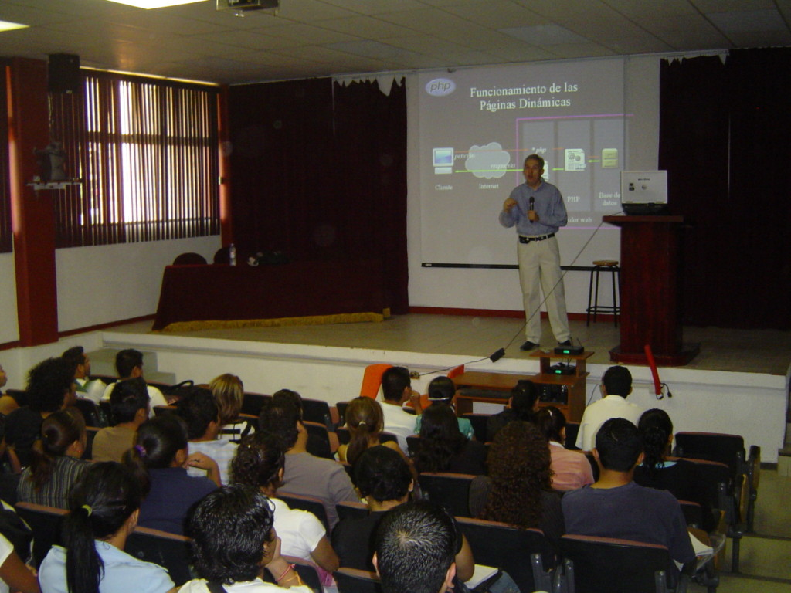

Title: PHP Básico en el Tec de Lerdo
Slug: tec-lerdo-php-basico
Summary: El 15 de abril de 2008, a nombre del GULAG, impartí la conferencia PHP Básico en el Instituto Tecnológico Superior de Lerdo.
Tags: conferencias
Date: 2008-04-17 22:55
Modified: 2008-04-17 22:55
Category: articulos
Preview: instituto-tecnologico-superior-de-lerdo.jpg

El pasado 15 de abril de 2008, a nombre del [Grupo de Usuarios de GNU/Linux de La Laguna](http://www.gulag.org.mx/), impartí la conferencia [PHP Básico]({filename}/presentaciones/php-basico/php-basico.md) en el [Instituto Tecnológico Superior de Lerdo](http://www.itslerdo.edu.mx/).

[PHP](http://www.php.net) es hoy en día el lenguaje de programación libre más usado en aplicaciones web. Generalmente se ejecuta en un servidor web, tomando el código en PHP como su entrada y creando páginas web como salida. Puede ser desplegado en la mayoría de los servidores web y en casi todos los sistemas operativos y plataformas. Y, por supuesto, es [Software Libre](http://es.wikipedia.org/wiki/Software_libre).

Los asistentes mostraron gran interés en el tema. Además del tradicional material de presentación, su servidor, ejecutó algunos programas en PHP, esto con el fin de llevar a la práctica los conceptos explicados. Agradezco grandemente todo el apoyo de maestros y personal del Tec de Lerdo, en particular, por haber desconectado la computadora del auditorio (con MS Windows) y permitir conectar la portátil de su servidor.

