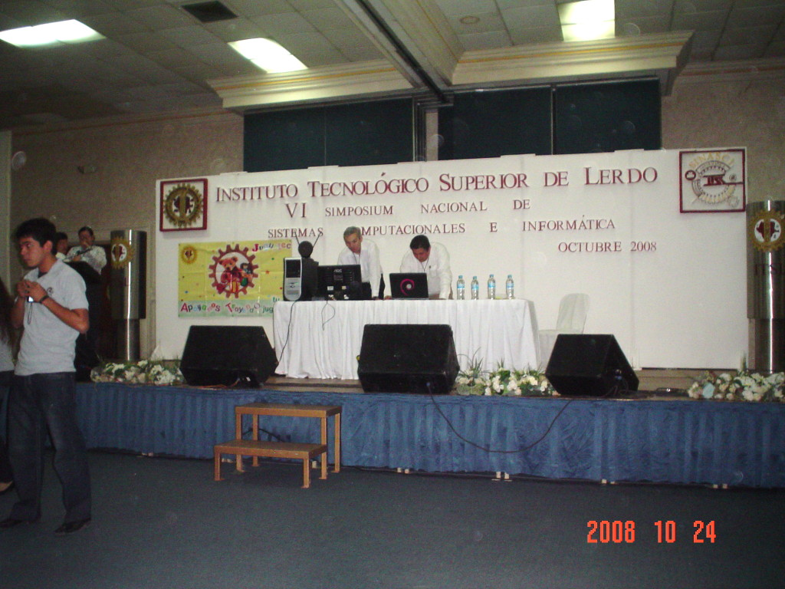
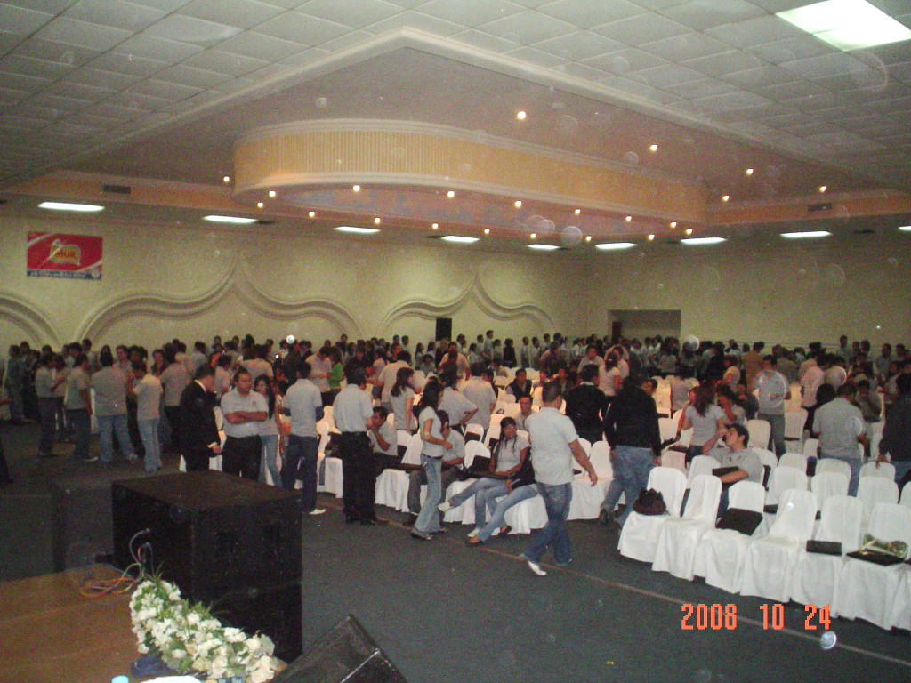

Title: Demostración de Programas Multimedia en el SINASCI 2008
Slug: tec-lerdo-sinasci-4
Summary: El Instituto Tecnológico Superior de Lerdo nos honró a César Espino (RIVE) y a su servidor con la invitación al VI Simposium Nacional de Sistemas Computacionales e Informática con la ponencia Demostración de programas de aplicación multimedia.
Tags: conferencias
Date: 2008-10-26 21:00
Modified: 2008-10-26 21:00
Category: articulos
Preview: instituto-tecnologico-superior-de-lerdo.jpg

El [Instituto Tecnológico Superior de Lerdo](http://www.itslerdo.edu.mx/) nos honró a [César Espino (RIVE)](http://riveonline.com/) y a su servidor con la invitación al **VI Simposium Nacional de Sistemas Computacionales e Informática** con la ponencia **Demostración de programas de aplicación multimedia.**

El evento comenzó con su servidor explicando los tipos de archivos de audio y video, la patente del formato MP3 y las aplicaciones LAME, Audacity, FFMPEG, MPlayer, Xine y VLC. Mostré la visualización de la TV en una computadora Pentium 4, con 512 MB de RAM y una tarjeta Pinnacle i110 para demostrar la versatilidad de GNU/Linux y de que no se necesitan equipos de punta para lograr excelentes resultados en multimedia.

César Espino mostró los programas GIMP, Inkscape y Blender. De este último programa, proyectó parte del cortometraje [Big Buck Bunny](http://www.bigbuckbunny.org/) con el que cautivó a los asistentes.

Mi más profundo agradecimiento y felicitaciones al [Instituto Tecnológico Superior de Lerdo](http://www.itslerdo.edu.mx/) por difundir el Software Libre en la Comarca Lagunera. La presentación que mostré puede descargarse en [Audio y Video en GNU/Linux]({filename}/presentaciones/audio-y-video-en-gnu-linux/audio-y-video-en-gnu-linux.md).

