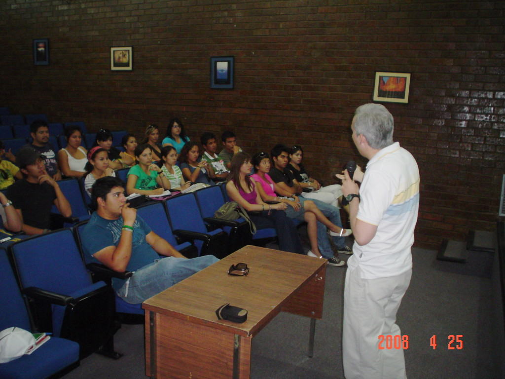
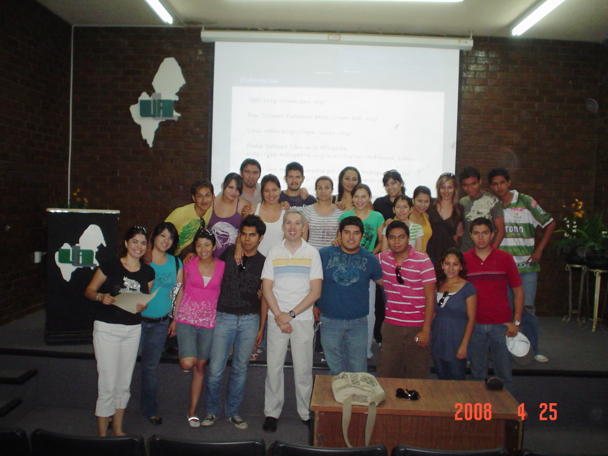

Title: Software Libre en la UAL para alumnos de diversas licenciaturas
Slug: ual-conferencia-software-libre-2
Summary: El 25 de abril de 2008 fui amablemente invitado a dar la conferencia Software Libre al grupo de la Lic. Mayela Luna en la Universidad Autónoma de La Laguna.
Tags: conferencias
Date: 2008-05-03 08:00
Modified: 2008-05-03 08:00
Category: articulos
Preview: ual.jpg

El pasado 25 de abril de 2008 fui amablemente invitado a dar la conferencia [Software Libre]({filename}/presentaciones/software-libre/software-libre.md) al grupo de la Lic. Mayela Luna en la [Universidad Autónoma de La Laguna](http://www.ual.mx). Ante un nutrido grupo de estudiantes de diversas carreras de licenciatura expuse las virtudes del software libre.

Me llevo de este grupo, el recuerdo de que en general, el usuario que siempre ha usado software privativo tiene gran temor de cambiar al software libre porque piensa que perderá la capacidad de trabajar con los archivos anteriores o con los trabajos que le encarguen en la institución educativa.

No dudo que usar GNU/Linux es la mejor opción como sistema operativo y que hay muchos programas que son tan buenos (e incluso mejores) como sus contrapartes comerciales. Pero, quien crea necesitar estos softwares privativos puede optar por continuar usando el mismo sistema operativo e instalar en él software libre de gran utilidad como [FireFox](http://www.mozilla.com/), [Open Office](http://www.openoffice.org/), [Gimp](http://www.gimp.org/), [Inkscape](http://www.inkscape.org/) y muchos más que le ahorrarán dinero (en la compra se software) y sin ser software ilegal (o pirata).

