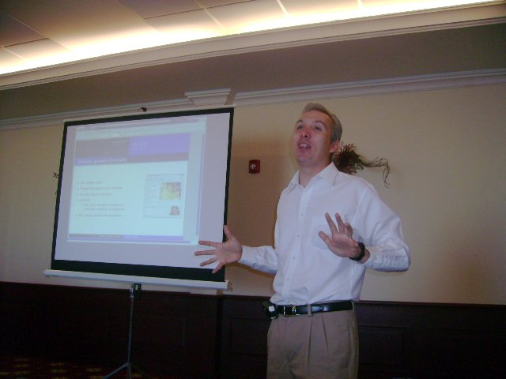
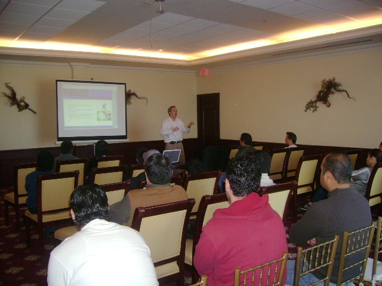

Title: Software Libre en el Congreso UAL 2008
Slug: ual-conferencia-software-libre
Summary: El 7 de diciembre de 2007 participé en el Congreso UAL 2008 exponiendo el tema Software Libre ante alumnos, maestros y compañeros del GULAG.
Tags: conferencias
Date: 2007-12-10 13:10
Modified: 2007-12-10 13:10
Category: articulos
Preview: ual.jpg

El pasado 7 de diciembre participé en el Congreso [UAL](http://www.ual.mx/) 2008 exponiendo el tema [Software Libre]({filename}/presentaciones/software-libre/software-libre.md) ante alumnos, maestros y compañeros del [GULAG](http://www.gulag.org.mx/).

Cuando muestro este material, no dejo de recalcar que son las instituciones educativas las que deben de tomar la iniciativa de enseñar el software libre y el software comercial (o privativo). La principal razón para esto es que los futuros egresados no lleguen al campo laborar sólo usando aplicaciones privativas, por que podrían volverse dependientes de los fabricantes de estas aplicaciones. Hacemos notar el hecho de que las licencias estudiantiles y académicas son más económicas que la licencia comercial del mismo programa. En cambio, el egresado que conozca tanto las aplicaciones libres como las privativas, conocerá las ventajas del software libre y tendrá la libertad de elegir la opción que mejor le convenga cuando ejerza su profesión.
