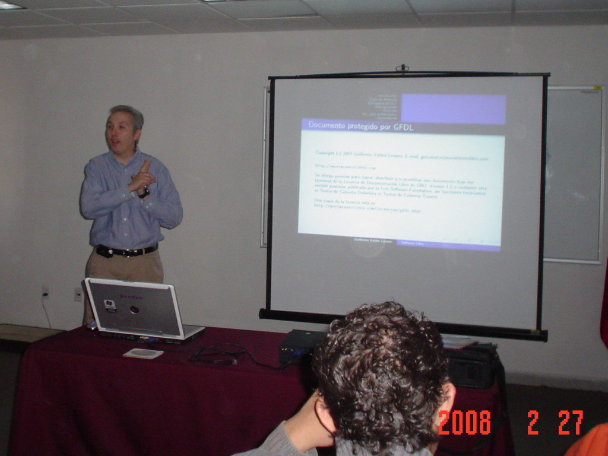
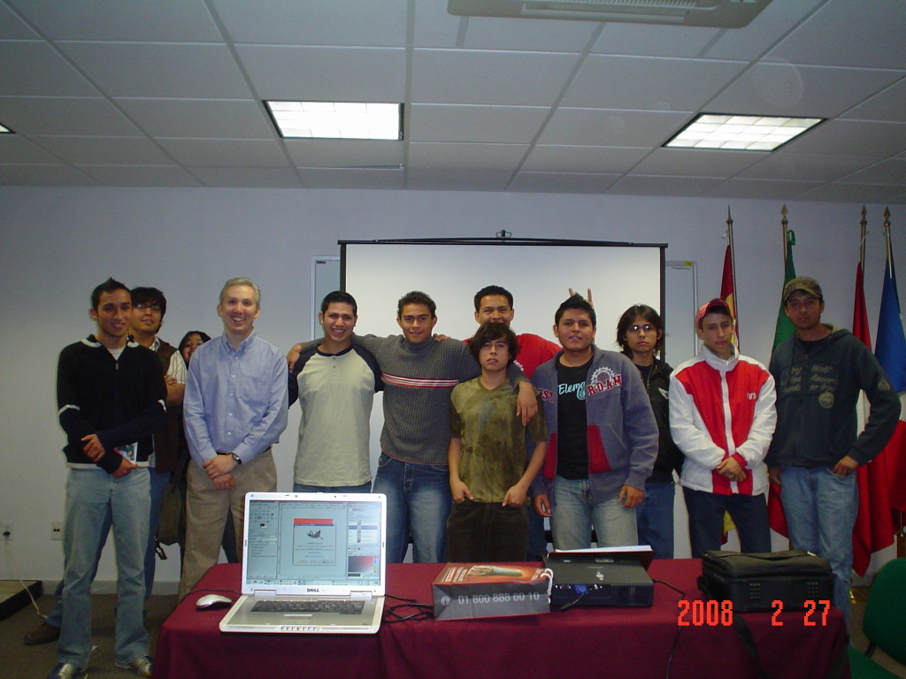

Title: "Software Libre" en la Universidad del Valle de México - Laguna
Slug: uvm-conferencia-software-libre
Summary: El 27 de febrero de 2008 fui cordialmente invitado a dar la plática Software Libre en la Universidad del Valle de México (UVM) Plantel Laguna.
Tags: conferencias
Date: 2008-02-29 13:00
Modified: 2008-02-29 13:00
Category: articulos
Preview: uvm.png

El pasado 27 de febrero de 2008 fui cordialmente invitado a dar la plática [Software Libre]({filename}/presentaciones/software-libre/software-libre.md) en la [Universidad del Valle de México](http://www.uvmnet.edu) (UVM) Plantel Laguna. Ante aproximadamente 20 asistentes, expliqué lo que es el software libre, pero principalmente, lo que significa la filosofía de este movimiento.

Los alumnos mostraron gran interés y comentaron que tienen en puerta algunos proyectos en los que podrían recibir ayuda de empresas de software. Su servidor, les hizo la recomendación de revisar muy detenidamente las ofertas estas empresas, ya que podrían estar condicionadas a la entrega de los derechos del software que desarrollaran.

Al final de cuentas, la **decisión de elegir** entre software libre y el no libre **es personal**, en ese sentido, ellos pueden elegir entre aprovechar los beneficios (económicos, equipos, etc.) de una empresa de software _privativa_ o las ventajas de _liberar_ sus trabajos como software libre (compartir conocimiento, dar y recibir apoyo de la comunidad, etc.).

También agradezco grandemente las excelentes atenciones de los profesores y personal de la UVM.

