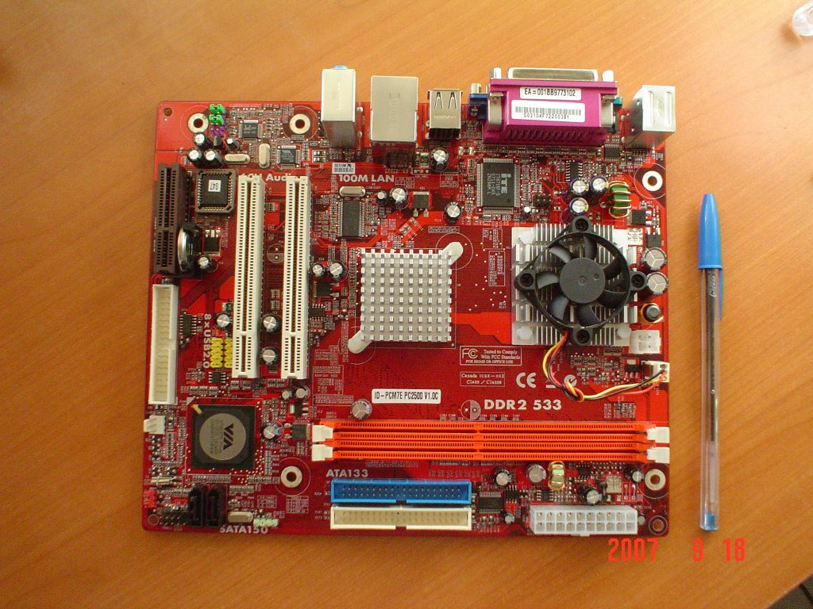
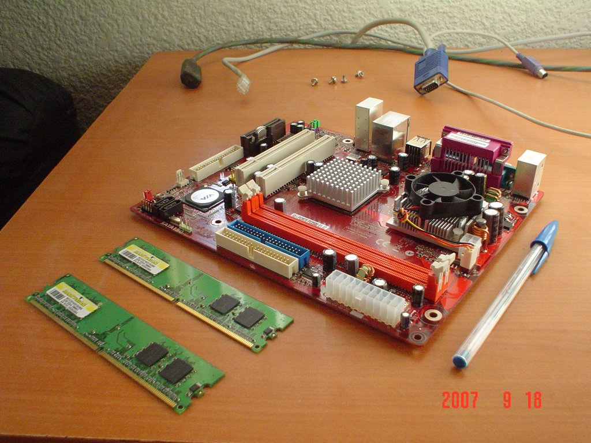
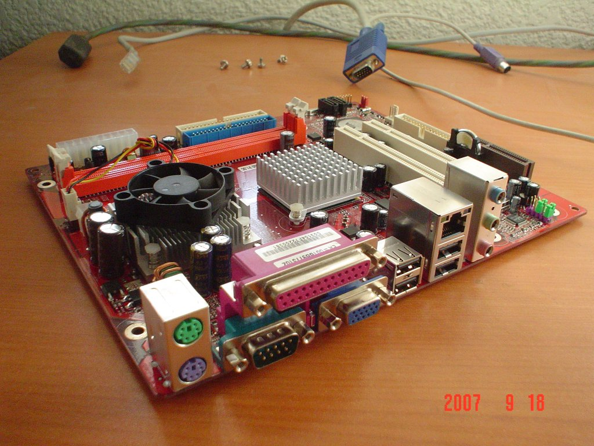
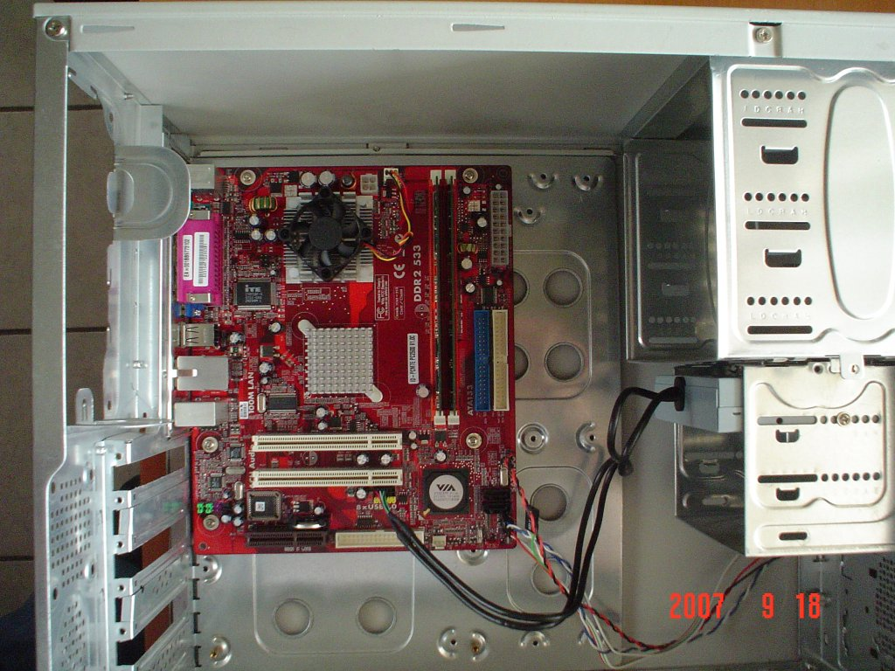
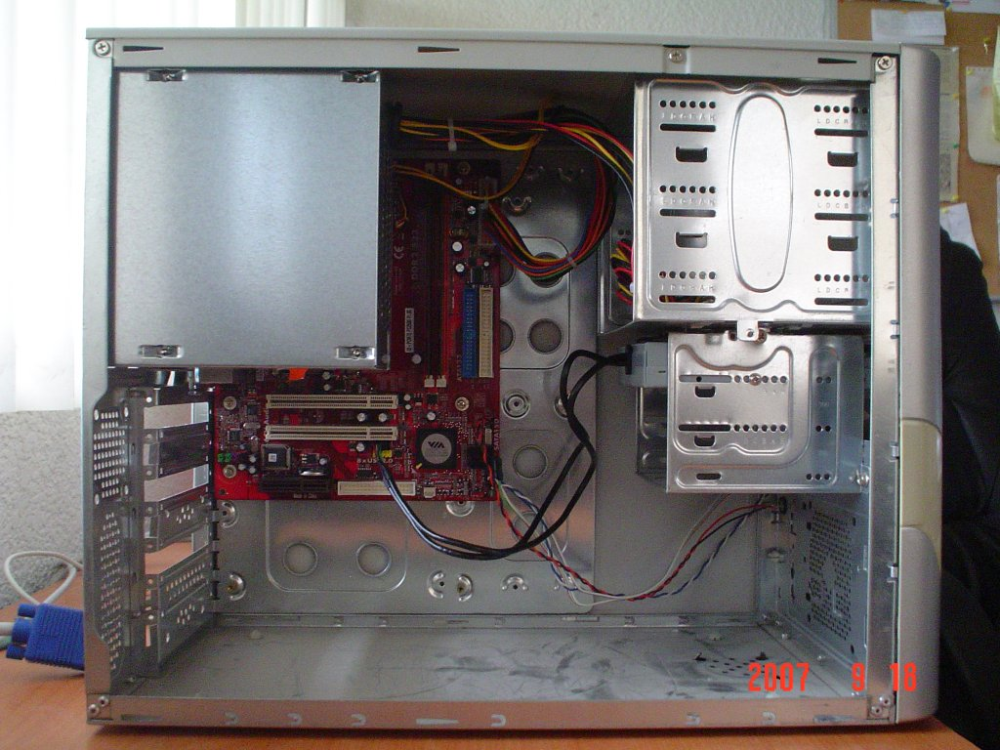

Title: Via pc2500 primera impresión
Slug: via-pc2500-primera-impresion
Summary: Después de mucho tiempo de búsqueda, por fin tengo en mis manos un equipo Mini-ITX de Via Technologies.
Tags: hardware
Date: 2007-09-24 13:00
Modified: 2007-09-24 13:00
Category: articulos
Preview: preview.jpg

Después de mucho tiempo de búsqueda, por fin tengo en mis manos un equipo [Mini-ITX](http://es.wikipedia.org/wiki/Mini-ITX) de [Via Technologies](http://www.via.com.tw).

Las placas Mini-ITX son generalmente refrigeradas mediante dispositivos pasivos (disipadores de calor) por su arquitectura de bajo consumo y son ideales para su uso como [HTPC](http://es.wikipedia.org/wiki/HTPC) (como un _Home Theater_ con una PC) donde el ruido generado por la computadora (y en particular, por los ventiladores de refrigeración) resultaría molesto a la hora de disfrutar una película. Particularmente para este modelo, el [VIA pc2500](http://www.via.com.tw/en/initiatives/empowered/pc2500_platform/), sólo se tiene un pequeño ventilador para el procesador.

Antes de entrar de lleno en mostrarles las características de este equipo, quiero hacer un paréntesis para que reflexione sobre el hardware que hay en el mercado. Por un lado el avance tecnológico da como fruto procesadores y equipos más poderosos, como muestro en esta tabla de los procesadores [Intel](http://www.intel.com/) obtenida de [microprocessor_timeline.pdf](http://www.intel.com/pressroom/kits/core2duo/pdf/microprocessor_timeline.pdf):

Lanzamiento | Procesador         | Velocidad
------------|--------------------|-----------------------------
1993        | Pentium            | 60 - 66 MHz
1997        | Pentium II         | 200 - 300 MHz
1999        | Pentium III        | 650 - 1200 MHz
2000        | Pentium 4          | 1300 - 2000 MHz
2002        | Pentium 4 HT       | 3200 - 3400 MHz
2006        | Pentium Core 2 Duo | 1800 - 3000 MHz x 2 núcleos
2007        | Pentium Quaq Core  | 2400 - 2660 MHz x 4 núcleos

Vemos que los procesadores se hacen más rápidos y poderosos, y en beneficio, las computadoras más nuevas tienen más capacidad para hacer tareas demandantes.

Pero vayamos al grano, a la aplicación o tarea final del equipo. Si usted demanda los más nuevos entornos gráficos, edición de video o virtualización, definitivamente necesita un equipo poderoso del que hablamos. En cambio, tareas simples y concretas pueden hacerce perfectamente en tecnologías anteriores y bien probadas.

Via Technologies le está apostando a este último concepto. Ha mezclado las nuevas tecnologías de minitiaurización y rendimiento energético con la herencia de los mejores procesadores para crear computadoras eficientes y económicas.

El modelo [VIA pc2500](http://www.via.com.tw/en/initiatives/empowered/pc2500_platform/) tiene como características técnicas:

* Procesador VIA C7-D de 1.5 GHz (compatible con x86)
* Tamaño 17 x 17 cm (Mini-ITX)
* Capacidades multimedia y 3D (MMX, SSE, SSE2, SSE3)
* Hasta 2 GB de RAM DDR2
* Video VIA UniChrome con aceleración para decodificar MPEG-2
* Audio integrado 6 canales
* Hasta 8 puertos USB
* Tarjeta de red integrada 10/100 mbps

El objetivo de VIA es ocupar con este formato nichos de mercado como los HTPC y los _appliances_ o _cajas negras_ de bajo costo, por ejemplo, almacenamiento NAS, enrutadores de comunicaciones, etc. Esto fue posible gracias al microprocesador **Eden** y sus sucesores. Este microprocesador es la herencia legada por **Cyrix**, compañía fabricante de microprocesadores clónicos x86, que fue adquirida por VIA Technologies.

En conclusión, esta es la opción _verde_ y realmente económica ($700 M.N. aproximadamente en México) en lo que a computación se refiere.

Próximamente les describiré como es posible usar **GNU/Linux** en este equipo, usando la técnica de toma del **sistema operativo por red**, esto es **sin disco duro**, usando **Gentoo Linux**.
