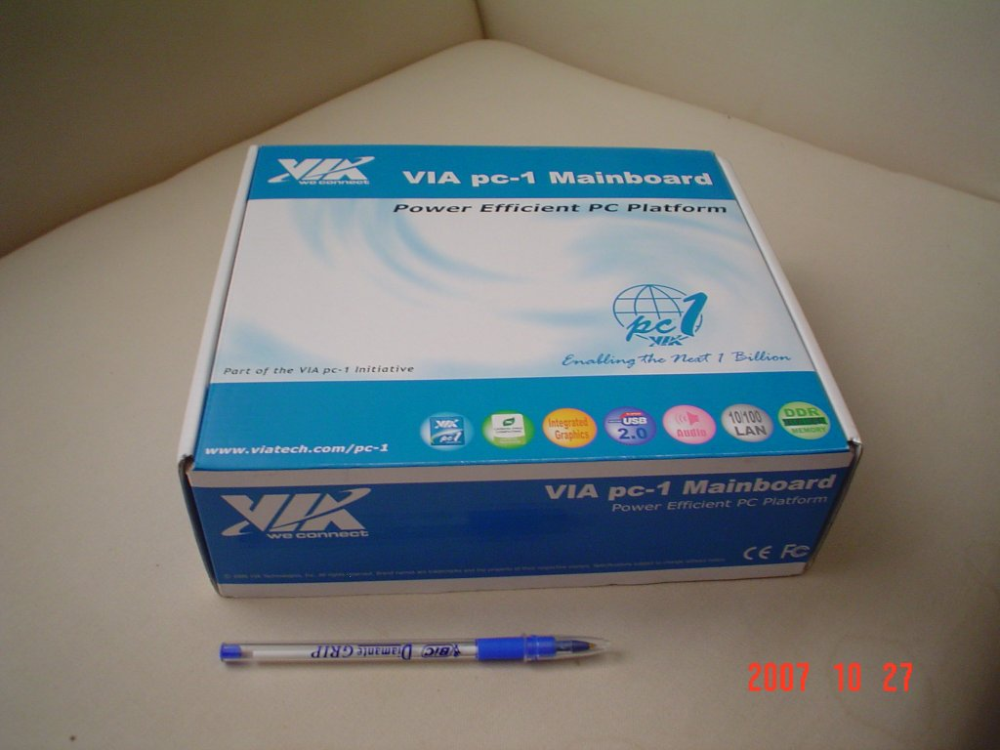
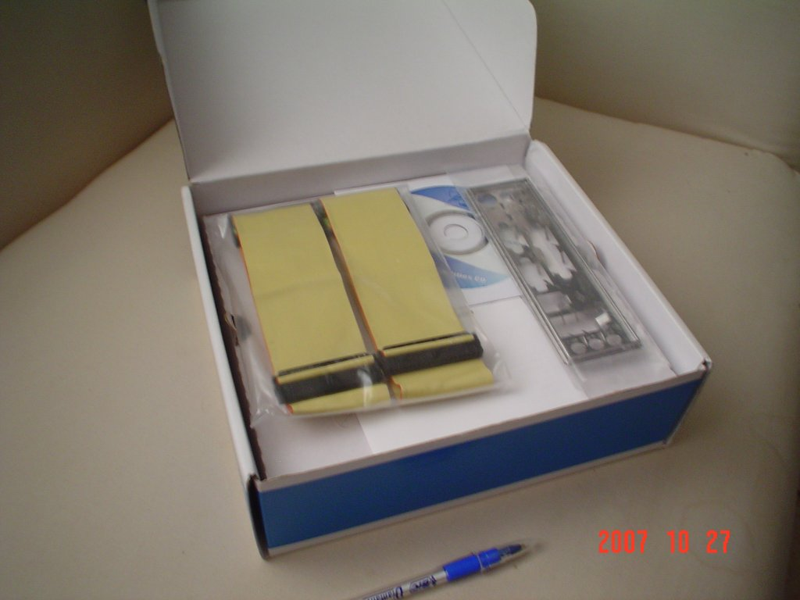
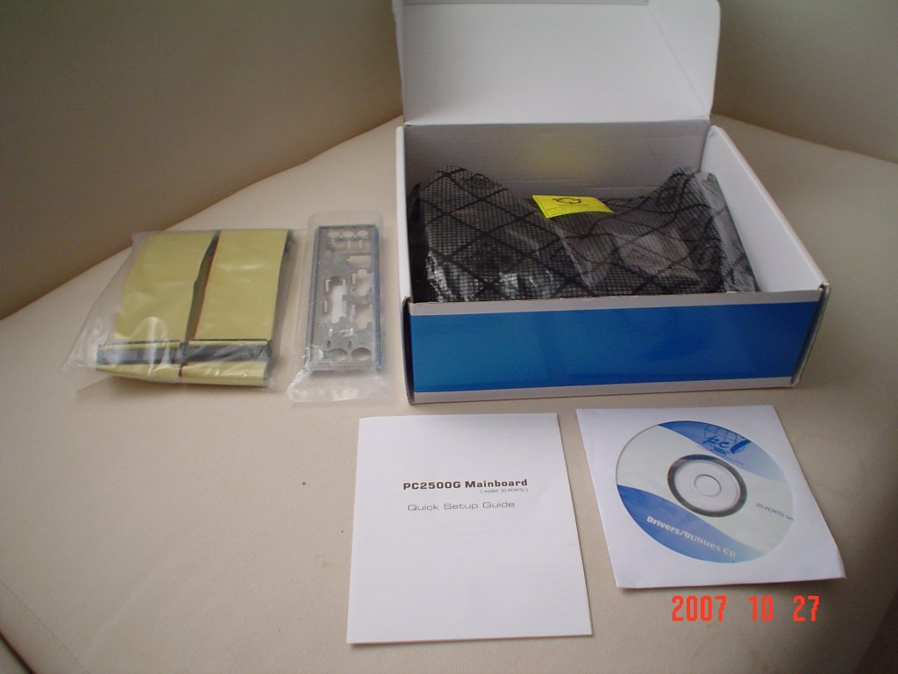
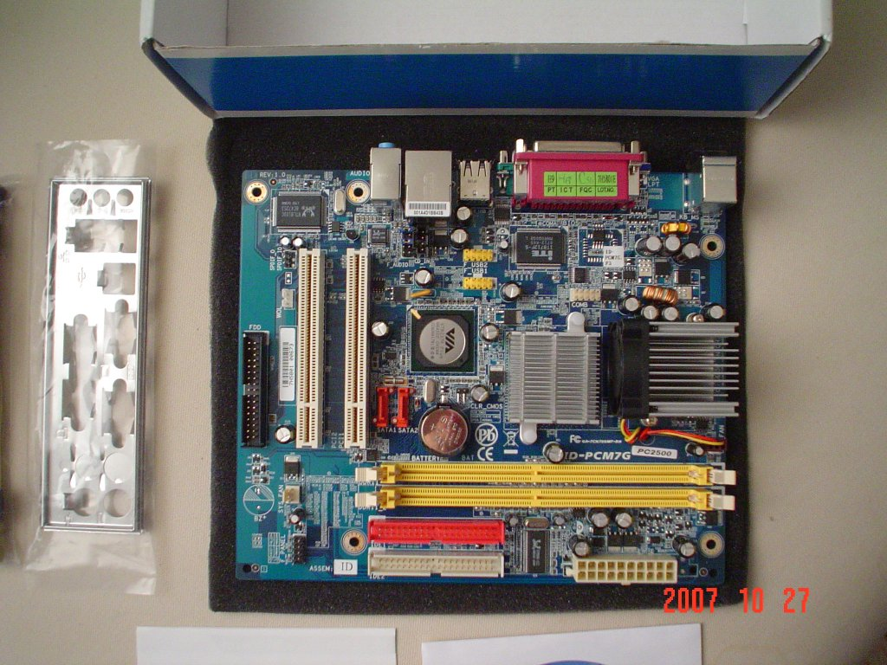
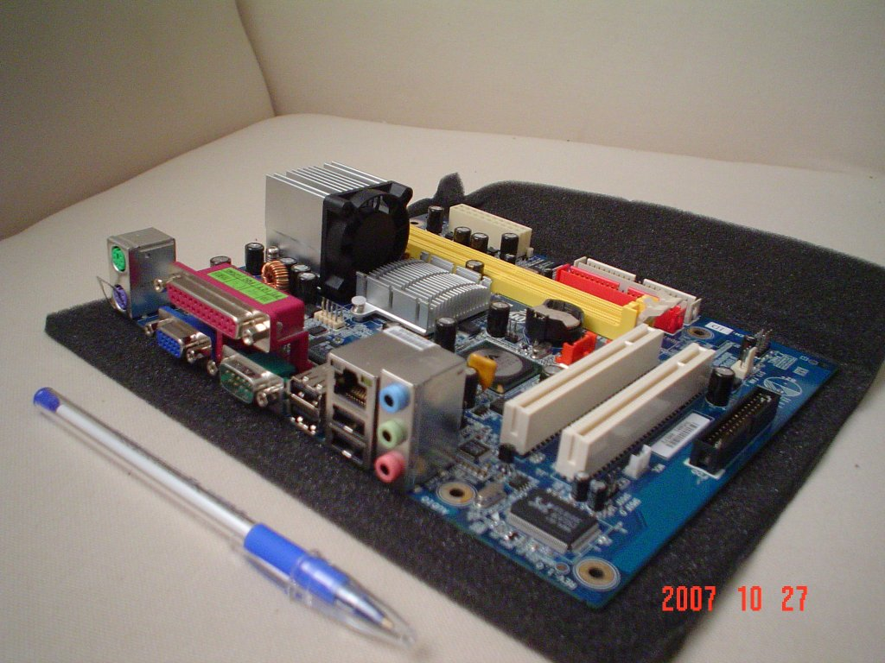
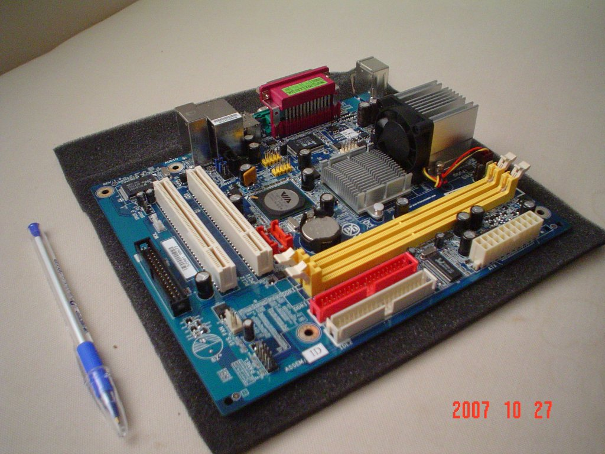
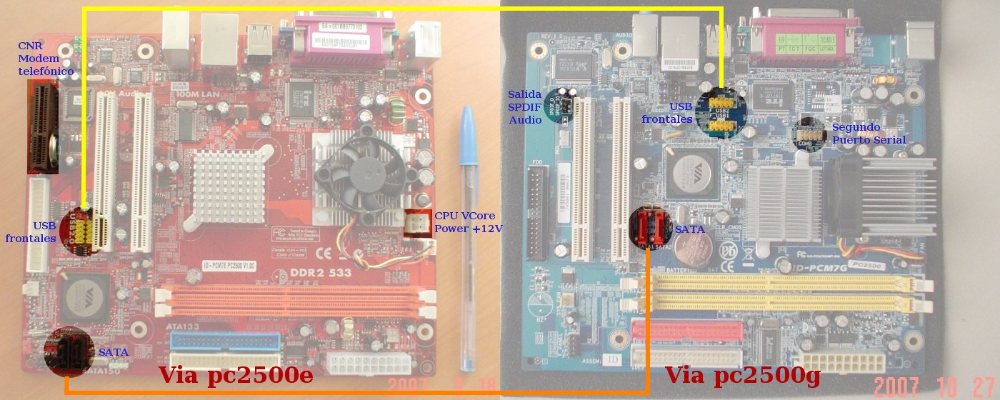

Title: Desempaque de la Via pc2500g
Slug: via-pc2500g-desempaque
Summary: Para continuar estudiando los equipos Via pc-1 adquirmos una segunda computadora. Solicité la variante g, es decir, es la pc2500g. Les muestro la tradicional secuencia de imágenes del desempaque del nuevo hardware.
Tags: hardware
Date: 2007-10-30 13:10
Modified: 2007-10-30 13:10
Category: articulos
Preview: preview.jpg

Para continuar estudiando los equipos [Via pc-1](http://es.viatech.com/es/initiatives/empowered/sys-platform_arch.jsp) adquirmos una segunda computadora. Solicité la variante **g**, es decir, es la [pc2500g](http://es.viatech.com/es/initiatives/empowered/pc2500_platform/index.jsp). Les muestro la tradicional secuencia de imágenes del desempaque del nuevo hardware.

No me esperaba que el diseño de esta placa fuera tan diferente al pc2500e. En esta imagen podrán apreciar algunas diferencias entre ambos modelos:

Las principales características de este modelo son:

* MiniATX, 7.2" x 8.5"
* Procesador [VIA C7-D](http://es.viatech.com/es/products/processors/c7-d/index.jsp) 1.5 GHz, 400 MHz FSB, 128 K Cache
* Chipset [CN700](http://www.via.com.tw/en/products/chipsets/c-series/cn700/)
* Gráficos S3 Unichrome Pro
* Red Realtek 10/100 Mbit
* Audio Realtek 2/4/6 canales, con salida SPDIF
* 2 conectores IDE
* 2 conectores SATA
* 2 ranuras para RAM DDR2
* 2 ranuras PCI
* 8 puertos USB 2.0 (4 en la parte posterior, 4 para panel frontal)

Aun no la he probado. Estoy esperando el gabinete, la memoria y un disco duro SATA para armar el equipo. El próximo modelo a comprar será una computadora [Via pc3500](http://www.via.com.tw/en/initiatives/empowered/pc3500_platform/index.jsp), la cual tiene salida a TV.
