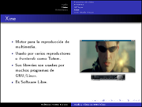
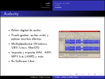
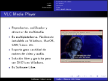

Title: Audio y Video en GNU/Linux
Slug: audio-y-video-en-gnu-linux
Summary: Presentación donde se muestran los programas multimedia de GNU/Linux como LAME, Audacity, FFMPEG, MPlayer, Xine y VLC.
Tags: gnu linux
Date: 2008-10-26 20:45
Modified: 2008-10-26 20:45
Category: presentaciones
Preview: preview.jpg

Con motivo del **VI Simposium Nacional de Sistemas Computacionales e Informática (SINASCI)** organizado por el [Instituto Tecnológico Superior de Lerdo](http://www.itslerdo.edu.mx/) elaboré esta sencilla presentación para mostrar las cualidades de los programas multimedia LAME, Audacity, FFMPEG, MPlayer, Xine y VLC. Todos son Software Libre.

### Descargar

* [Presentación](audio-y-video-en-gnu-linux.pdf)
* [Fuentes LaTeX](audio-y-video-en-gnu-linux.tar.gz)
