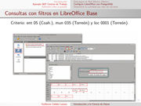

Title: Introducción a la Ciencia de Datos
Slug: ciencia-de-datos-introduccion
Summary: Presentación para hacer una introducción a la Ciencia de Datos.
Tags: ciencia de datos
Date: 2015-09-27 23:30
Modified: 2015-09-27 23:30
Category: presentaciones
Preview: preview.jpg

En el [Congreso de Software Libre GULAG 2015](http://www.gulag.org.mx/entradas/2015-09-02-congreso-2015.html) impartí la conferencia **Introducción a la Ciencia de Datos** donde hable'sobre lo que hacen los **Científicos de Datos** y de lo que se necesita para llegar a serlo.

### Descargar

* [Presentación PDF 1.5 MB](ciencia-de-datos-introduccion.pdf)
* [Fuentes LaTeX 1.4 MB](ciencia-de-datos-introduccion.tar.gz)
