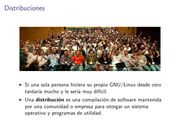
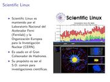

Title: Distribuciones GNU/Linux, entornos y programas libres
Slug: distribuciones-gnulinux
Summary: Amena y visual presentación sobre las distribuciones GNU/Linux y los entornos de escritorio más populares.
Tags: gnu linux
Date: 2010-10-19 23:55
Modified: 2010-10-19 23:55
Category: presentaciones
Preview: preview.jpg

Para el XX Semana Académica en la [Universidad Autónoma de Coahuila](http://www.uadec.mx/) su servidor elaboró esta amena y visual presentación sobre las distribuciones GNU/Linux y los entornos de escritorio más populares.

### Descargar

* [Presentación 3.2 MB](distribuciones-gnulinux.pdf)
* [Fuentes LaTeX 6.2 MB](distribuciones-gnulinux.tar.gz)
