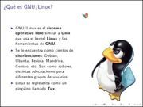
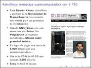
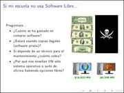

Title: Edubuntu en la educación
Slug: edubuntu-en-la-educacion
Summary: Presentación sobre lo que es el Software Libre, Ubuntu y Edubuntu, haciendo énfasis en su aplicación para el ámbito educativo.
Tags: educación
Date: 2009-10-28 01:00
Modified: 2009-10-28 01:05
Category: presentaciones
Preview: preview.jpg

Para la [16va. Semana Nacional de Ciencia y Tecnología](http://www.conacyt.mx/Comunicacion/sncyt/index.html) en un evento organizado por el [COECYT de Coahuila](http://www.coecyt-coah.gob.mx/) representando a [InnovaTIC](http://www.innovatic.org.mx/) y al [GULAG](http://www.gulag.org.mx/), elaboré la presentación "Edubuntu en la educación".

Este material es una semblanza de lo que es el Software Libre, [Ubuntu](http://www.ubuntu.com/) y [Edubuntu](http://www.edubuntu.org/), haciendo énfasis en su aplicación para el ámbito educativo. Se le hace la pregunta al público de que si sabe cuánto se gasta por comprar software privativo, si sabe que se estén usando copias ilegales del mismo y si es justo que sólo se enseñe una alternativa comercial habiendo otras libres. Concluye reflexionando sobre el potencial de la Comarca Lagunera para integrarse a las Industrias de la Información y Comunicación.

### Descargar

* [Presentación 5.4 MB](edubuntu-en-la-educacion.pdf)
* [Fuentes LaTeX 12.3 MB](edubuntu-en-la-educacion.tar.gz)
