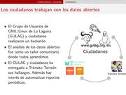
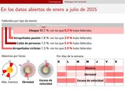

Title: El Poder de los Datos Abiertos
Slug: el-poder-de-los-datos-abiertos
Summary: El Encuentro de Ciudades Abiertas e Innovadoras de PIDES Innovación Social es un evento que forma parte del programa de Ciudades ASI el cuál se centra en promover mecanismos para el desarrollo y la sustentabilidad a través de políticas públicas y proyectos de gobierno abierto a nivel local.
Tags: ciencia de datos, política
Date: 2016-02-24 13:08
Modified: 2016-02-24 13:08
Category: presentaciones
Preview: preview.jpg

El 26 de febrero de 2016, [PIDES Innovación Social](http://www.pidesinnovacion.org/) y la [Embajada del Reino Unido en México](https://twitter.com/UKinMexico) organizan el [Encuentro de Ciudades Abiertas e Innovadoras 2016](http://www.pidesinnovacion.org/Iniciativas/ciudades-asi/).

Con el honor de exponer las experiencias del municipio que represento, he publicado la presentación titulada "El Poder de los Datos Abiertos Gubernamentales" donde compartimos el camino recorrido para lograr que la información sobre **Seguridad Vial** aparezca en [datos.gob.mx](http://datos.gob.mx/).

### Descargar

* [Presentación PDF 5.6 MB](poder-datos-abiertos-gubernamentales.pdf)
* [Fuentes LaTeX tar.gz 5.9 MB](poder-datos-abiertos-gubernamentales.tar.gz)
