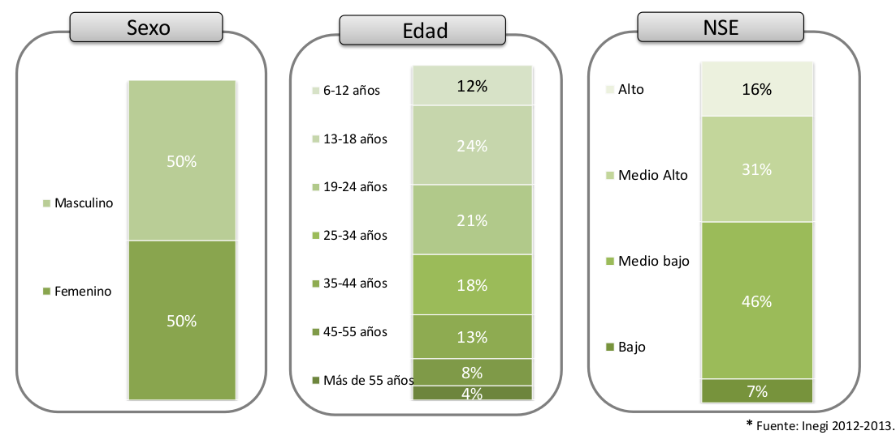
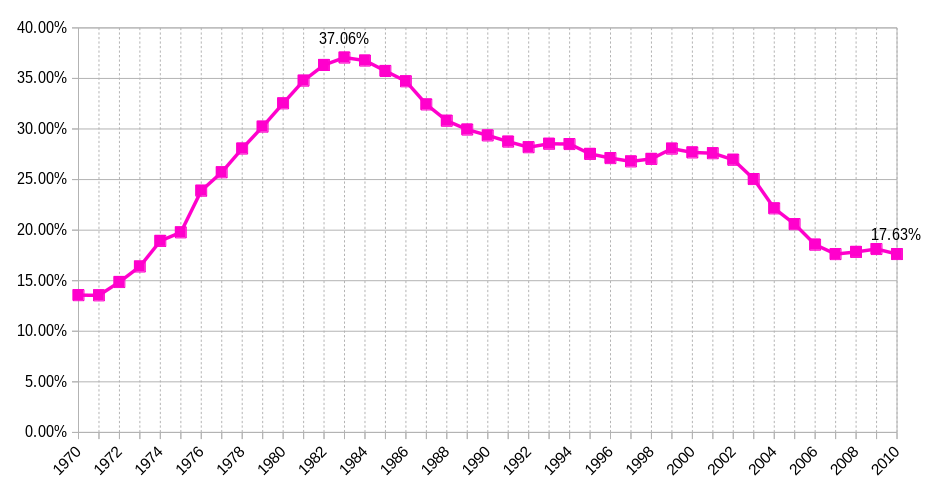
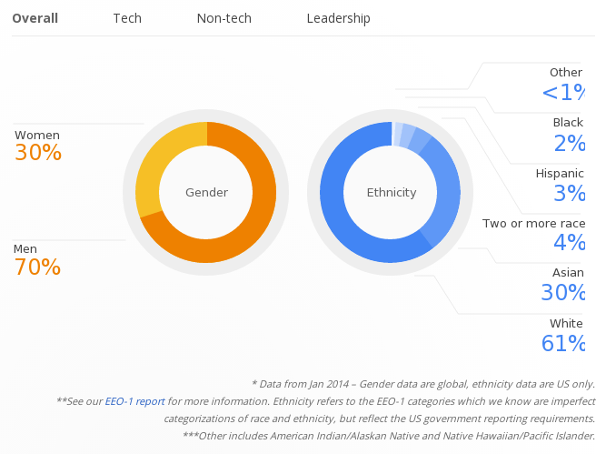
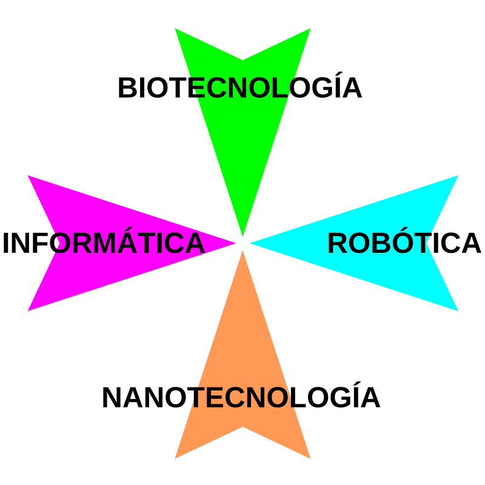

Title: Equidad de Género en Informática
Slug: equidad-genero-informatica
Summary: Aunque vivimos el mejor momento de las Ciencias Computacionales, el género femenino tiene muy poca participación en el sector.
Tags: educación
Date: 2015-03-09 11:00
Modified: 2015-03-09 11:00
Category: presentaciones
Preview: preview.jpg

Nuestro país ha tenido avances en la igualdad en el trabajo, gracias a ello, las mujeres tienen labores que antes se consideraban exclusivas para los hombres. Esto es positivo, pero México aun enfrenta varios retos como la **discriminación, violencia de género y el equilibrio de los salarios.**

### Género Femenino en la Informática y Ciencias

A pesar de las evidentes ventajas, muchas niñas ni siquiera se llegan a plantear una carrera en las TIC (Tecnologías de la Información y Comunicación). Esta situación se debe a más de un factor; que va desde la educación que los padres dan a sus hijas, hasta la falta de información entre las estudiantes, profesores y padres de lo que una carrera en las TIC puede ofrecer.

Este problema también está presente en las ciencias. Como muestra, sólo 6.6% de los físicos del [CERN](http://www.cern.ch) son mujeres.

### Usuarios de Internet en México

De acuerdo a los datos del INEGI el acceso a Internet se distribuye por igual entre las mexicanas y los mexicanos. Por lo que está claro que sí hay equidad en ésto y no representa un factor para la situación que mostramos.

### Discriminación de Género

Quienes discriminan designan un trato diferencial o inferior en cuanto a los derechos y las consideraciones sociales de las personas, organizaciones y estados.

Hacen esta diferencia ya sea por el color de piel, etnia, **sexo**, edad, cultura, religión o ideología.

### ¿Qué provoca el poco interés del género femenino en las TICs?

* La **educación en la mayoría de los hogares mexicanos** desmotiva a las niñas a aspirar una profesión. En la generalidad se les inculca que la labor de la mujer es el hogar y la crianza de los hijos.
* Los **juguetes** y la **publicidad en los medios masivos de comunicación** acentúan este estereotipo.
* La **falsa idea** de que las mujeres son malas para las matemáticas y problemas razonados.
* Y creer que las TICs son sólo para hombres.

### Datos del género femenino en el sistema educativo de EE.UU.

El dato más grave es que al paso de los años ha disminuido el porcentaje de matrícula femenina en las carreras de ciencias de la información:

Al examinar el resultado promedio de las pruebas I.Q. de las diferentes carreras se concluye que las pocas mujeres que estudian Ingenieria, Física, Filosofía tienen un resultado más alto. No significa ésto que sean menos inteligentes las que estudien las otras carreras; sencillamente es que el promedio es menor porque se aplica a más personas, a una muestra más grande que la primera.

### Género femenino en la industrial del software

Hace algunos meses las empresas más grandes y emblemáticas de la informática publicaron sus Reportes de Diversidad. En el caso de Google, sólo 3 de cada 10 empleados son mujeres. También es muy relevante el escaso porcentaje de hispanos y afroamericanos.

La industria de la información está en constante crecimiento. Por ejemplo, en el campo del Software Libre, la Linux Fundation pronostica un incremento en la demanda de especialistas en sistemas y de desarrolladores de GNU/Linux.

Es clara la necesidad de ingenieros en informática y desarrolladores de software en EE.UU. Este déficit de especialistas, en mujeres y hombres ha alertado al gobierno norteamericano y a las grandes industrias del software; los cuales han comenzado a tomar acciones al respecto.

Podría ser que nuestro país tenga este problema en un nivel más grave. Pero hagamos que ésto sea un motivo importante para hacer el esfuerzo de provocar un cambio social preparándonos para las tecnologías emergentes.

### Tecnologías Emergentes

Las tecnologías emergentes son aquellas ramas científicas que están en pleno desarrollo y que prometen que en el futuro inmediato, dentro de pocos años, harán un cambio trascendental en nuestras vidas.

* **Informática:** Definitivamente la humanidad ya ha cambiado con la informática y el internet.
* **Robótica:** Los vehículos autónomos podrían circular en nuestras calles dentro de dos años. Más adelante, se estima que conviviremos con robots en veinte años.
* **Nanotecnología:** Trata sobre construir al nivel molecular y las máquinas microscópicas. Los visionarios hablan que será posible desde curar enfermedades con microrobots hasta construir un ascensor espacial que nos lleve a una estación espacial en órbita.
* **Biotecnología:** Es el dominio de los genes y la simbiosis entre seres vivos y máquinas. Imagine simplemente aprovechar la luz del Sol y el agua de los mares con plantas genéticamente modificadas.

La informática es sólo la _antesala_ de lo que nos depara. Razón por demás para motivar a nuestras hijas e hijos para que no dejen de prepararse para el futuro.

### ¿Qué hacer para que haya más mujeres en la Informática y las Ciencias?

* **Como padres:** inspirar, educar y equipar a nuestras hijas e hijos por igual para que adquieran las habilidades que necesitarán en el futuro.
* **Como educadores:** cambiar la actitud y descartar estereotipos; invitar a niñas a visitar empresas donde conozcan los profesionales TIC y ver cómo trabajan.
* **Como empresarios:** respetar la ley del trabajo (a trabajos iguales, igual salario) así como contratar por actitud, habilidad y conocimiento.
* **Como gobernantes:** se dió un primer paso con la ley de equidad de género en los diputados. Sigue modernizar el sistema educativo.

### Video inspirador

<iframe width="100%" src="//www.youtube.com/embed/XP3cyRRAfX0?rel=0" frameborder="0" allowfullscreen></iframe>

### Descargas

Descargue la [Presentación Equidad de Género en Informática](equidad-genero-informatica.pdf) como un archivo PDF de 3.3 MB. Además de los [archivos fuente](equidad-genero-informatica.tar.gz) de 7.6 MB.

### Referencias

* [Niñas en las TIC](http://girlsinict.org)
* [Celebrating women in particle physics](http://internationalwomensday.web.cern.ch)
* [Power and prejudice: women in physics](http://cerncourier.com/cws/article/cern/30150)
* [Wikipedia: Discriminación](https://es.wikipedia.org/wiki/Discriminación)
* [Estudios de la Asociación Mexicana de Internet](https://www.amipci.org.mx/es/estudios)
* [Carnegie Mellon urges young women to consider computer science](http://www.qatar.cmu.edu/news/view/1296)
* [Degrees in C.I.S. conferred by sex of student](http://nces.ed.gov/programs/digest/d12/tables/dt12_349.asp)
* [Google Diversity Report](http://www.google.com/diversity)
* [Linux Fundation](http://www.linuxfoundation.org/)
* [Gartner's 2014 Hype Cycle for Emerging Technologies](http://www.gartner.com/newsroom/id/2819918)
* [Girls Who Code](http://girlswhocode.com/)
* [Google Made With Code](https://www.madewithcode.com/)
* [Verizon Commercial 2014, Inspire Her Mind](https://www.youtube.com/watch?v=XP3cyRRAfX0)
