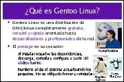
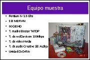

Title: Instalación de Gentoo Linux
Slug: gentoo-instalacion
Summary: En esta presentación se muestran los pasos de la instalación del Gentoo Linux.
Tags: gnu linux, gentoo linux
Date: 2006-10-01 15:00
Modified: 2006-10-01 15:00
Category: presentaciones
Preview: preview.jpg

[Gentoo Linux](http://www.gentoo.org) es una distribución de GNU/Linux completamente gratuita, versátil y rápida orientada hacia desarrolladores y profesionales de la red.

En esta presentación se muestran los pasos de la instalación del Gentoo Linux en un _equipo muestra_.

### Descargar

* [Presentación](instalacion-gentoo.pdf)
